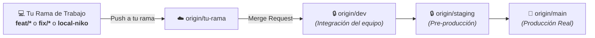

<div align="center">
  
  <h1>🎮 RageNodes Ultimate</h1>
  <p><strong>Plataforma de Alto Rendimiento para Orquestación de Servidores de Juegos y Bots</strong></p>

  <p>
    
    
    
    
    
  </p>
</div>

---

## 🚀 Visión General
**RageNodes Ultimate** es una plataforma integral y modular de hosting y orquestación de servidores de juegos y aplicaciones. Combina una arquitectura orientada a objetos en **Node.js**, un proxy inverso ultra-rápido de baja latencia en **Rust (`OxideProxy`)**, y aislamiento estricto de contenedores en **Docker**.

---

## 🛠️ Stack Tecnológico y Arquitectura

* **Backend:** Node.js (ESM), Express, PostgreSQL, MariaDB, Redis.
* **Capa de Red & Proxy:** Rust (`oxideproxy`), TLS termination, Nonce CSP y caché de consultas.
* **Patrones de Diseño:** *Template Method* (`BaseGameService`), *Factory & Registry* (`GameFactory`), *Observer* (Docker Events), *Strategy* (Backups).
* **Testing:** Test runner nativo de Node.js (`node:test` y `node:assert/strict`).
* **Frontend:** Vanilla JS moderno, CSS Glassmorphism, WebSockets para métricas en vivo.

---

## 💻 Guía Rápida para Nuevos Desarrolladores (Local Setup)

### 1. Requisitos Previos
* **Node.js** >= 20.x (recomendado Node 22 o 24).
* **Docker Desktop** (o Docker Engine en Linux) con soporte para Docker Compose v2.
* **Git**.

### 2. Clonar y Preparar el Entorno
```bash
# 1. Clonar el repositorio
git clone https://gitlab.com/mariomatos/ragenodesultimate.git
cd ragenodesultimate

# 2. Crear tu rama de trabajo (según el protocolo de equipo)
git checkout -b feat/mi-nueva-caracteristica

# 3. Configurar variables de entorno locales
cp .env.example .env
```

### 3. Instalar Dependencias
```bash
# En el backend
cd backend
npm install
cd ..
```

### 4. Ejecutar la Suite de Pruebas Automatizadas
Verifica que todos los módulos y pruebas unitarias pasen al 100%:
```bash
cd backend
npm test
cd ..
```
*(Debe ejecutar 15 pruebas unitarias en ~500ms validando cálculos de recursos, bridges de Rust, GameFactory, aislamiento de Cloudflare y salud).*

### 5. Levantar el Stack Completo en Local
Para desarrollo local, utiliza el override `docker-compose.local.yml` (que mantiene el túnel Cloudflare en modo opcional):
```bash
docker compose -f docker-compose.yml -f docker-compose.local.yml up -d
```

### 6. Acceso al Panel en Local
* **Panel de Control Web:** [http://localhost:8088](http://localhost:8088)
* **API Backend:** [http://localhost:3011](http://localhost:3011)
* **Sonda de Salud en Vivo:** [http://localhost:3011/readyz](http://localhost:3011/readyz)
* **phpMyAdmin:** [http://localhost:8089](http://localhost:8089)

---

## 🛡️ Protocolo de Git y Ramas para el Equipo (*GitFlow*)

Para garantizar la estabilidad y prevenir conflictos o regresiones en los servidores de producción, **todos los desarrolladores deben seguir estas reglas estrictas**:



### 📋 Reglas de Colaboración:
1. **Ramas Protegidas (`dev`, `staging`, `main`):**
   - 🚫 **PROHIBIDO hacer push directo** a `dev`, `staging` o `main`.
2. **Flujo de Trabajo:**
   - Trabaja siempre en tu rama asignada (ej: `local-niko`, `feat/nombre-feature`, `fix/nombre-bug`).
   - Sube los cambios a tu rama remota: `git push origin mi-rama`.
   - Abre un **Merge Request (MR)** en GitLab hacia la rama **`dev`** para revisión del equipo.
   - Una vez aprobado y probado en `dev`, se promueve a `staging` y posteriormente a `main`.

---

## ☁️ Aislamiento de Túneles Cloudflare (*Namespace Isolation*)

El proyecto cuenta con un sistema de aislamiento por prefijos (`CF_TUNNEL_ENV_PREFIX`) para que el desarrollo local y de staging **jamás interfiera ni borre túneles de Producción**:

* **Producción:** `CF_TUNNEL_ENV_PREFIX=""` (URLs: `tx40120.ragenodes.com`, `node1.ragenodes.com`).
* **Staging:** `CF_TUNNEL_ENV_PREFIX="staging-"` (URLs: `staging-tx40120.ragenodes.com`, `staging.ragenodes.com`).
* **Desarrollo:** `CF_TUNNEL_ENV_PREFIX="dev-"` (URLs: `dev-tx40120.ragenodes.com`).

*Los workers de limpieza solo pueden evaluar y eliminar túneles que coincidan con su prefijo exacto.*

---

## 🕹️ Cómo Añadir un Nuevo Juego (Extender `GameFactory`)

Gracias a la arquitectura orientada a objetos, añadir soporte para un nuevo juego requiere únicamente crear su clase especializada heredando de `BaseGameService`:

1. Crea el archivo `backend/src/services/games/nuevoJuego.js`:
```javascript
import { BaseGameService } from './BaseGameService.js';
import { GameFactory } from './GameFactory.js';
import { config } from '../../config.js';

export class NuevoJuegoService extends BaseGameService {
    constructor() {
        super('nuevo_juego', 'imagen/docker:latest');
    }

    buildEnvironment(opts) {
        return [
            `SERVER_NAME=${opts.serverName}`,
            `PORT=${opts.gamePort}`
        ];
    }

    buildPortBindings(opts) {
        return {
            exposed: { [`${opts.gamePort}/udp`]: {} },
            bindings: { [`${opts.gamePort}/udp`]: [{ HostIp: "0.0.0.0", HostPort: String(opts.gamePort) }] }
        };
    }
}

// Instanciar y registrar en la fábrica
export const nuevoJuegoService = new NuevoJuegoService();
GameFactory.register('nuevo_juego', nuevoJuegoService);
```
2. ¡Listo! El orquestador `dockerService`, las cuotas de RAM/CPU, permisos de archivos `1000:1000`, branding y logs se gestionan automáticamente.

---

## 🧪 Comandos de Calidad y Seguridad

```bash
# Ejecutar todas las pruebas unitarias e integración del backend
npm --prefix backend test

# Ejecutar auditorías de contratos de seguridad
npm run security:secrets
npm run security:csp-bindings
npm run security:inline-code
npm run security:routes
```

---

## 📚 Documentación Técnica Detallada
* [Arquitectura del Sistema & Diagramas UML](docs/ARCHITECTURE.md)
* [ADR-001: OxideProxy en Rust](docs/adr/ADR-001-rust-reverse-proxy.md)
* [ADR-002: Arquitectura POO y GameFactory](docs/adr/ADR-002-game-factory-oop-architecture.md)
* [ADR-003: Aislamiento de Túneles Cloudflare](docs/adr/ADR-003-cloudflare-tunnel-namespace-isolation.md)

---

## 🤝 Contribuidores
* [@payniko24](https://gitlab.com/payniko24)
* [@marioscience](https://github.com/marioscience)

---

## 📜 Licencia
Este proyecto es privado. Asegúrate de cumplir con los términos y EULAs de los servidores de juego respectivos (FiveM, SteamCMD, etc.).
