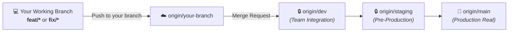
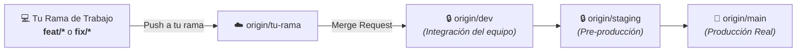

> **Desarrollo local rápido / Quick local development:** `bash dev setup`,
> `bash dev doctor`, `bash dev up prebuilt` (release de `dev` sin compilar),
> `bash dev up frontend` (simulado) o `bash dev up core` (compilación local).
> Logs: `bash dev logs backend`.
> Consulta [la guía de desarrollo local](docs/LOCAL-DEVELOPMENT.md) para Linux,
> WSL2, Dev Container, componentes, escenarios y solución de problemas.
> Las [puertas automáticas antes de `dev`](docs/AUTOMATED-QUALITY-GATES.md)
> explican qué se valida localmente, en GitLab y en un laboratorio opcional.
> Este flujo ligero utiliza `compose.development.yml` y `.env.development`;
> los comandos del stack completo que siguen son para integración con juegos reales.

<div align="center">
  
  <h1>🎮 RageNodes Ultimate</h1>
  <p><strong>High-Performance Game Server & Discord Bot Orchestration Platform</strong></p>
  <p><strong>Plataforma de Alto Rendimiento para Orquestación de Servidores de Juegos y Bots</strong></p>

  <p>
    <a href="#-english"><b>🇬🇧 English Documentation</b></a> | <a href="#-español"><b>🇪🇸 Documentación en Español</b></a>
  </p>

  <p>
    
    
    
    
    
    
  </p>
</div>

---

# 🇬🇧 English

## 🚀 Overview
**RageNodes Ultimate** is an all-in-one, production-oriented game server and application orchestration platform. It combines an object-oriented **Node.js** backend, a low-latency reverse proxy written in **Rust (`OxideProxy`)**, and hardened **Docker** container isolation.

Whether deploying a large FiveM roleplay community or a multi-node cluster for Rust and Minecraft, RageNodes provides hardware orchestration with defense-in-depth controls and direct public endpoints managed by OxideProxy.

---

## 🌟 Key Features
- **🕹️ 1-Click Service Deployment:** Orchestration for FiveM (txAdmin), Rust, Minecraft, CS2, Valheim, Project Zomboid, Palworld, ARK, 7 Days to Die, Discord bots, WordPress, MariaDB and Blender Studio 3D.
- **🤖 Discord Bot Hosting:** Secure, isolated containers for Node.js and Python bots with automated health monitoring.
- **⚡ OxideProxy (Rust Core & L7 Control Plane):** Layer 4/7 reverse proxy with TLS termination, cryptographic CSP nonces, real Aya-based eBPF/XDP filtering, short-lived authorization caching, and configurable traffic-mitigation controls.
- **🛡️ Environment-Aware CORS & CSRF:** Production accepts only configured HTTPS origins; private-network and localhost origins are limited to explicit local-development policy.
- **🐳 Hardened Hybrid Docker Architecture:** A rootful control plane is separated from rootless customer game runtimes; services run non-root where supported, capabilities are restricted per workload, and volume/image validation fails fast before deployment.
- **📊 Real-Time Telemetry & iFrame Auth:** Live CPU, memory, network and I/O metrics use SSE, WebSockets or bounded polling according to the feature, with authenticated browser requests and token propagation where required.
- **🩺 Production & Staging Diagnostics:** Native `/healthz`, `/readyz` probes, and an adaptive hardware test suite (`backend/src/services/stagingHealthTestRunner.js`) generating PDF/HTML diagnostic reports.
- **📦 Complete Base-Image Cache:** Every deployable service has a reusable local base image. FiveM and Blender are version-aware RageNodes masters that are built and archived locally; Minecraft, Rust, Palworld, CS2, Valheim, Project Zomboid, ARK, 7 Days to Die, Discord bots, WordPress and MariaDB use digest-pinned upstream images that are prefetched into the local cache. A hardened systemd timer refreshes the complete manifest without replacing active customer containers, so subsequent deployments normally start from local storage instead of downloading again.
- **⚡ Local Game-Template Tier:** When shared masters live on NFS/HDD and instance data lives on local Btrfs/SSD, CS2, Rust, Palworld, Valheim, Project Zomboid, ARK and 7 Days to Die seed one validated local cache and create subsequent instances with atomic reflinks. Existing instance data is never overwritten. FiveM and Minecraft keep their specialized installation flows.

<!-- QA_STATUS_EN_START -->
### 🧭 Quick Start Guide: How to Run a QA Test

Anyone on the team can test a game server—even with zero technical background:

1. **Create the Tracking Issue**: Click **🚀 Start** next to your game in the matrix below (or open the [Testing Playbook](docs/qa/playbooks/en/) and click the 1-click launch button). The issue opens in GitLab with title, labels, and checkboxes pre-filled! (Alternatively, in GitLab go to **Issues $\rightarrow$ New Issue** and choose the template once merged).
2. **🎮 Gamer QA Phase (Non-Technical)**: Open the game's [Testing Playbook](docs/qa/playbooks/en/), deploy the server in the web panel, play the game with a teammate (test driving, combat, hordes, mods), and check off the **Part 1** boxes in the issue.
3. **Pass the Baton**: Leave a comment tagging the developers: `@devs Finished gamer testing! Ready for technical checks.`
4. **⚙️ Dev QA Phase (Developers)**: A developer spends 3 minutes running the terminal/Docker verification commands in **Part 2** (RAM cgroups, port offsets, chaos netem, clean teardown).
5. **Sync to README**: Close the issue with label `qa::certified`. The table below updates automatically via CI (or run `npm run sync:qa`).

### 🚀 Platform Roadmap & Feature Readiness

| Feature / Milestone | Checklist Progress | Status | Lead / Auditor | Last Audit |
| :--- | :---: | :---: | :---: | :---: |
| 🛠️ [**Platform Roadmap & Feature Testing Readiness**](docs/qa/playbooks/en/00_roadmap.md) • [🚀 Start](https://gitlab.com/mariomatos/ragenodesultimate/-/issues/new?issue%5Btitle%5D=%5BQA-EN%5D+%F0%9F%9A%80+Platform+Roadmap+%26+Feature+Testing+Readiness&issue%5Blabels%5D=qa%3A%3Ain-progress%2Cgame%3A%3Aroadmap&issue%5Bdescription%5D=%23%23+%F0%9F%9A%80+QA+Certification%3A+Platform+Roadmap+%26+Feature+Testing+Readiness%0A%0A%3E+%F0%9F%93%96+**Full+step-by-step+testing+guide**%3A+See+the+%5BPlatform+Roadmap+%26+Feature+Testing+Readiness+Testing+Playbook%5D%28docs%2Fqa%2Fplaybooks%2Fen%2F00_roadmap.md%29.%0A%0A%23%23%23+%F0%9F%8E%AE+Part+1%3A+Gamer+Tests+%28QA+Tester%29%0A*Check+off+the+boxes+as+you+complete+your+gameplay+session%3A*%0A%0A-+%5B+%5D+**Step+1%3A+Verify+Instant+Deployment+in+Web+Panel**+%28Pass+rule%3A+%60Server+creates%2C+shows+%22Online%22+in+under+2+minutes%2C+and+displays+its+public+IP.%60%29%0A-+%5B+%5D+**Step+2%3A+Test+Monaco+Code+Editor**+%28Pass+rule%3A+%60Editor+highlights+syntax+and+saves+cleanly+without+refreshing+the+browser.%60%29%0A-+%5B+%5D+**Step+3%3A+Test+Marketplace+Vault+Protection**+%28Pass+rule%3A+%60System+denies+action+with+%22Vault+Protection%3A+Protected+source+file%22.%60%29%0A%0A%3E+%F0%9F%92%AC+**Finished+gamer+testing%3F**+Leave+a+comment+tagging+the+developers%3A++%0A%3E+%60%40devs+Finished+gameplay+tests+successfully.+Ready+for+tech+review.%60%0A%0A%23%23%23+%E2%9A%99%EF%B8%8F+Part+2%3A+Technical+Engine+Tests+%28Developers%29%0A*Terminal+commands+for+development+team%3A*%0A%0A-+%5B+%5D+**TC-DEV-1%3A+DDoS+Mitigation+with+OxideProxy+eBPF%2FXDP**+%28%60docker+logs+ragenodes_oxideproxy+%7C+grep+-i+%22ebpf%22%60%29%0A-+%5B+%5D+**TC-DEV-2%3A+Rank-Based+Backup+Priority+Queue**+%28%60docker+exec+-it+ragenodes_backend+node+-e+%22import%28%27.%2Fsrc%2Fservices%2FbackupQueue.js%27%29.then%28m+%3D%3E+console.log%28m.backupQueue%29%29%22%60%29%0A-+%5B+%5D+**TC-DEV-3%3A+Multi-Node+Hot+Migration**+%28%60curl+-s+http%3A%2F%2Flocalhost%3A3000%2Fapi%2Fadmin%2Fnodes+-H+%22Authorization%3A+Bearer+%24TOKEN%22%60%29%0A-+%5B+%5D+**TC-DEV-4%3A+SSE+LogHub+Streaming+%26+15s+Heartbeat**+%28%60curl+-N+-H+%22Accept%3A+text%2Fevent-stream%22+http%3A%2F%2Flocalhost%3A3000%2Fapi%2Fservers%2F1%2Flogs%2Fstream+-H+%22Authorization%3A+Bearer+%24TOKEN%22%60%29%0A%0A%2Flabel+%7E%22qa%3A%3Ain-progress%22+%7E%22game%3A%3Aroadmap%22%0A) | `0/7` (0%) | 🔵 Planned | @dev-team | 2026-09-17 |

### 🎮 Verified Game Server Engines & QA Matrix

> 💡 **How testing works**: Tests are split into **🎮 Gamer QA** (tested by in-game players in live sessions) and **⚙️ Dev QA** (deep systems checks on memory cgroups, port forwarding, and adverse netcode). Full testing playbooks: [`docs/qa/playbooks/en/`](docs/qa/playbooks/en/).

| Game Engine | 🎮 Gamer Verified | ⚙️ Dev Engine Audit | Overall Status | Playbook Guide | Tested Version |
| :--- | :---: | :---: | :---: | :---: | :---: |
| 🚗 [**FiveM (GTA V RP)**](docs/qa/playbooks/en/01_fivem.md) | `0/5` | `0/4` | ⚪ Queued | [📖 Playbook](docs/qa/playbooks/en/01_fivem.md) • [🚀 Start](https://gitlab.com/mariomatos/ragenodesultimate/-/issues/new?issue%5Btitle%5D=%5BQA-EN%5D+%F0%9F%9A%97+FiveM+%28GTA+V+RP+FXServer%29&issue%5Blabels%5D=qa%3A%3Ain-progress%2Cgame%3A%3Afivem&issue%5Bdescription%5D=%23%23+%F0%9F%9A%97+QA+Certification%3A+FiveM+%28GTA+V+RP+FXServer%29%0A%0A%3E+%F0%9F%93%96+**Full+step-by-step+testing+guide**%3A+See+the+%5BFiveM+%28GTA+V+RP+FXServer%29+Testing+Playbook%5D%28docs%2Fqa%2Fplaybooks%2Fen%2F01_fivem.md%29.%0A%0A%23%23%23+%F0%9F%8E%AE+Part+1%3A+Gamer+Tests+%28QA+Tester%29%0A*Check+off+the+boxes+as+you+complete+your+gameplay+session%3A*%0A%0A-+%5B+%5D+**Step+1%3A+Deploy+%26+Boot+FiveM+Server**+%28Pass+rule%3A+%60Status+flips+to+%22Online%22%2C+displays+public+game+IP+and+txAdmin+access.%60%29%0A-+%5B+%5D+**Step+2%3A+Open+txAdmin+Web+Interface**+%28Pass+rule%3A+%60txAdmin+loads+over+HTTPS+without+security+warnings+and+allows+admin+login.%60%29%0A-+%5B+%5D+**Step+3%3A+In-Game+Connection+%26+Spawn**+%28Pass+rule%3A+%60Both+players+load+into+Los+Santos%2C+see+each+other+move%2C+and+proximity+voice+chat+works.%60%29%0A-+%5B+%5D+**Step+4%3A+High-Speed+200+km%2Fh+Highway+Test**+%28Pass+rule%3A+%60Passenger+remains+smoothly+seated+inside+car%3B+road+and+buildings+stream+without+pop-in.%60%29%0A-+%5B+%5D+**Step+5%3A+Test+Blender+WebTop+3D+Editor**+%28Pass+rule%3A+%60Blender+3D+interface+loads+in+browser%2C+ready+to+edit+.ydr%2F.yft+vehicle+models.%60%29%0A%0A%3E+%F0%9F%92%AC+**Finished+gamer+testing%3F**+Leave+a+comment+tagging+the+developers%3A++%0A%3E+%60%40devs+Finished+gameplay+tests+successfully.+Ready+for+tech+review.%60%0A%0A%23%23%23+%E2%9A%99%EF%B8%8F+Part+2%3A+Technical+Engine+Tests+%28Developers%29%0A*Terminal+commands+for+development+team%3A*%0A%0A-+%5B+%5D+**TC-DEV-1%3A+Port+Offsets+%26+OxideProxy+L4+Routing**+%28%60docker+port+%3Cfivem-container%3E%60%29%0A-+%5B+%5D+**TC-DEV-2%3A+MariaDB+Privilege+Isolation**+%28%60docker+exec+-it+ragenodes_mariadb+mysql+-u+root+-p+-e+%22SHOW+GRANTS+FOR+%27%3Cdb_user%3E%27%40%27%25%27%3B%22%60%29%0A-+%5B+%5D+**TC-DEV-3%3A+Blender+WebTop+Heartbeat+Auto-Shutdown**+%28%60docker+ps+%7C+grep+blender%60%29%0A-+%5B+%5D+**TC-DEV-4%3A+Authoritative+Hitreg+under+Simulated+Latency**+%28%60tc+qdisc+add+dev+docker0+root+netem+delay+120ms%60%29%0A%0A%2Flabel+%7E%22qa%3A%3Ain-progress%22+%7E%22game%3A%3Afivem%22%0A) | `v0.0.1` |
| ⛏️ [**Minecraft (Paper/Forge)**](docs/qa/playbooks/en/02_minecraft.md) | `0/6` | `0/3` | ⚪ Queued | [📖 Playbook](docs/qa/playbooks/en/02_minecraft.md) • [🚀 Start](https://gitlab.com/mariomatos/ragenodesultimate/-/issues/new?issue%5Btitle%5D=%5BQA-EN%5D+%E2%9B%8F%EF%B8%8F+Minecraft+%28Paper%2C+Fabric%2C+Forge%2C+Vanilla%29&issue%5Blabels%5D=qa%3A%3Ain-progress%2Cgame%3A%3Aminecraft&issue%5Bdescription%5D=%23%23+%E2%9B%8F%EF%B8%8F+QA+Certification%3A+Minecraft+%28Paper%2C+Fabric%2C+Forge%2C+Vanilla%29%0A%0A%3E+%F0%9F%93%96+**Full+step-by-step+testing+guide**%3A+See+the+%5BMinecraft+%28Paper%2C+Fabric%2C+Forge%2C+Vanilla%29+Testing+Playbook%5D%28docs%2Fqa%2Fplaybooks%2Fen%2F02_minecraft.md%29.%0A%0A%23%23%23+%F0%9F%8E%AE+Part+1%3A+Gamer+Tests+%28QA+Tester%29%0A*Check+off+the+boxes+as+you+complete+your+gameplay+session%3A*%0A%0A-+%5B+%5D+**Step+1%3A+Deploy+Server+%26+Choose+Version**+%28Pass+rule%3A+%60Server+turns+on%2C+auto-accepts+EULA%2C+and+binds+to+port+25565.%60%29%0A-+%5B+%5D+**Step+2%3A+1-Click+Plugin+Installation**+%28Pass+rule%3A+%60.jar+appears+in+%2Fplugins%2F+folder+and+plugin+commands+work+in-game.%60%29%0A-+%5B+%5D+**Step+3%3A+Join+Server+from+Client**+%28Pass+rule%3A+%60Immediate+connection%2C+low+ping%2C+no+auth+errors.%60%29%0A-+%5B+%5D+**Step+4%3A+High-Speed+Spectator+Flight+%28Chunk+Stress%29**+%28Pass+rule%3A+%60Chunks+stream+ahead+smoothly%3B+running+%2Ftps+confirms+stability+between+19.8+-+20.0.%60%29%0A-+%5B+%5D+**Step+5%3A+Ghost+Block+Desync+Test**+%28Pass+rule%3A+%60Blocks+break+smoothly+and+drop+items%3B+no+blocks+reappear+magically+%28no+ghost+blocks%29.%60%29%0A-+%5B+%5D+**Step+6%3A+Visual+server.properties+Editor**+%28Pass+rule%3A+%60Values+persist+to+server.properties+on+disk+and+apply+upon+reboot.%60%29%0A%0A%3E+%F0%9F%92%AC+**Finished+gamer+testing%3F**+Leave+a+comment+tagging+the+developers%3A++%0A%3E+%60%40devs+Finished+gameplay+tests+successfully.+Ready+for+tech+review.%60%0A%0A%23%23%23+%E2%9A%99%EF%B8%8F+Part+2%3A+Technical+Engine+Tests+%28Developers%29%0A*Terminal+commands+for+development+team%3A*%0A%0A-+%5B+%5D+**TC-DEV-1%3A+Dynamic+OpenJDK+Tag+Resolution**+%28%60docker+inspect+%3Cmc-container%3E+%7C+grep+-i+%22image%22%60%29%0A-+%5B+%5D+**TC-DEV-2%3A+JVM+Memory+Headroom+Formula**+%28%60docker+exec+-it+%3Cmc-container%3E+env+%7C+grep+-E+%22%28MEMORY%7CJVM%29%22%60%29%0A-+%5B+%5D+**TC-DEV-3%3A+World+Identity+Lock+Integrity**+%28%60cat+%3CdataPath%3E%2F.ragenodes-minecraft-identity.json%60%29%0A%0A%2Flabel+%7E%22qa%3A%3Ain-progress%22+%7E%22game%3A%3Aminecraft%22%0A) | `v0.0.1` |
| ☢️ [**Rust Dedicated**](docs/qa/playbooks/en/03_rust.md) | `0/5` | `0/4` | ⚪ Queued | [📖 Playbook](docs/qa/playbooks/en/03_rust.md) • [🚀 Start](https://gitlab.com/mariomatos/ragenodesultimate/-/issues/new?issue%5Btitle%5D=%5BQA-EN%5D+%E2%98%A2%EF%B8%8F+Rust+Dedicated+Server&issue%5Blabels%5D=qa%3A%3Ain-progress%2Cgame%3A%3Arust&issue%5Bdescription%5D=%23%23+%E2%98%A2%EF%B8%8F+QA+Certification%3A+Rust+Dedicated+Server%0A%0A%3E+%F0%9F%93%96+**Full+step-by-step+testing+guide**%3A+See+the+%5BRust+Dedicated+Server+Testing+Playbook%5D%28docs%2Fqa%2Fplaybooks%2Fen%2F03_rust.md%29.%0A%0A%23%23%23+%F0%9F%8E%AE+Part+1%3A+Gamer+Tests+%28QA+Tester%29%0A*Check+off+the+boxes+as+you+complete+your+gameplay+session%3A*%0A%0A-+%5B+%5D+**Step+1%3A+Deploy+Rust+Server+%26+Start**+%28Pass+rule%3A+%60Server+turns+green+and+console+indicates+procedural+map+generation.%60%29%0A-+%5B+%5D+**Step+2%3A+Connect+via+In-Game+F1+Console**+%28Pass+rule%3A+%60Loads+procedural+map+and+spawns+player+on+the+beach.%60%29%0A-+%5B+%5D+**Step+3%3A+AK-47+Ballistics+%26+Combatlog+Hitreg**+%28Pass+rule%3A+%60Crisp+hitmarker+audio+plays%3B+typing+combatlog+in+F1+console+confirms+valid+server-authoritative+hits.%60%29%0A-+%5B+%5D+**Step+4%3A+1-Click+uMod+Plugin+Install+%26+Hot+Reload**+%28Pass+rule%3A+%60.cs+file+downloads+to+%2Foxide%2Fplugins+and+Oxide+C%23+compiler+hot-reloads+it+without+rebooting.%60%29%0A-+%5B+%5D+**Step+5%3A+Test+Map+Wipe+Tool**+%28Pass+rule%3A+%60Server+unlinks+.map+and+.sav+files+but+preserves+player+blueprints.%60%29%0A%0A%3E+%F0%9F%92%AC+**Finished+gamer+testing%3F**+Leave+a+comment+tagging+the+developers%3A++%0A%3E+%60%40devs+Finished+gameplay+tests+successfully.+Ready+for+tech+review.%60%0A%0A%23%23%23+%E2%9A%99%EF%B8%8F+Part+2%3A+Technical+Engine+Tests+%28Developers%29%0A*Terminal+commands+for+development+team%3A*%0A%0A-+%5B+%5D+**TC-DEV-1%3A+L4+Multi-Port+Proxy+Triplet**+%28%60docker+port+%3Crust-container%3E%60%29%0A-+%5B+%5D+**TC-DEV-2%3A+Server+FPS+%26+Garbage+Collection+Pauses**+%28%60docker+exec+-it+%3Crust-container%3E+rcon+%22serverinfo%22%60%29%0A-+%5B+%5D+**TC-DEV-3%3A+Live+Killfeed+%26+Chat+API+Feed**+%28%60curl+-s+http%3A%2F%2Flocalhost%3A3000%2Fapi%2Frcon%2F%3Cid%3E%2Fkillfeed+-H+%22Authorization%3A+Bearer+%24TOKEN%22%60%29%0A-+%5B+%5D+**TC-DEV-4%3A+Server+Identity+Isolation**+%28%60ls+-la+%3CdataPath%3E%2Fserver%2Fragenodes%60%29%0A%0A%2Flabel+%7E%22qa%3A%3Ain-progress%22+%7E%22game%3A%3Arust%22%0A) | `v0.0.1` |
| 🥚 [**Palworld Dedicated**](docs/qa/playbooks/en/04_palworld.md) | `0/5` | `0/3` | ⚪ Queued | [📖 Playbook](docs/qa/playbooks/en/04_palworld.md) • [🚀 Start](https://gitlab.com/mariomatos/ragenodesultimate/-/issues/new?issue%5Btitle%5D=%5BQA-EN%5D+%F0%9F%A5%9A+Palworld+Dedicated+Server&issue%5Blabels%5D=qa%3A%3Ain-progress%2Cgame%3A%3Apalworld&issue%5Bdescription%5D=%23%23+%F0%9F%A5%9A+QA+Certification%3A+Palworld+Dedicated+Server%0A%0A%3E+%F0%9F%93%96+**Full+step-by-step+testing+guide**%3A+See+the+%5BPalworld+Dedicated+Server+Testing+Playbook%5D%28docs%2Fqa%2Fplaybooks%2Fen%2F04_palworld.md%29.%0A%0A%23%23%23+%F0%9F%8E%AE+Part+1%3A+Gamer+Tests+%28QA+Tester%29%0A*Check+off+the+boxes+as+you+complete+your+gameplay+session%3A*%0A%0A-+%5B+%5D+**Step+1%3A+Deploy+Palworld+Server**+%28Pass+rule%3A+%60Turns+green+and+binds+UDP+port+8211.%60%29%0A-+%5B+%5D+**Step+2%3A+Join+via+Direct+IP+in+Game**+%28Pass+rule%3A+%60Character+creation+loads+and+player+spawns+on+the+island.%60%29%0A-+%5B+%5D+**Step+3%3A+Pal+Capture+%26+Co-op+Combat+Sync**+%28Pass+rule%3A+%60Capture+percentage+rolls+in+sync+for+all+players%3B+captured+Pal+responds+to+companion+AI+commands.%60%29%0A-+%5B+%5D+**Step+4%3A+Base+Automation+%26+Chunk+Retention**+%28Pass+rule%3A+%60Upon+return%2C+Pals+are+still+actively+working+and+resources+accumulated+in+storage.%60%29%0A-+%5B+%5D+**Step+5%3A+Guild+Inspector+in+Panel**+%28Pass+rule%3A+%60Displays+active+guild+names%2C+roster+members%2C+and+base+coordinates+accurately.%60%29%0A%0A%3E+%F0%9F%92%AC+**Finished+gamer+testing%3F**+Leave+a+comment+tagging+the+developers%3A++%0A%3E+%60%40devs+Finished+gameplay+tests+successfully.+Ready+for+tech+review.%60%0A%0A%23%23%23+%E2%9A%99%EF%B8%8F+Part+2%3A+Technical+Engine+Tests+%28Developers%29%0A*Terminal+commands+for+development+team%3A*%0A%0A-+%5B+%5D+**TC-DEV-1%3A+Rootless+UID+1000%3A1000+Permissions**+%28%60ls+-ld+%3CdataPath%3E%60%29%0A-+%5B+%5D+**TC-DEV-2%3A+Unreal+Engine+4-Hour+Memory+Soak+Test**+%28%60docker+stats+%3Cpalworld-container%3E+--no-stream%60%29%0A-+%5B+%5D+**TC-DEV-3%3A+RCON+Broadcast+%26+Admin+Commands**+%28%60curl+-X+POST+http%3A%2F%2Flocalhost%3A3000%2Fapi%2Frcon%2F%3Cid%3E%2Fcommand+-d+%27%7B%22command%22%3A%22Broadcast+Hello%22%7D%27+-H+%22Content-Type%3A+application%2Fjson%22+-H+%22Authorization%3A+Bearer+%24TOKEN%22%60%29%0A%0A%2Flabel+%7E%22qa%3A%3Ain-progress%22+%7E%22game%3A%3Apalworld%22%0A) | `v0.0.1` |
| 🔫 [**Counter-Strike 2**](docs/qa/playbooks/en/05_cs2.md) | `0/4` | `0/3` | ⚪ Queued | [📖 Playbook](docs/qa/playbooks/en/05_cs2.md) • [🚀 Start](https://gitlab.com/mariomatos/ragenodesultimate/-/issues/new?issue%5Btitle%5D=%5BQA-EN%5D+%F0%9F%94%AB+Counter-Strike+2+%28Source+2%29&issue%5Blabels%5D=qa%3A%3Ain-progress%2Cgame%3A%3Acs2&issue%5Bdescription%5D=%23%23+%F0%9F%94%AB+QA+Certification%3A+Counter-Strike+2+%28Source+2%29%0A%0A%3E+%F0%9F%93%96+**Full+step-by-step+testing+guide**%3A+See+the+%5BCounter-Strike+2+%28Source+2%29+Testing+Playbook%5D%28docs%2Fqa%2Fplaybooks%2Fen%2F05_cs2.md%29.%0A%0A%23%23%23+%F0%9F%8E%AE+Part+1%3A+Gamer+Tests+%28QA+Tester%29%0A*Check+off+the+boxes+as+you+complete+your+gameplay+session%3A*%0A%0A-+%5B+%5D+**Step+1%3A+Deploy+Server+%26+Inject+GSLT+Token**+%28Pass+rule%3A+%60Starts+up+and+binds+port+27015+TCP%2FUDP.%60%29%0A-+%5B+%5D+**Step+2%3A+Connect+via+Developer+Console**+%28Pass+rule%3A+%60Loads+map+%28de_dust2%2Fde_mirage%29+and+prompts+team+selection+%28CT%2FT%29.%60%29%0A-+%5B+%5D+**Step+3%3A+Volumetric+Smoke+%26+Grenade+Sync**+%28Pass+rule%3A+%60Volumetric+smoke+plume+renders+identical+geometry+and+dissipates+simultaneously+on+both+clients.%60%29%0A-+%5B+%5D+**Step+4%3A+Competitive+Matchpad+Console**+%28Pass+rule%3A+%60Match+immediately+resets+in-game+or+loads+designated+competitive+map.%60%29%0A%0A%3E+%F0%9F%92%AC+**Finished+gamer+testing%3F**+Leave+a+comment+tagging+the+developers%3A++%0A%3E+%60%40devs+Finished+gameplay+tests+successfully.+Ready+for+tech+review.%60%0A%0A%23%23%23+%E2%9A%99%EF%B8%8F+Part+2%3A+Technical+Engine+Tests+%28Developers%29%0A*Terminal+commands+for+development+team%3A*%0A%0A-+%5B+%5D+**TC-DEV-1%3A+Rootless+Ownership+Normalization+Helper**+%28%60docker+inspect+%3Ccs2-container%3E%60%29%0A-+%5B+%5D+**TC-DEV-2%3A+Sub-Tick+Packet+Rate+%26+Socket+27015**+%28%60docker+logs+%3Ccs2-container%3E+%7C+grep+-i+%22tick%22%60%29%0A-+%5B+%5D+**TC-DEV-3%3A+server.cfg+Visual+Persistence**+%28%60cat+%3CdataPath%3E%2Fgame%2Fcsgo%2Fcfg%2Fserver.cfg%60%29%0A%0A%2Flabel+%7E%22qa%3A%3Ain-progress%22+%7E%22game%3A%3Acs2%22%0A) | `v0.0.1` |
| 🦖 [**ARK: Survival Ascended**](docs/qa/playbooks/en/06_ark.md) | `0/5` | `0/4` | ⚪ Queued | [📖 Playbook](docs/qa/playbooks/en/06_ark.md) • [🚀 Start](https://gitlab.com/mariomatos/ragenodesultimate/-/issues/new?issue%5Btitle%5D=%5BQA-EN%5D+%F0%9F%A6%96+ARK%3A+Survival+Ascended+%2F+Evolved&issue%5Blabels%5D=qa%3A%3Ain-progress%2Cgame%3A%3Aark&issue%5Bdescription%5D=%23%23+%F0%9F%A6%96+QA+Certification%3A+ARK%3A+Survival+Ascended+%2F+Evolved%0A%0A%3E+%F0%9F%93%96+**Full+step-by-step+testing+guide**%3A+See+the+%5BARK%3A+Survival+Ascended+%2F+Evolved+Testing+Playbook%5D%28docs%2Fqa%2Fplaybooks%2Fen%2F06_ark.md%29.%0A%0A%23%23%23+%F0%9F%8E%AE+Part+1%3A+Gamer+Tests+%28QA+Tester%29%0A*Check+off+the+boxes+as+you+complete+your+gameplay+session%3A*%0A%0A-+%5B+%5D+**Step+1%3A+Deploy+ARK+Server**+%28Pass+rule%3A+%60Boots+cleanly+and+initializes+TheIsland_WP.%60%29%0A-+%5B+%5D+**Step+2%3A+Join+Server+from+In-Game+Browser**+%28Pass+rule%3A+%60Loads+map+data+and+prompts+survivor+spawn+screen+on+beach.%60%29%0A-+%5B+%5D+**Step+3%3A+Ride+Dinosaur+%26+Tree+Collision+Sync**+%28Pass+rule%3A+%60Creature+moves+smoothly%3B+foliage+destructions+replicate+in+sync+across+players.%60%29%0A-+%5B+%5D+**Step+4%3A+Obelisk+Clustered+Transfer+Test**+%28Pass+rule%3A+%60Creature+transfers+with+stats%2C+level%2C+and+inventory+intact.%60%29%0A-+%5B+%5D+**Step+5%3A+Force+Engine+Version+Update**+%28Pass+rule%3A+%60Server+purges+manifest+and+SteamCMD+re-validates+engine+files+upon+restart.%60%29%0A%0A%3E+%F0%9F%92%AC+**Finished+gamer+testing%3F**+Leave+a+comment+tagging+the+developers%3A++%0A%3E+%60%40devs+Finished+gameplay+tests+successfully.+Ready+for+tech+review.%60%0A%0A%23%23%23+%E2%9A%99%EF%B8%8F+Part+2%3A+Technical+Engine+Tests+%28Developers%29%0A*Terminal+commands+for+development+team%3A*%0A%0A-+%5B+%5D+**TC-DEV-1%3A+Proton%2FWine+Elevated+Capabilities**+%28%60docker+inspect+%3Cark-container%3E+%7C+grep+-A+10+%22CapAdd%22%60%29%0A-+%5B+%5D+**TC-DEV-2%3A+Cross-ARK+Cluster+Shared+Volume+Mount**+%28%60docker+inspect+%3Cark-container%3E+%7C+grep+-i+%22cluster%22%60%29%0A-+%5B+%5D+**TC-DEV-3%3A+Atomic+Removal+of+appmanifest_2430930.acf**+%28%60ls+-la+%3CdataPath%3E%2Fsteamapps%2F%60%29%0A%0A%2Flabel+%7E%22qa%3A%3Ain-progress%22+%7E%22game%3A%3Aark%22%0A) | `v0.0.1` |
| 🧟 [**7 Days to Die**](docs/qa/playbooks/en/07_sdtd.md) | `0/4` | `0/3` | ⚪ Queued | [📖 Playbook](docs/qa/playbooks/en/07_sdtd.md) • [🚀 Start](https://gitlab.com/mariomatos/ragenodesultimate/-/issues/new?issue%5Btitle%5D=%5BQA-EN%5D+%F0%9F%A7%9F+7+Days+to+Die+%28The+Fun+Pimps%29&issue%5Blabels%5D=qa%3A%3Ain-progress%2Cgame%3A%3Asdtd&issue%5Bdescription%5D=%23%23+%F0%9F%A7%9F+QA+Certification%3A+7+Days+to+Die+%28The+Fun+Pimps%29%0A%0A%3E+%F0%9F%93%96+**Full+step-by-step+testing+guide**%3A+See+the+%5B7+Days+to+Die+%28The+Fun+Pimps%29+Testing+Playbook%5D%28docs%2Fqa%2Fplaybooks%2Fen%2F07_sdtd.md%29.%0A%0A%23%23%23+%F0%9F%8E%AE+Part+1%3A+Gamer+Tests+%28QA+Tester%29%0A*Check+off+the+boxes+as+you+complete+your+gameplay+session%3A*%0A%0A-+%5B+%5D+**Step+1%3A+Deploy+7+Days+to+Die+Server**+%28Pass+rule%3A+%60Turns+online+and+exposes+UDP+26900+and+TCP+26902+ports.%60%29%0A-+%5B+%5D+**Step+2%3A+Join+Game+with+Easy+Anti-Cheat+%28EAC%29**+%28Pass+rule%3A+%60EAC+handshake+passes+and+player+enters+the+voxel+world.%60%29%0A-+%5B+%5D+**Step+3%3A+Structural+Integrity+%26+Voxel+Collapse**+%28Pass+rule%3A+%60Upper+floors+collapse+into+physical+rubble+in+exact+sync+across+clients.%60%29%0A-+%5B+%5D+**Step+4%3A+Blood+Moon+64-Zombie+Horde+Night**+%28Pass+rule%3A+%60Zombies+pathfind+dynamically+toward+defenses+without+freezing+server+tickrate.%60%29%0A%0A%3E+%F0%9F%92%AC+**Finished+gamer+testing%3F**+Leave+a+comment+tagging+the+developers%3A++%0A%3E+%60%40devs+Finished+gameplay+tests+successfully.+Ready+for+tech+review.%60%0A%0A%23%23%23+%E2%9A%99%EF%B8%8F+Part+2%3A+Technical+Engine+Tests+%28Developers%29%0A*Terminal+commands+for+development+team%3A*%0A%0A-+%5B+%5D+**TC-DEV-1%3A+Binary+Installation+Integrity+Verification**+%28%60docker+exec+-it+%3Csdtd-container%3E+bash+-c+%22test+-x+%2F7dtd%2F7DaysToDieServer.x86_64+%26%26+echo+OK%22%60%29%0A-+%5B+%5D+**TC-DEV-2%3A+Administrative+Telnet+Port+Security**+%28%60docker+port+%3Csdtd-container%3E+%7C+grep+26902%60%29%0A-+%5B+%5D+**TC-DEV-3%3A+serverconfig.xml+Formatting+%26+Persistence**+%28%60cat+%3CdataPath%3E%2Fserverconfig.xml%60%29%0A%0A%2Flabel+%7E%22qa%3A%3Ain-progress%22+%7E%22game%3A%3Asdtd%22%0A) | `v0.0.1` |
| 🪓 [**Valheim Dedicated**](docs/qa/playbooks/en/08_valheim.md) | `0/4` | `0/3` | ⚪ Queued | [📖 Playbook](docs/qa/playbooks/en/08_valheim.md) • [🚀 Start](https://gitlab.com/mariomatos/ragenodesultimate/-/issues/new?issue%5Btitle%5D=%5BQA-EN%5D+%F0%9F%AA%93+Valheim+Dedicated+Server&issue%5Blabels%5D=qa%3A%3Ain-progress%2Cgame%3A%3Avalheim&issue%5Bdescription%5D=%23%23+%F0%9F%AA%93+QA+Certification%3A+Valheim+Dedicated+Server%0A%0A%3E+%F0%9F%93%96+**Full+step-by-step+testing+guide**%3A+See+the+%5BValheim+Dedicated+Server+Testing+Playbook%5D%28docs%2Fqa%2Fplaybooks%2Fen%2F08_valheim.md%29.%0A%0A%23%23%23+%F0%9F%8E%AE+Part+1%3A+Gamer+Tests+%28QA+Tester%29%0A*Check+off+the+boxes+as+you+complete+your+gameplay+session%3A*%0A%0A-+%5B+%5D+**Step+1%3A+Deploy+Valheim+Server+with+Valid+Password**+%28Pass+rule%3A+%60Boots+online+and+initializes+viking+world+on+UDP+port+2456.%60%29%0A-+%5B+%5D+**Step+2%3A+Join+from+PC+and+Console+%28Crossplay%29**+%28Pass+rule%3A+%60Both+players+spawn+at+the+sacrificial+stones.%60%29%0A-+%5B+%5D+**Step+3%3A+Massive+Terrain+Deformation+Sync**+%28Pass+rule%3A+%60Voxel+terrain+mesh+deformation+syncs+in+real+time+without+visual+glitching.%60%29%0A-+%5B+%5D+**Step+4%3A+Stormy+Ocean+Longship+Sailing**+%28Pass+rule%3A+%60Boat+displacement+and+water+physics+sync+smoothly%3B+passengers+remain+firmly+on+board.%60%29%0A%0A%3E+%F0%9F%92%AC+**Finished+gamer+testing%3F**+Leave+a+comment+tagging+the+developers%3A++%0A%3E+%60%40devs+Finished+gameplay+tests+successfully.+Ready+for+tech+review.%60%0A%0A%23%23%23+%E2%9A%99%EF%B8%8F+Part+2%3A+Technical+Engine+Tests+%28Developers%29%0A*Terminal+commands+for+development+team%3A*%0A%0A-+%5B+%5D+**TC-DEV-1%3A+-crossplay+Startup+Flag+Verification**+%28%60docker+inspect+%3Cvalheim-container%3E+%7C+grep+-i+%22crossplay%22%60%29%0A-+%5B+%5D+**TC-DEV-2%3A+UDP+Port+Triplet+Forwarding**+%28%60docker+port+%3Cvalheim-container%3E%60%29%0A-+%5B+%5D+**TC-DEV-3%3A+Access+List+Persistence+%28adminlist+%2F+bannedlist%29**+%28%60cat+%3CdataPath%3E%2Fadminlist.txt%60%29%0A%0A%2Flabel+%7E%22qa%3A%3Ain-progress%22+%7E%22game%3A%3Avalheim%22%0A) | `v0.0.1` |
| 🧟‍♂️ [**Project Zomboid**](docs/qa/playbooks/en/09_project_zomboid.md) | `0/5` | `0/4` | ⚪ Queued | [📖 Playbook](docs/qa/playbooks/en/09_project_zomboid.md) • [🚀 Start](https://gitlab.com/mariomatos/ragenodesultimate/-/issues/new?issue%5Btitle%5D=%5BQA-EN%5D+%F0%9F%A7%9F%E2%80%8D%E2%99%82%EF%B8%8F+Project+Zomboid+Dedicated+Server&issue%5Blabels%5D=qa%3A%3Ain-progress%2Cgame%3A%3Azomboid&issue%5Bdescription%5D=%23%23+%F0%9F%A7%9F%E2%80%8D%E2%99%82%EF%B8%8F+QA+Certification%3A+Project+Zomboid+Dedicated+Server%0A%0A%3E+%F0%9F%93%96+**Full+step-by-step+testing+guide**%3A+See+the+%5BProject+Zomboid+Dedicated+Server+Testing+Playbook%5D%28docs%2Fqa%2Fplaybooks%2Fen%2F09_project_zomboid.md%29.%0A%0A%23%23%23+%F0%9F%8E%AE+Part+1%3A+Gamer+Tests+%28QA+Tester%29%0A*Check+off+the+boxes+as+you+complete+your+gameplay+session%3A*%0A%0A-+%5B+%5D+**Step+1%3A+Deploy+Server+%26+Boot**+%28Pass+rule%3A+%60Status+turns+green+%28%22Online%22%29+and+displays+ports+16261+and+16262.%60%29%0A-+%5B+%5D+**Step+2%3A+1-Click+Steam+Workshop+Mod+Install**+%28Pass+rule%3A+%60Panel+confirms+install+and+startup+log+verifies+SteamCMD+downloading+mod+files.%60%29%0A-+%5B+%5D+**Step+3%3A+Two-Player+Co-op+Join**+%28Pass+rule%3A+%60Both+spawn+in+starting+house%2C+see+each+other+move%2C+and+local+chat+functions.%60%29%0A-+%5B+%5D+**Step+4%3A+Highway+70+MPH+Road+Trip+%28Vehicle+Desync%29**+%28Pass+rule%3A+%60Passenger+remains+firmly+seated%3B+road+tiles+render+ahead+without+void+holes.%60%29%0A-+%5B+%5D+**Step+5%3A+Shotgun+Horde+Combat+%26+Hitreg**+%28Pass+rule%3A+%60Melee+swings+knock+zombies+back+instantly%3B+zero+ghost+bites+from+distance.%60%29%0A%0A%3E+%F0%9F%92%AC+**Finished+gamer+testing%3F**+Leave+a+comment+tagging+the+developers%3A++%0A%3E+%60%40devs+Finished+gameplay+tests+successfully.+Ready+for+tech+review.%60%0A%0A%23%23%23+%E2%9A%99%EF%B8%8F+Part+2%3A+Technical+Engine+Tests+%28Developers%29%0A*Terminal+commands+for+development+team%3A*%0A%0A-+%5B+%5D+**TC-DEV-1%3A+Safe+JVM+Headspace+Calculation**+%28%60docker+inspect+%3Cpz-container%3E+%7C+grep+MAX_RAM%60%29%0A-+%5B+%5D+**TC-DEV-2%3A+Dual+UDP+Port+Routing+%2816261+%26+16262%29**+%28%60docker+port+%3Cpz-container%3E%60%29%0A-+%5B+%5D+**TC-DEV-3%3A+Abrupt+Disconnect+%26+Reconnect+Recovery**+%28%60tc+qdisc+add+dev+docker0+root+netem+loss+10%25%60%29%0A-+%5B+%5D+**TC-DEV-4%3A+Clean+Teardown+%26+Volume+Purge**+%28%60docker+ps+-a+%7C+grep+zomboid%60%29%0A%0A%2Flabel+%7E%22qa%3A%3Ain-progress%22+%7E%22game%3A%3Azomboid%22%0A) | `v0.0.1` |
| 🤖 [**Discord Bot (Node/Py)**](docs/qa/playbooks/en/10_discord_bot.md) | `0/3` | `0/2` | ⚪ Queued | [📖 Playbook](docs/qa/playbooks/en/10_discord_bot.md) • [🚀 Start](https://gitlab.com/mariomatos/ragenodesultimate/-/issues/new?issue%5Btitle%5D=%5BQA-EN%5D+%F0%9F%A4%96+Discord+Bot+%28Node.js+%26+Python+Dual+Runtime%29&issue%5Blabels%5D=qa%3A%3Ain-progress%2Cgame%3A%3Adiscordbot&issue%5Bdescription%5D=%23%23+%F0%9F%A4%96+QA+Certification%3A+Discord+Bot+%28Node.js+%26+Python+Dual+Runtime%29%0A%0A%3E+%F0%9F%93%96+**Full+step-by-step+testing+guide**%3A+See+the+%5BDiscord+Bot+%28Node.js+%26+Python+Dual+Runtime%29+Testing+Playbook%5D%28docs%2Fqa%2Fplaybooks%2Fen%2F10_discord_bot.md%29.%0A%0A%23%23%23+%F0%9F%8E%AE+Part+1%3A+Gamer+Tests+%28QA+Tester%29%0A*Check+off+the+boxes+as+you+complete+your+gameplay+session%3A*%0A%0A-+%5B+%5D+**Step+1%3A+Upload+Bot+Scripts**+%28Pass+rule%3A+%60Files+upload+cleanly+into+the+root+container+directory.%60%29%0A-+%5B+%5D+**Step+2%3A+1-Click+Auto+Dependency+Install**+%28Pass+rule%3A+%60Console+executes+npm+install+or+pip+install+-r+requirements.txt+successfully.%60%29%0A-+%5B+%5D+**Step+3%3A+Start+Bot+%26+Verify+Live+in+Discord**+%28Pass+rule%3A+%60Bot+icon+flips+to+green+%28%22Online%22%29+in+your+Discord+guild+and+responds+to+slash+commands.%60%29%0A%0A%3E+%F0%9F%92%AC+**Finished+gamer+testing%3F**+Leave+a+comment+tagging+the+developers%3A++%0A%3E+%60%40devs+Finished+gameplay+tests+successfully.+Ready+for+tech+review.%60%0A%0A%23%23%23+%E2%9A%99%EF%B8%8F+Part+2%3A+Technical+Engine+Tests+%28Developers%29%0A*Terminal+commands+for+development+team%3A*%0A%0A-+%5B+%5D+**TC-DEV-1%3A+Process+Supervisor+Crash+Recovery**+%28%60docker+exec+-it+%3Cbot-container%3E+kill+-9+1%60%29%0A-+%5B+%5D+**TC-DEV-2%3A+Token+Masking+%26+Environment+Security**+%28%60docker+logs+%3Cbot-container%3E%60%29%0A%0A%2Flabel+%7E%22qa%3A%3Ain-progress%22+%7E%22game%3A%3Adiscordbot%22%0A) | `v0.0.1` |
| 🌐 [**WordPress CMS**](docs/qa/playbooks/en/11_wordpress.md) | `0/3` | `0/2` | ⚪ Queued | [📖 Playbook](docs/qa/playbooks/en/11_wordpress.md) • [🚀 Start](https://gitlab.com/mariomatos/ragenodesultimate/-/issues/new?issue%5Btitle%5D=%5BQA-EN%5D+%F0%9F%8C%90+WordPress+CMS+%26+Web+Hosting&issue%5Blabels%5D=qa%3A%3Ain-progress%2Cgame%3A%3Awordpress&issue%5Bdescription%5D=%23%23+%F0%9F%8C%90+QA+Certification%3A+WordPress+CMS+%26+Web+Hosting%0A%0A%3E+%F0%9F%93%96+**Full+step-by-step+testing+guide**%3A+See+the+%5BWordPress+CMS+%26+Web+Hosting+Testing+Playbook%5D%28docs%2Fqa%2Fplaybooks%2Fen%2F11_wordpress.md%29.%0A%0A%23%23%23+%F0%9F%8E%AE+Part+1%3A+Gamer+Tests+%28QA+Tester%29%0A*Check+off+the+boxes+as+you+complete+your+gameplay+session%3A*%0A%0A-+%5B+%5D+**Step+1%3A+Deploy+WordPress+Instance**+%28Pass+rule%3A+%60Turns+online+and+provides+public+HTTP+web+port+URL.%60%29%0A-+%5B+%5D+**Step+2%3A+Complete+5-Minute+Install+Wizard**+%28Pass+rule%3A+%60WordPress+installs+smoothly+without+prompting+for+DB+credentials+%28auto-configured%29.%60%29%0A-+%5B+%5D+**Step+3%3A+Install+Plugin+%26+Upload+Image**+%28Pass+rule%3A+%60Media+uploads+cleanly+and+plugin+activates+without+disk+permission+errors.%60%29%0A%0A%3E+%F0%9F%92%AC+**Finished+gamer+testing%3F**+Leave+a+comment+tagging+the+developers%3A++%0A%3E+%60%40devs+Finished+gameplay+tests+successfully.+Ready+for+tech+review.%60%0A%0A%23%23%23+%E2%9A%99%EF%B8%8F+Part+2%3A+Technical+Engine+Tests+%28Developers%29%0A*Terminal+commands+for+development+team%3A*%0A%0A-+%5B+%5D+**TC-DEV-1%3A+Dedicated+Paired+MariaDB+Container**+%28%60docker+ps+%7C+grep+wordpress%60%29%0A-+%5B+%5D+**TC-DEV-2%3A+Atomic+Files+%2B+SQL+Dump+Backup**+%28%60curl+-X+POST+http%3A%2F%2Flocalhost%3A3000%2Fapi%2Fservers%2F%3Cid%3E%2Fbackup+-H+%22Authorization%3A+Bearer+%24TOKEN%22%60%29%0A%0A%2Flabel+%7E%22qa%3A%3Ain-progress%22+%7E%22game%3A%3Awordpress%22%0A) | `v0.0.1` |
| 🗄️ [**Standalone MariaDB**](docs/qa/playbooks/en/12_database.md) | `0/3` | `0/2` | ⚪ Queued | [📖 Playbook](docs/qa/playbooks/en/12_database.md) • [🚀 Start](https://gitlab.com/mariomatos/ragenodesultimate/-/issues/new?issue%5Btitle%5D=%5BQA-EN%5D+%F0%9F%97%84%EF%B8%8F+Standalone+Database+%28MariaDB+%2F+MySQL%29&issue%5Blabels%5D=qa%3A%3Ain-progress%2Cgame%3A%3Adatabase&issue%5Bdescription%5D=%23%23+%F0%9F%97%84%EF%B8%8F+QA+Certification%3A+Standalone+Database+%28MariaDB+%2F+MySQL%29%0A%0A%3E+%F0%9F%93%96+**Full+step-by-step+testing+guide**%3A+See+the+%5BStandalone+Database+%28MariaDB+%2F+MySQL%29+Testing+Playbook%5D%28docs%2Fqa%2Fplaybooks%2Fen%2F12_database.md%29.%0A%0A%23%23%23+%F0%9F%8E%AE+Part+1%3A+Gamer+Tests+%28QA+Tester%29%0A*Check+off+the+boxes+as+you+complete+your+gameplay+session%3A*%0A%0A-+%5B+%5D+**Step+1%3A+Deploy+Database+Instance**+%28Pass+rule%3A+%60Status+turns+green+and+displays+mapped+MySQL+port+3306.%60%29%0A-+%5B+%5D+**Step+2%3A+Open+phpMyAdmin+with+1-Click+SSO**+%28Pass+rule%3A+%60phpMyAdmin+loads+with+session+pre-authenticated+into+user+database.%60%29%0A-+%5B+%5D+**Step+3%3A+Create+Table+%26+Run+Query**+%28Pass+rule%3A+%60Table+creates+and+SELECT+query+displays+record+cleanly.%60%29%0A%0A%3E+%F0%9F%92%AC+**Finished+gamer+testing%3F**+Leave+a+comment+tagging+the+developers%3A++%0A%3E+%60%40devs+Finished+gameplay+tests+successfully.+Ready+for+tech+review.%60%0A%0A%23%23%23+%E2%9A%99%EF%B8%8F+Part+2%3A+Technical+Engine+Tests+%28Developers%29%0A*Terminal+commands+for+development+team%3A*%0A%0A-+%5B+%5D+**TC-DEV-1%3A+External+Remote+Client+Connection**+%28%60mysql+-h+%3CnodeIp%3E+-P+%3CpublicPort%3E+-u+%3CdbUser%3E+-p%60%29%0A-+%5B+%5D+**TC-DEV-2%3A+100MB+SQL+Dump+Import+Stress+Test**+%28%60mysql+-h+localhost+-P+%3Cport%3E+-u+root+-p+%3C+big_dump.sql%60%29%0A%0A%2Flabel+%7E%22qa%3A%3Ain-progress%22+%7E%22game%3A%3Adatabase%22%0A) | `v0.0.1` |
| ⚡ [**Adverse Network & Chaos**](docs/qa/playbooks/en/13_chaos_network.md) | `0/2` | `0/5` | ⚪ Queued | [📖 Playbook](docs/qa/playbooks/en/13_chaos_network.md) • [🚀 Start](https://gitlab.com/mariomatos/ragenodesultimate/-/issues/new?issue%5Btitle%5D=%5BQA-EN%5D+%E2%9A%A1+Adverse+Network+%26+Chaos+Netcode+Testing&issue%5Blabels%5D=qa%3A%3Ain-progress%2Cgame%3A%3Achaos&issue%5Bdescription%5D=%23%23+%E2%9A%A1+QA+Certification%3A+Adverse+Network+%26+Chaos+Netcode+Testing%0A%0A%3E+%F0%9F%93%96+**Full+step-by-step+testing+guide**%3A+See+the+%5BAdverse+Network+%26+Chaos+Netcode+Testing+Testing+Playbook%5D%28docs%2Fqa%2Fplaybooks%2Fen%2F13_chaos_network.md%29.%0A%0A%23%23%23+%F0%9F%8E%AE+Part+1%3A+Gamer+Tests+%28QA+Tester%29%0A*Check+off+the+boxes+as+you+complete+your+gameplay+session%3A*%0A%0A-+%5B+%5D+**Step+1%3A+Play+under+150ms+Latency+%28High+Ping%29**+%28Pass+rule%3A+%60Gameplay+remains+smooth%3B+client-side+prediction+masks+delay+without+rubberbanding.%60%29%0A-+%5B+%5D+**Step+2%3A+Rapid+Disconnect+%26+Reconnect+Recovery**+%28Pass+rule%3A+%60Player+reconnects+into+the+active+session+at+the+exact+same+location+with+inventory+intact.%60%29%0A%0A%3E+%F0%9F%92%AC+**Finished+gamer+testing%3F**+Leave+a+comment+tagging+the+developers%3A++%0A%3E+%60%40devs+Finished+gameplay+tests+successfully.+Ready+for+tech+review.%60%0A%0A%23%23%23+%E2%9A%99%EF%B8%8F+Part+2%3A+Technical+Engine+Tests+%28Developers%29%0A*Terminal+commands+for+development+team%3A*%0A%0A-+%5B+%5D+**TC-DEV-1%3A+200ms+Latency+Injection+with+tc-netem**+%28%60tc+qdisc+add+dev+docker0+root+netem+delay+200ms+20ms%60%29%0A-+%5B+%5D+**TC-DEV-2%3A+Packet+Loss+Injection+%285%25+%26+20%25+bursts%29**+%28%60tc+qdisc+change+dev+docker0+root+netem+loss+5%25%60%29%0A-+%5B+%5D+**TC-DEV-3%3A+Packet+Reordering+%28Jitter+%26+Out-of-Order%29**+%28%60tc+qdisc+change+dev+docker0+root+netem+delay+100ms+30ms+reorder+25%25%60%29%0A-+%5B+%5D+**TC-DEV-4%3A+Bandwidth+Throttling+to+64+kbps**+%28%60tc+qdisc+change+dev+docker0+root+tbf+rate+64kbit+burst+32kbit+latency+400ms%60%29%0A-+%5B+%5D+**TC-DEV-5%3A+Abrupt+Container+Termination+%28SIGKILL%29**+%28%60docker+kill+%3Ccontainer-name%3E%60%29%0A%0A%2Flabel+%7E%22qa%3A%3Ain-progress%22+%7E%22game%3A%3Achaos%22%0A) | `v0.0.1` |

<!-- QA_STATUS_EN_END -->

## 🧭 Platform Capability Map

This repository is the control plane for the complete RageNodes service lifecycle, not only a game proxy:

- **Provisioning and lifecycle:** plan-aware placement, dynamic multi-port allocation, creation, start, stop, restart, safe recreation, deletion and rollback across local or remote nodes.
- **Customer panel:** live resource charts, console streaming, file manager, game configuration editors, scheduled tasks, backups, sub-users, mods, databases and connection details.
- **Service catalog:** game servers, Discord bots, WordPress with an isolated database, dedicated MariaDB services, Blender Studio 3D and web tools.
- **Networking:** authenticated OxideProxy L7 routes for HTTPS panels and iframes, plus generated TCP, UDP or dual-protocol L4 routes for every declared service port. Route inventory is reconciled from PostgreSQL and Docker state rather than being limited to a fixed list of games.
- **Data protection:** persistent volumes, ownership normalization between rootful and rootless Docker, database migrations, backup/restore workflows and preservation of customer containers during platform upgrades.
- **Operations:** Docker-event and statistics workers, health/readiness probes, SSE/WebSocket streams, audit logs, image-cache refresh, production readiness checks and automatic fast-forward deployment.
- **Security:** authentication and role checks, admin impersonation controls, CSRF/origin validation, CSP nonces, rate limiting, secret detection, container capability restrictions and isolated staging access.
- **Commercial administration:** plans and quotas, payments/subscriptions, licenses, marketplace, vendors, invoices and deployment limits.

### Game ingress rollout

OxideProxy can act as the public ingress for every service that declares routable ports. Depending on the service manifest, a route can be **TCP**, **UDP**, **dual protocol**, or **HTTPS/L7**. Public game ports are owned by the dedicated, host-networked `oxide_game` service, while customer containers bind shifted backend ports to loopback only. The authenticated route inventory is reconciled from PostgreSQL and Docker state, written atomically, and reloaded automatically. This covers single- and multi-port services such as Minecraft, FiveM, Rust, CS2, Valheim, Project Zomboid, 7 Days to Die, Palworld and ARK; txAdmin, Blender, WordPress and other web tools continue through the HTTPS L7 proxy. Existing direct-published containers remain compatible and can be migrated individually. Set `OXIDE_GAME_PROXY_ENABLED=true` only after the dedicated ingress service is healthy.

Minecraft deployments pin the requested edition and version in the server data directory. Automatic healing therefore recreates the same runtime instead of silently upgrading it, and hosted servers remain active while empty so proxy handshakes and paused clients are not disconnected.

---

## 🖥️ Supported Game Engines & Services

| Game / Service | Engine / Stack | Status | Environment Ports |
|---|---|---|---|
| **FiveM (GTA V)** | FXServer + txAdmin | ✅ Implemented | Game + txAdmin; TCP/UDP + HTTPS |
| **Rust** | Unity / SteamCMD | ✅ Implemented | Game, query and RCON |
| **Minecraft** | Java / Paper / Bedrock | ✅ Implemented | TCP or UDP according to edition |
| **Counter-Strike 2** | Source 2 | ✅ Implemented | Game, query and RCON |
| **Valheim** | Unity | ✅ Implemented | Multi-port UDP |
| **Project Zomboid** | Java / SteamCMD | ✅ Implemented | Multi-port TCP/UDP |
| **7 Days to Die** | Unity / SteamCMD | ✅ Implemented | Game, query and control ports |
| **Palworld** | Unreal Engine 5 | ✅ Implemented | Game, query and RCON |
| **ARK: Survival Ascended** | Unreal Engine 5 | ✅ Implemented | Game, peer and query ports |
| **Discord Bots** | Node.js / Python | ✅ Implemented | Isolated application runtime |
| **WordPress** | WordPress + MariaDB | ✅ Implemented | HTTPS route + private database |
| **Dedicated Database** | MariaDB | ✅ Implemented | Plan-controlled database endpoint |
| **Blender Studio 3D** | Blender + browser streaming | ✅ Implemented | Authenticated HTTPS iframe |

---

## 🛠️ Technology Stack
* **Backend:** Node.js (ESM), Express, PostgreSQL, MariaDB, Redis.
* **Networking/Proxy:** Rust (`oxideproxy`), TLS termination, dynamic CSP nonces, query caching.
* **Design Patterns:** *Template Method* (`BaseGameService`), *Factory & Registry* (`GameFactory`), *Observer* (Docker Events), *Strategy* (Backups).
* **Testing:** Native Node.js test runner (`node:test` and `node:assert/strict`), Adaptive Hardware Health Test Suite.
* **Frontend:** Vanilla JS, Glassmorphism CSS, SSE/WebSockets and bounded polling for live state.

## 🗂️ Repository Guide for New Developers

| Path | Responsibility |
|---|---|
| `backend/src/routes/` | HTTP API boundaries, authentication and request validation |
| `backend/src/services/` | Business rules, lifecycle orchestration, plans, backups, telemetry and integrations |
| `backend/src/services/games/` | Container specification for each game or hosted application |
| `backend/src/migrations/` | Versioned PostgreSQL schema changes |
| `backend/test/` and `backend/tests/` | Unit, integration and security regression tests |
| `frontend/public/` | Landing page, customer/admin panels, static assets and browser controllers |
| `oxideproxy/` | Rust L4/L7 proxy, TLS, routing, access gate and telemetry |
| `oxide_web/` | OxideProxy web/control configuration |
| `runtime-images/blender-web/` | Browser-accessible Blender runtime |
| `runtime-images/fivem/` | Cached and reproducible FiveM base image |
| `scripts/` | Deployment, image cache, security checks, diagnostics and operational automation |
| `docker-compose*.yml` | Base, local, staging, production and security overlays |
| `docs/` | Architecture decisions, readiness checklist and operational documentation |

Start a feature by locating its route, service and tests. Changes to a hosted service normally also require reviewing its game adapter, port manifest, plan policy, proxy reconciliation and backup behavior. Never add a secret to Git; document new variables in the appropriate example environment file.

---

## 💻 Quickstart for New Developers (Local Setup)

### 1. Prerequisites
* **Node.js** >= 20.x (recommended Node 22 or 24).
* **Docker Desktop** (or Linux Docker Engine) with Docker Compose v2.
* **Git**.

### 2. Clone & Setup Workspace
```bash
# 1. Clone the repository
git clone https://gitlab.com/mariomatos/ragenodesultimate.git
cd ragenodesultimate

# 2. Switch/create your working branch (following GitFlow rules)
git checkout -b feat/my-feature

# 3. Configure the Linux local-development environment
cp .env.local.example .env
# Materialize the absolute local paths; the safe dotenv loader never evaluates shell expressions.
sed -i "s|\${HOME}|$HOME|g" .env
mkdir -p "$HOME/.local/share/ragenodes-ultimate/data/templates" \
  "$HOME/.local/share/ragenodes-ultimate/backups"
```

### Optional: Reproducible Development Container

The repository includes [`.devcontainer/devcontainer.json`](.devcontainer/devcontainer.json) for editors and tools that support the Development Container Specification. It provides Node.js 24, Rust, Docker Compose and an isolated Docker-in-Docker daemon, then installs the exact locked dependencies automatically. Choose **Reopen in Container** after cloning.

The container does not start RageNodes or any game service automatically, does not contain real secrets, and does not mount the host Docker socket. Copy `.env.local.example` to `.env` only when you explicitly want to launch the local stack. See [`.devcontainer/README.md`](.devcontainer/README.md) for the workflow and security boundary.

### 3. Install Dependencies & Run Tests
```bash
# Install the exact locked backend dependencies
cd backend
npm ci

# Run the current backend suite (the CI report is the source of truth for counts)
npm test
cd ..
```

### 4. Start the Local Docker Stack

For the fastest start, authenticate once with a read-only GitLab Registry token
and reuse the immutable images already built and validated on `dev`. Local
`backend/src` and `frontend/public` remain mounted with live reload:

```bash
docker login registry.gitlab.com
./dev setup
./dev doctor
./dev pull
./dev up prebuilt
```

Rebuild only when changing dependencies, a Dockerfile or Rust: use
`./dev up backend` or `./dev up proxy`. The official reproducible build runs
again in GitLab after the feature MR reaches `dev`.

For full game-runtime integration from local source, use the larger stack:

```bash
# Build the RageNodes-only images before starting the stack. These names are
# local build targets and are intentionally not pulled from Docker Hub.
docker compose -f docker-compose.yml -f docker-compose.local.yml build \
  oxide_control_panel oxide_game oxide_web

# Start the complete local stack.
docker compose -f docker-compose.yml -f docker-compose.local.yml up -d
```

#### Fast Local Development Scripts (`npm run dev:*`)

For rapid daily development with live reloading, root NPM shortcuts wrap the local Compose stack:

```bash
# Start oxide_web along with backend, databases, redis, and control panel
npm run dev:up

# Stream live backend logs
npm run dev:logs

# Restart the backend service
npm run dev:restart

# Stop the local development stack
npm run dev:down
```

> [!TIP]
> **Live Backend Reloading (`node --watch`):**
> `docker-compose.local.yml` mounts `./backend/src:/app/src` and runs `node --watch src/server.js`. Changes inside `backend/src` reload automatically without rebuilding images.
>
> **Development Server Plan Policy (Project Zomboid):**
> In non-production environments (`NODE_ENV !== 'production'`), Project Zomboid creation requires a minimum of **4 GiB** RAM instead of the 6 GiB required in production (`serverPlanPolicy.js`), enabling local testing on machines with lower memory footprints.

The backend applies versioned migrations during startup. For an explicit manual run, wait until PostgreSQL is healthy and then execute `npm --prefix backend run db:migrate` with the configured environment.

#### Linux and WSL troubleshooting: `pull access denied`

`ragenodes/oxide-control-panel:1.0.0-local` and `ragenodes/oxideproxy:1.0.0-local` are local image names declared with `build:` in `docker-compose.yml`; they are not public Docker Hub repositories. Do not run `docker compose pull` or `docker compose up --pull always` for the local stack. If Docker reports `pull access denied`, run the explicit `build` command above and then start the stack again.

On WSL 2, Docker Desktop must be running and **Settings → Resources → WSL Integration** must be enabled for the developer's distribution. On native Linux, the Docker daemon must be running and the user must have permission to access it. Verify the environment before starting:

```bash
docker version
docker compose version
docker compose -f docker-compose.yml -f docker-compose.local.yml config --quiet
docker image inspect ragenodes/oxide-control-panel:1.0.0-local >/dev/null
docker image inspect ragenodes/oxideproxy:1.0.0-local >/dev/null
```

For the recommended prebuilt workflow use `./dev pull` and `./dev up prebuilt`;
the helper validates immutable digests and image revision labels automatically.
`docker login` is unnecessary only when using the source-build or frontend-mock
workflow.

#### Start only the component being developed

The same commands work on native Linux, WSL 2 and inside the Development Container. Compose starts the declared dependencies of the selected service, but it does not start unrelated workers, the bot or game services.

```bash
# Backend API plus PostgreSQL and MariaDB
docker compose -f docker-compose.yml -f docker-compose.local.yml up -d --build backend

# Web dashboard/proxy plus its required backend, control panel, databases and Redis
docker compose -f docker-compose.yml -f docker-compose.local.yml up -d --build oxide_web

# OxideProxy control panel plus the backend and databases
docker compose -f docker-compose.yml -f docker-compose.local.yml up -d --build oxide_control_panel

# Game traffic proxy/XDP plus the backend and its runtime initializer (Linux only)
docker compose -f docker-compose.yml -f docker-compose.local.yml up -d --build oxide_game

# Discord bot plus the backend and databases
docker compose -f docker-compose.yml -f docker-compose.local.yml up -d --build bot

# Individual background workers
docker compose -f docker-compose.yml -f docker-compose.local.yml up -d --build worker-backups
docker compose -f docker-compose.yml -f docker-compose.local.yml up -d --build worker-stats
docker compose -f docker-compose.yml -f docker-compose.local.yml up -d --build worker-docker-events
docker compose -f docker-compose.yml -f docker-compose.local.yml up -d --build worker-deployments

# Databases/cache only, or phpMyAdmin plus MariaDB
docker compose -f docker-compose.yml -f docker-compose.local.yml up -d postgres mariadb redis
docker compose -f docker-compose.yml -f docker-compose.local.yml up -d phpmyadmin
```

For a service whose dependencies are already running, add `--no-deps` to rebuild/restart only that service. For example: `docker compose -f docker-compose.yml -f docker-compose.local.yml up -d --build --no-deps backend`. Do not use `--no-deps` on the first start. Frontend files under `frontend/public` are bind-mounted into `oxide_web`, so ordinary static-file edits are visible without rebuilding the image; refresh the browser. Use `docker compose -f docker-compose.yml -f docker-compose.local.yml logs -f <service>` to follow one component and `docker compose -f docker-compose.yml -f docker-compose.local.yml stop <service>` to stop only that component.

Inside the Development Container, run these commands from the repository root after creating `.env` as described above. Its Docker daemon is isolated from the host. `oxide_game` requires Linux/XDP capabilities and may be used for build and integration checks inside the container, but real NIC/XDP validation must be performed on a suitable Linux host.

### 5. Local Access URLs
* **Web Dashboard:** [http://localhost:8088](http://localhost:8088)
* **Backend API:** [http://localhost:3010](http://localhost:3010)
* **Live Readiness Probe:** [http://localhost:3010/readyz](http://localhost:3010/readyz)
* **phpMyAdmin:** [http://localhost:8089](http://localhost:8089)

---

## 🛡️ GitFlow & Release Management Protocol

To protect production stability and avoid merge conflicts, **all developers must strictly follow this protocol**:



### 📋 Collaboration & Tagging Rules:
1. **Protected Branches (`dev`, `staging`, `main`):**
   - 🚫 **Direct pushes are strictly prohibited.**
2. **Sequential Promotion:**
   - Develop on your feature branch -> Merge Request to `dev` -> promote to `staging` -> merge to `main`.
3. **Official Releases:**
   - This repository starts from base version **`0.0.1`**. Future releases on `main` use semantic versioning.

### Mandatory feature/fix promotion procedure

This procedure applies to every code, deployment, Compose, migration, proxy,
worker or security change. A green pipeline on one branch does not authorize
skipping the next environment.

1. **Synchronize before writing code.** Fetch the remote branches, confirm the
   working tree is clean, and create `feat/<short-name>` or `fix/<short-name>`
   from the latest `origin/dev`. Never develop from an old local `dev`,
   `staging` or `main` branch.
2. **Check for concurrent work.** Before committing and again before opening
   the merge request, fetch `origin/dev` and review its new commits. Rebase or
   merge the updated integration branch into the work branch, resolve conflicts
   there, and rerun the affected checks. Never overwrite another developer's
   changes with a force push to a shared or protected branch.
3. **Validate locally.** Run the smallest relevant tests while developing, then
   the complete checks affected by the change. At minimum validate Compose and
   the backend/security contracts; Rust/OxideProxy changes also require the
   locked Cargo tests. Test migrations both on an existing database and on an
   empty disposable database. A local pass is supporting evidence; GitLab CI is
   still mandatory.
4. **Commit one reviewable change.** Do not include `.env` files, credentials,
   generated runtime routes, customer data, backups or unrelated formatting.
   Document new environment variables in the example files and update the
   operational documentation when behavior or deployment changes.
5. **Merge to `dev` through an MR.** Push only the work branch, open an MR to
   `dev`, review the complete diff, and wait until every required job is green.
   A failed, cancelled, skipped or still-running pipeline is not a successful
   release. Retry only after reading the failed job and correcting its cause.
6. **Verify development after deployment.** Confirm `/healthz` and `/readyz`,
   inspect the affected service logs, and exercise the user-visible path that
   changed. For console, backups, txAdmin, game ingress or authentication fixes,
   perform a real end-to-end action rather than relying only on the page loading.
7. **Promote `dev` to `staging` through an MR.** Refresh the remote branches
   first and verify that no unreviewed commits are being included. Promote the
   reviewed content—never copy files manually—and wait for the staging pipeline
   and deployment to finish. Application images must come from the reviewed
   immutable digests in `deploy/registry-release.lock`; do not rebuild a
   different image for staging.
8. **Run staging acceptance checks.** Verify health/readiness, authentication,
   customer and admin panels, commands through every affected game console,
   OxideProxy TCP/UDP/HTTPS routing, txAdmin, database access, backup creation
   and a disposable restore when those areas are in scope. Confirm existing
   customer containers, volumes and environment-specific ports/configuration
   were preserved. Record the commit, pipeline and test result in the MR.
9. **Promote `staging` to `main` through an MR.** Only promote the content that
   passed staging. Recheck the diff immediately before merging, require a fully
   green pipeline, and never bypass a job merely because another environment
   passed. Production consumes the same immutable image digests tested in
   staging.
10. **Verify production and close.** Confirm the production updater completed,
    `/healthz` and `/readyz` are healthy, affected services have no new error
    loop, public endpoints work, and one safe functional smoke test succeeds.
    Compare the protected branches by intended content, allowing only reviewed
    environment-specific files or release-lock differences. Delete the feature
    and temporary promotion branches only after their commits are reachable from
    the protected branches and rollback information has been recorded.

If any stage fails, stop promotion. Keep the last healthy environment serving,
diagnose the failing job or host, and fix the issue in a new `fix/*` branch that
starts again at `dev`. Do not edit tracked files directly on a server, replace
runtime configuration during deployment, use mutable image tags, or promote a
partially deployed revision. The deployment scripts preserve customer volumes
and runtime OxideProxy configuration; any change to that contract requires a
reviewed migration and rollback plan.

---

## 🌐 Public Edge and Direct Game Endpoints

The platform exposes OxideProxy and game ports directly, without a tunnel provider. Game traffic remains transparent TCP/UDP; web panels and embedded tools use HTTPS. txAdmin URLs are generated from the public host and assigned port. For the current production rollout, `ragenodes.com` keeps Cloudflare only as its public web/SSL edge; Cloudflare is not used to tunnel game traffic. The `.dev` staging zone and `.app` tool endpoints terminate or pass through TLS at OxideProxy according to their environment configuration.

When staging sits behind the production edge, production must set `STAGING_UPSTREAM` for HTTP and `STAGING_TLS_UPSTREAM` for raw TLS passthrough. `STAGING_TLS_DOMAINS` limits SNI forwarding to the staging zone, so dynamic hosts such as `tx41120.ragenodes.dev` retain staging's certificate and access gate without weakening production TLS.

TLS passthrough does not create certificates. The staging edge must therefore have a publicly trusted certificate for every name listed in `OXIDE_ACME_DOMAINS`, or use a wildcard certificate provisioned through DNS-01. Never expose the embedded self-signed development certificate on a public endpoint.

The authenticated **DNS & SSL** area in the Oxide control panel manages records through the PowerDNS API without exposing its API key to the browser. It is fail-closed: only zones listed in `PDNS_MANAGED_ZONES` (or `POWERDNS_ZONE`) and validated A, AAAA, CNAME, TXT, MX, SRV and CAA records can be changed. The panel also reports the active ACME provider, mode and domains. Enable this integration with `docker-compose.powerdns.yml`; keep `ragenodes.com` outside the managed-zone list while Cloudflare remains its public SSL edge.

The same area manages an exact HTTPS allowlist for embedded web integrations. Changes are validated, persisted in `oxide_proxy.yml`, and applied by restarting only the OxideProxy data plane—no image rebuild is required. The telemetry cards report the Rust process CPU and resident memory separately from host-wide resource usage.

| Environment | Public endpoint | Docker policy | Data and ports |
|---|---|---|---|
| Local | `http://localhost:8088` | Rootful exception permitted only in development | Developer-owned paths and local ports |
| Staging | `https://panel.ragenodes.dev` | Isolated runtime socket and `STAGING_PORT_BASE_OFFSET` | Separate databases, volumes, networks and `.dev` endpoints |
| Production | `https://ragenodes.com` / `.app` tools | Hardened hybrid: rootful control plane and rootless game runtime | Production-only volumes and unshifted port bands |

The GitLab pipeline validates tests, security contracts, dependencies, Rust and Compose; it does not connect to production or perform the deployment itself. Promotion remains `feature -> dev -> staging -> main`. On the production host, a local updater polls `origin/main`, accepts only a clean fast-forward update, runs the reviewed deployment script and records success or rollback in its deployment log. This keeps deployment automatic after promotion to `main` without granting the GitLab runner direct production access.

Deployments are transactional at the host level. Before advancing Git, each updater atomically records the previous and target commits. A configurable 30-minute deadline (`RAGENODES_DEPLOY_TIMEOUT_SECS`, minimum 60 seconds) prevents a stalled Compose operation from holding the environment indefinitely. Success clears the marker; a validation failure rolls back to the previous commit. If the updater or host is interrupted after Git advances, the next timer run detects the durable marker and reruns the idempotent deployment and health/readiness checks instead of incorrectly treating `HEAD == origin` as complete. Runtime-generated OxideProxy routes are backed up and restored across update, retry and rollback; other tracked local changes remain fail-closed.

Release synchronization is content-based: `dev`, `staging` and `main` may have different merge commits and `deploy/registry-release.lock` revisions, but their application build contexts must remain identical. Only already-merged, non-protected topic branches may be removed; never delete `dev`, `staging`, `main` or a branch containing commits absent from all three protected branches.

The `dev` pipeline builds the backend, bot, OxideProxy and Oxide control-panel
containers once and publishes them to the private GitLab Container Registry.
After the build succeeds, the release bot opens a lock-only MR with the exact
`sha256` references and auto-merges it after its validation pipeline passes;
staging and production therefore consume the same immutable application images
without recompiling. Target hosts verify every digest and source-revision label
before and after replacement and use read-only Registry credentials. Staging
and production run with `RAGENODES_REGISTRY_REQUIRED=true`, so a missing image or
invalid credential stops the deployment instead of silently compiling different
artifacts. Source builds remain an explicitly configured recovery path for other
environments. Customer game containers, databases and persistent volumes are
not stored in the Registry or replaced by this application release flow. See
[`docs/container-registry-deployments.md`](docs/container-registry-deployments.md).

### Complete base-image cache refresh

```bash
# Safe manual refresh; active customer containers are not recreated
./scripts/update_image_cache.sh

# Verify the scheduled refresh
systemctl status ragenodes-image-cache.timer
```

---

## 🕹️ Adding a New Game (Extending `GameFactory`)

To add support for a new game, create an OOP service extending `BaseGameService`:

```javascript
import { BaseGameService } from './BaseGameService.js';
import { GameFactory } from './GameFactory.js';

export class NewGameService extends BaseGameService {
    constructor() {
        super('new_game', 'image/docker:latest');
    }

    buildEnvironment(opts) {
        return [
            `SERVER_NAME=${opts.serverName}`,
            `PORT=${opts.gamePort}`
        ];
    }

    buildPortBindings(opts) {
        return {
            exposed: { [`${opts.gamePort}/udp`]: {} },
            bindings: { [`${opts.gamePort}/udp`]: [{ HostIp: "0.0.0.0", HostPort: String(opts.gamePort) }] }
        };
    }
}

// Instantiate and register in the factory
export const newGameService = new NewGameService();
GameFactory.register('new_game', newGameService);
```

---

## 🧪 Quality & Security Commands

```bash
# Run all unit and integration tests
npm --prefix backend test

# Run security contract audits
npm run security:secrets
npm run security:csp-bindings
npm run security:inline-code
npm run security:deployment
npm run security:routes
```

---

<br/>
<br/>

# 🇪🇸 Español

## 🚀 Visión General
**RageNodes Ultimate** es una plataforma integral, orientada a producción, para la orquestación y administración de servidores de juegos y aplicaciones. Combina una arquitectura orientada a objetos en **Node.js**, un proxy inverso de baja latencia en **Rust (`OxideProxy`)** y aislamiento endurecido de contenedores en **Docker**.

Ya sea para desplegar una comunidad de FiveM o un clúster multi-nodo para Rust y Minecraft, RageNodes proporciona orquestación del hardware con controles de defensa en profundidad y endpoints públicos directos administrados por OxideProxy.

---

## 🌟 Características Principales
- **🕹️ Despliegue de Servicios en 1-Clic:** Orquestación para FiveM (txAdmin), Rust, Minecraft, CS2, Valheim, Project Zomboid, Palworld, ARK, 7 Days to Die, bots de Discord, WordPress, MariaDB y Blender Studio 3D.
- **🤖 Hosting de Bots de Discord:** Contenedores seguros y aislados para bots en Node.js y Python con monitoreo de salud.
- **⚡ OxideProxy (Núcleo en Rust & L7 Control Plane):** Proxy inverso L4/L7 con terminación TLS, nonces criptográficos CSP, filtrado eBPF/XDP real basado en Aya, caché breve de autorización y controles configurables de mitigación de tráfico.
- **🛡️ CORS y CSRF por entorno:** Producción sólo acepta HTTPS y dominios configurados; los orígenes privados se permiten exclusivamente durante desarrollo local.
- **🐳 Arquitectura Docker Híbrida Endurecida:** El plano de control rootful está separado de los runtimes rootless de juegos; los servicios se ejecutan sin root cuando lo permiten, las capacidades se restringen por carga y la validación de volúmenes e imágenes falla antes del despliegue.
- **📊 Telemetría en Tiempo Real e iframe Autenticado:** Métricas de CPU, memoria, red e I/O mediante SSE, WebSockets o polling acotado según la función, con solicitudes autenticadas y propagación de tokens cuando corresponde.
- **🩺 Diagnóstico Adaptativo de Salud:** Sondas nativas `/healthz`, `/readyz` y runner adaptativo en staging (`backend/src/services/stagingHealthTestRunner.js`) con generación de reportes PDF/HTML.
- **📦 Caché Completa de Imágenes Base:** Cada servicio desplegable dispone de una imagen base reutilizable en local. FiveM y Blender son imágenes maestras de RageNodes, versionadas, construidas y archivadas localmente; Minecraft, Rust, Palworld, CS2, Valheim, Project Zomboid, ARK, 7 Days to Die, bots de Discord, WordPress y MariaDB usan imágenes externas fijadas por digest que se precargan en la caché local. Un timer systemd endurecido actualiza el manifiesto completo sin reemplazar contenedores activos, permitiendo que los siguientes despliegues se inicien normalmente desde el almacenamiento local sin volver a descargar.
- **⚡ Nivel local de plantillas de juegos:** Cuando las plantillas compartidas están en NFS/HDD y los datos de instancias en Btrfs/SSD local, CS2, Rust, Palworld, Valheim, Project Zomboid, ARK y 7 Days to Die preparan una única caché local validada y crean las instancias siguientes mediante reflinks atómicos. Nunca se sobrescriben datos de una instancia existente. FiveM y Minecraft conservan sus flujos especializados.

Los despliegues de Minecraft fijan en el directorio de datos la edición y versión solicitadas. El auto-curado recrea exactamente ese runtime, sin actualizarlo de forma silenciosa, y los servidores alojados permanecen activos aunque estén vacíos para no interrumpir handshakes del proxy ni clientes en pausa.

<!-- QA_STATUS_ES_START -->
### 🧭 Primeros Pasos para Iniciar una Prueba de QA (Guía Rápida)

Cualquier miembro del equipo puede probar un servidor de juego, ¡incluso sin experiencia técnica previa!

1. **Crear la Tarea en GitLab**: Haz clic en **🚀 Iniciar** al lado de tu juego en la tabla de abajo (o entra a la [Guía de Pruebas](docs/qa/playbooks/es/) y pulsa el botón de 1 clic). ¡La tarea se abrirá en GitLab con título, etiquetas y lista de verificación ya listos! (O en GitLab ve a **Issues $\rightarrow$ New Issue** y elige la plantilla cuando esté en main).
2. **🎮 Fase de Jugador (Sin conocimientos técnicos)**: Abre la [Guía de Pruebas](docs/qa/playbooks/es/) del juego, crea el servidor en el panel web, entra a jugar con un amigo (prueba vehículos, combate, hordas y mods) y marca las casillas de la **Parte 1** en la tarea.
3. **Pasar el Relevo**: Escribe un comentario etiquetando a los programadores: `@devs Pruebas de jugador terminadas con éxito. Listo para la revisión técnica.`
4. **⚙️ Fase Técnica (Programadores)**: Un desarrollador ejecuta en 3 minutos los comandos de terminal de la **Parte 2** (consumo de RAM cgroups, puertos, netcode adverso y limpieza de volúmenes).
5. **Sincronizar con el README**: Cierra la tarea con la etiqueta `qa::certified`. La tabla de abajo se actualiza automáticamente por GitLab CI (o ejecutando `npm run sync:qa`).

### 🚀 Hoja de Ruta de la Plataforma y Nuevas Funcionalidades

| Funcionalidad / Hito | Progreso de Lista | Estado | Auditor Responsable | Última Auditoría |
| :--- | :---: | :---: | :---: | :---: |
| 🛠️ [**Hoja de Ruta y Preparación de Nuevas Funcionalidades**](docs/qa/playbooks/es/00_roadmap.md) • [🚀 Iniciar](https://gitlab.com/mariomatos/ragenodesultimate/-/issues/new?issue%5Btitle%5D=%5BQA-ES%5D+%F0%9F%9A%80+Hoja+de+Ruta+de+la+Plataforma+y+Nuevas+Funcionalidades&issue%5Blabels%5D=qa%3A%3Ain-progress%2Cgame%3A%3Aroadmap&issue%5Bdescription%5D=%23%23+%F0%9F%9A%80+Certificaci%C3%B3n+QA%3A+Hoja+de+Ruta+de+la+Plataforma+y+Nuevas+Funcionalidades%0A%0A%3E+%F0%9F%93%96+**Gu%C3%ADa+completa+paso+a+paso**%3A+Consulta+la+%5BGu%C3%ADa+de+Pruebas+de+Hoja+de+Ruta+de+la+Plataforma+y+Nuevas+Funcionalidades%5D%28docs%2Fqa%2Fplaybooks%2Fes%2F00_roadmap.md%29.%0A%0A%23%23%23+%F0%9F%8E%AE+Parte+1%3A+Pruebas+de+Jugador+%28Tester+de+QA%29%0A*Marca+las+casillas+conforme+vayas+jugando+y+probando+cada+funci%C3%B3n%3A*%0A%0A-+%5B+%5D+**Paso+1%3A+Verificar+Despliegue+Instant%C3%A1neo+en+el+Panel**+%28Ver+gu%C3%ADa%3A+%60El+servidor+se+crea%2C+muestra+estado+%22En+l%C3%ADnea%22+en+menos+de+2+minutos+y+genera+su+IP.%60%29%0A-+%5B+%5D+**Paso+2%3A+Probar+el+Editor+de+C%C3%B3digo+Monaco**+%28Ver+gu%C3%ADa%3A+%60El+editor+resalta+la+sintaxis+correctamente+y+guarda+los+cambios+sin+recargar+la+p%C3%A1gina.%60%29%0A-+%5B+%5D+**Paso+3%3A+Probar+la+Protecci%C3%B3n+Vault+en+Archivos+Protegidos**+%28Ver+gu%C3%ADa%3A+%60El+sistema+bloquea+la+edici%C3%B3n+mostrando+%22Vault+Protection%3A+Archivo+protegido%22.%60%29%0A%0A%3E+%F0%9F%92%AC+**%C2%BFTerminaste+las+pruebas+de+jugador%3F**+Deja+un+comentario+etiquetando+a+los+desarrolladores%3A++%0A%3E+%60%40devs+Pruebas+de+jugador+terminadas+con+%C3%A9xito.+Listo+para+la+revisi%C3%B3n+t%C3%A9cnica.%60%0A%0A%23%23%23+%E2%9A%99%EF%B8%8F+Parte+2%3A+Pruebas+T%C3%A9cnicas+%28Programadores%29%0A*Comandos+de+terminal+para+el+equipo+de+desarrollo%3A*%0A%0A-+%5B+%5D+**TC-DEV-1%3A+Mitigaci%C3%B3n+DDoS+con+OxideProxy+eBPF%2FXDP**+%28%60docker+logs+ragenodes_oxideproxy+%7C+grep+-i+%22ebpf%22%60%29%0A-+%5B+%5D+**TC-DEV-2%3A+Cola+de+Backups+con+Prioridad+por+Rango**+%28%60docker+exec+-it+ragenodes_backend+node+-e+%22import%28%27.%2Fsrc%2Fservices%2FbackupQueue.js%27%29.then%28m+%3D%3E+console.log%28m.backupQueue%29%29%22%60%29%0A-+%5B+%5D+**TC-DEV-3%3A+Migraci%C3%B3n+en+Caliente+Multi-Nodo**+%28%60curl+-s+http%3A%2F%2Flocalhost%3A3000%2Fapi%2Fadmin%2Fnodes+-H+%22Authorization%3A+Bearer+%24TOKEN%22%60%29%0A-+%5B+%5D+**TC-DEV-4%3A+Streaming+de+Logs+con+LogHub+y+Heartbeat+SSE**+%28%60curl+-N+-H+%22Accept%3A+text%2Fevent-stream%22+http%3A%2F%2Flocalhost%3A3000%2Fapi%2Fservers%2F1%2Flogs%2Fstream+-H+%22Authorization%3A+Bearer+%24TOKEN%22%60%29%0A%0A%2Flabel+%7E%22qa%3A%3Ain-progress%22+%7E%22game%3A%3Aroadmap%22%0A) | `0/7` (0%) | 🔵 Planificado | @dev-team | 2026-09-17 |

### 🎮 Motores de Juego Verificados y Matriz de Control de Calidad (QA)

> 💡 **Cómo funciona el testing**: Las pruebas están divididas entre **🎮 Pruebas de Jugador** (partidas reales jugando en equipo) y **⚙️ Auditoría Técnica** (consumo de RAM, puertos y netcode adverso). Guías completas paso a paso: [`docs/qa/playbooks/es/`](docs/qa/playbooks/es/).

| Motor de Juego | 🎮 Pruebas de Jugador | ⚙️ Auditoría Técnica | Estado General | Guía de Prueba | Versión Auditada |
| :--- | :---: | :---: | :---: | :---: | :---: |
| 🚗 [**FiveM (GTA V RP)**](docs/qa/playbooks/es/01_fivem.md) | `0/5` | `0/4` | ⚪ En Cola | [📖 Guía](docs/qa/playbooks/es/01_fivem.md) • [🚀 Iniciar](https://gitlab.com/mariomatos/ragenodesultimate/-/issues/new?issue%5Btitle%5D=%5BQA-ES%5D+%F0%9F%9A%97+FiveM+%28Grand+Theft+Auto+V+Roleplay%29&issue%5Blabels%5D=qa%3A%3Ain-progress%2Cgame%3A%3Afivem&issue%5Bdescription%5D=%23%23+%F0%9F%9A%97+Certificaci%C3%B3n+QA%3A+FiveM+%28Grand+Theft+Auto+V+Roleplay%29%0A%0A%3E+%F0%9F%93%96+**Gu%C3%ADa+completa+paso+a+paso**%3A+Consulta+la+%5BGu%C3%ADa+de+Pruebas+de+FiveM+%28Grand+Theft+Auto+V+Roleplay%29%5D%28docs%2Fqa%2Fplaybooks%2Fes%2F01_fivem.md%29.%0A%0A%23%23%23+%F0%9F%8E%AE+Parte+1%3A+Pruebas+de+Jugador+%28Tester+de+QA%29%0A*Marca+las+casillas+conforme+vayas+jugando+y+probando+cada+funci%C3%B3n%3A*%0A%0A-+%5B+%5D+**Paso+1%3A+Crear+y+Arrancar+Servidor+FiveM**+%28Ver+gu%C3%ADa%3A+%60El+bot%C3%B3n+se+pone+verde%2C+muestra+la+IP+p%C3%BAblica+y+el+puerto+txAdmin.%60%29%0A-+%5B+%5D+**Paso+2%3A+Entrar+a+txAdmin+por+Web**+%28Ver+gu%C3%ADa%3A+%60Abre+la+interfaz+de+txAdmin+bajo+HTTPS+sin+advertencias+de+certificado+y+te+deja+iniciar+sesi%C3%B3n.%60%29%0A-+%5B+%5D+**Paso+3%3A+Conectar+al+Servidor+desde+el+Juego**+%28Ver+gu%C3%ADa%3A+%60Ambos+cargan+el+mapa+de+Los+Santos%2C+se+ven+caminar+y+se+escuchan+por+voz+de+proximidad.%60%29%0A-+%5B+%5D+**Paso+4%3A+Prueba+de+Conducci%C3%B3n+a+200+km%2Fh**+%28Ver+gu%C3%ADa%3A+%60El+copiloto+se+mantiene+dentro+del+auto+sin+salir+despedido+y+las+texturas+cargan+fluido.%60%29%0A-+%5B+%5D+**Paso+5%3A+Probar+el+Editor+3D+Blender+WebTop**+%28Ver+gu%C3%ADa%3A+%60Abre+una+ventana+de+Blender+en+el+navegador+lista+para+editar+modelos+3D+%28.ydr+%2F+.yft%29.%60%29%0A%0A%3E+%F0%9F%92%AC+**%C2%BFTerminaste+las+pruebas+de+jugador%3F**+Deja+un+comentario+etiquetando+a+los+desarrolladores%3A++%0A%3E+%60%40devs+Pruebas+de+jugador+terminadas+con+%C3%A9xito.+Listo+para+la+revisi%C3%B3n+t%C3%A9cnica.%60%0A%0A%23%23%23+%E2%9A%99%EF%B8%8F+Parte+2%3A+Pruebas+T%C3%A9cnicas+%28Programadores%29%0A*Comandos+de+terminal+para+el+equipo+de+desarrollo%3A*%0A%0A-+%5B+%5D+**TC-DEV-1%3A+Offset+de+Puertos+y+Enrutamiento+OxideProxy+L4**+%28%60docker+port+%3Cfivem-container%3E%60%29%0A-+%5B+%5D+**TC-DEV-2%3A+Aislamiento+de+Base+de+Datos+MariaDB**+%28%60docker+exec+-it+ragenodes_mariadb+mysql+-u+root+-p+-e+%22SHOW+GRANTS+FOR+%27%3Cdb_user%3E%27%40%27%25%27%3B%22%60%29%0A-+%5B+%5D+**TC-DEV-3%3A+Heartbeat+y+Auto-Apagado+de+Blender+WebTop**+%28%60docker+ps+%7C+grep+blender%60%29%0A-+%5B+%5D+**TC-DEV-4%3A+Registro+de+Disparos+bajo+Latencia+Simulada**+%28%60tc+qdisc+add+dev+docker0+root+netem+delay+120ms%60%29%0A%0A%2Flabel+%7E%22qa%3A%3Ain-progress%22+%7E%22game%3A%3Afivem%22%0A) | `v0.0.1` |
| ⛏️ [**Minecraft (Paper/Forge)**](docs/qa/playbooks/es/02_minecraft.md) | `0/6` | `0/3` | ⚪ En Cola | [📖 Guía](docs/qa/playbooks/es/02_minecraft.md) • [🚀 Iniciar](https://gitlab.com/mariomatos/ragenodesultimate/-/issues/new?issue%5Btitle%5D=%5BQA-ES%5D+%E2%9B%8F%EF%B8%8F+Minecraft+%28Paper%2C+Fabric%2C+Forge%2C+Purpur%2C+Vanilla%29&issue%5Blabels%5D=qa%3A%3Ain-progress%2Cgame%3A%3Aminecraft&issue%5Bdescription%5D=%23%23+%E2%9B%8F%EF%B8%8F+Certificaci%C3%B3n+QA%3A+Minecraft+%28Paper%2C+Fabric%2C+Forge%2C+Purpur%2C+Vanilla%29%0A%0A%3E+%F0%9F%93%96+**Gu%C3%ADa+completa+paso+a+paso**%3A+Consulta+la+%5BGu%C3%ADa+de+Pruebas+de+Minecraft+%28Paper%2C+Fabric%2C+Forge%2C+Purpur%2C+Vanilla%29%5D%28docs%2Fqa%2Fplaybooks%2Fes%2F02_minecraft.md%29.%0A%0A%23%23%23+%F0%9F%8E%AE+Parte+1%3A+Pruebas+de+Jugador+%28Tester+de+QA%29%0A*Marca+las+casillas+conforme+vayas+jugando+y+probando+cada+funci%C3%B3n%3A*%0A%0A-+%5B+%5D+**Paso+1%3A+Crear+Servidor+y+Elegir+Versi%C3%B3n**+%28Ver+gu%C3%ADa%3A+%60El+servidor+enciende%2C+acepta+el+EULA+autom%C3%A1ticamente+y+muestra+el+puerto+25565.%60%29%0A-+%5B+%5D+**Paso+2%3A+Instalar+Plugin+con+1-Clic**+%28Ver+gu%C3%ADa%3A+%60El+archivo+.jar+aparece+en+la+carpeta+%2Fplugins%2F+y+los+comandos+del+plugin+funcionan+en+el+juego.%60%29%0A-+%5B+%5D+**Paso+3%3A+Conectar+al+Servidor+desde+Minecraft**+%28Ver+gu%C3%ADa%3A+%60Entras+al+mundo+al+instante+con+ping+bajo+y+sin+mensajes+de+error+de+autenticaci%C3%B3n.%60%29%0A-+%5B+%5D+**Paso+4%3A+Vuelo+a+Toda+Velocidad+en+Espectador+%28Test+de+Chunks%29**+%28Ver+gu%C3%ADa%3A+%60El+terreno+carga+delante+de+ti.+Al+escribir+%2Ftps+en+la+consola%2C+se+mantiene+entre+19.8+y+20.0+TPS.%60%29%0A-+%5B+%5D+**Paso+5%3A+Prueba+de+Bloques+Fantasma+%28Ghost+Blocks%29**+%28Ver+gu%C3%ADa%3A+%60Todos+los+bloques+se+rompen+de+forma+fluida+y+dan+el+item.+Ning%C3%BAn+bloque+roto+vuelve+a+aparecer+m%C3%A1gicamente.%60%29%0A-+%5B+%5D+**Paso+6%3A+Editor+Visual+de+server.properties**+%28Ver+gu%C3%ADa%3A+%60Los+cambios+se+reflejan+en+el+archivo+server.properties+y+aplican+tras+reiniciar.%60%29%0A%0A%3E+%F0%9F%92%AC+**%C2%BFTerminaste+las+pruebas+de+jugador%3F**+Deja+un+comentario+etiquetando+a+los+desarrolladores%3A++%0A%3E+%60%40devs+Pruebas+de+jugador+terminadas+con+%C3%A9xito.+Listo+para+la+revisi%C3%B3n+t%C3%A9cnica.%60%0A%0A%23%23%23+%E2%9A%99%EF%B8%8F+Parte+2%3A+Pruebas+T%C3%A9cnicas+%28Programadores%29%0A*Comandos+de+terminal+para+el+equipo+de+desarrollo%3A*%0A%0A-+%5B+%5D+**TC-DEV-1%3A+Resoluci%C3%B3n+Din%C3%A1mica+de+Imagen+OpenJDK**+%28%60docker+inspect+%3Cmc-container%3E+%7C+grep+-i+%22image%22%60%29%0A-+%5B+%5D+**TC-DEV-2%3A+C%C3%A1lculo+Seguro+de+Memoria+JVM+Headroom**+%28%60docker+exec+-it+%3Cmc-container%3E+env+%7C+grep+-E+%22%28MEMORY%7CJVM%29%22%60%29%0A-+%5B+%5D+**TC-DEV-3%3A+Bloqueo+de+Identidad+de+Mundo**+%28%60cat+%3CdataPath%3E%2F.ragenodes-minecraft-identity.json%60%29%0A%0A%2Flabel+%7E%22qa%3A%3Ain-progress%22+%7E%22game%3A%3Aminecraft%22%0A) | `v0.0.1` |
| ☢️ [**Rust Dedicated**](docs/qa/playbooks/es/03_rust.md) | `0/5` | `0/4` | ⚪ En Cola | [📖 Guía](docs/qa/playbooks/es/03_rust.md) • [🚀 Iniciar](https://gitlab.com/mariomatos/ragenodesultimate/-/issues/new?issue%5Btitle%5D=%5BQA-ES%5D+%E2%98%A2%EF%B8%8F+Rust+Dedicated+Server&issue%5Blabels%5D=qa%3A%3Ain-progress%2Cgame%3A%3Arust&issue%5Bdescription%5D=%23%23+%E2%98%A2%EF%B8%8F+Certificaci%C3%B3n+QA%3A+Rust+Dedicated+Server%0A%0A%3E+%F0%9F%93%96+**Gu%C3%ADa+completa+paso+a+paso**%3A+Consulta+la+%5BGu%C3%ADa+de+Pruebas+de+Rust+Dedicated+Server%5D%28docs%2Fqa%2Fplaybooks%2Fes%2F03_rust.md%29.%0A%0A%23%23%23+%F0%9F%8E%AE+Parte+1%3A+Pruebas+de+Jugador+%28Tester+de+QA%29%0A*Marca+las+casillas+conforme+vayas+jugando+y+probando+cada+funci%C3%B3n%3A*%0A%0A-+%5B+%5D+**Paso+1%3A+Crear+Servidor+de+Rust+y+Encender**+%28Ver+gu%C3%ADa%3A+%60Enciende+en+verde+y+en+la+consola+ves+que+descarga+el+mapa+procedural.%60%29%0A-+%5B+%5D+**Paso+2%3A+Conectar+desde+la+Consola+de+Rust**+%28Ver+gu%C3%ADa%3A+%60Descarga+el+mapa+procedural+y+apareces+en+la+playa+despierto.%60%29%0A-+%5B+%5D+**Paso+3%3A+Prueba+de+Bal%C3%ADstica+y+Registro+de+Disparos**+%28Ver+gu%C3%ADa%3A+%60Escuchas+el+sonido+de+impacto+%28hitmarker%29.+Al+escribir+combatlog+en+consola+F1%2C+registra+los+impactos+con+da%C3%B1o+real.%60%29%0A-+%5B+%5D+**Paso+4%3A+Instalaci%C3%B3n+y+Recarga+en+Caliente+de+Plugin+uMod**+%28Ver+gu%C3%ADa%3A+%60El+plugin+se+descarga+en+%2Foxide%2Fplugins+y+se+compila+solo+sin+tener+que+reiniciar+el+servidor.%60%29%0A-+%5B+%5D+**Paso+5%3A+Probar+el+Bot%C3%B3n+de+Wipe+de+Mapa**+%28Ver+gu%C3%ADa%3A+%60El+servidor+borra+los+archivos+.map+y+.sav+pero+conserva+los+planos+%28blueprints%29+de+los+jugadores.%60%29%0A%0A%3E+%F0%9F%92%AC+**%C2%BFTerminaste+las+pruebas+de+jugador%3F**+Deja+un+comentario+etiquetando+a+los+desarrolladores%3A++%0A%3E+%60%40devs+Pruebas+de+jugador+terminadas+con+%C3%A9xito.+Listo+para+la+revisi%C3%B3n+t%C3%A9cnica.%60%0A%0A%23%23%23+%E2%9A%99%EF%B8%8F+Parte+2%3A+Pruebas+T%C3%A9cnicas+%28Programadores%29%0A*Comandos+de+terminal+para+el+equipo+de+desarrollo%3A*%0A%0A-+%5B+%5D+**TC-DEV-1%3A+Enrutamiento+Triple+de+Puertos+L4**+%28%60docker+port+%3Crust-container%3E%60%29%0A-+%5B+%5D+**TC-DEV-2%3A+Tickrate+de+Servidor+y+Pausas+de+Garbage+Collection**+%28%60docker+exec+-it+%3Crust-container%3E+rcon+%22serverinfo%22%60%29%0A-+%5B+%5D+**TC-DEV-3%3A+Monitor+de+Killfeed+y+Chat+v%C3%ADa+API**+%28%60curl+-s+http%3A%2F%2Flocalhost%3A3000%2Fapi%2Frcon%2F%3Cid%3E%2Fkillfeed+-H+%22Authorization%3A+Bearer+%24TOKEN%22%60%29%0A-+%5B+%5D+**TC-DEV-4%3A+Aislamiento+de+Identidad+de+Servidor**+%28%60ls+-la+%3CdataPath%3E%2Fserver%2Fragenodes%60%29%0A%0A%2Flabel+%7E%22qa%3A%3Ain-progress%22+%7E%22game%3A%3Arust%22%0A) | `v0.0.1` |
| 🥚 [**Palworld Dedicated**](docs/qa/playbooks/es/04_palworld.md) | `0/5` | `0/3` | ⚪ En Cola | [📖 Guía](docs/qa/playbooks/es/04_palworld.md) • [🚀 Iniciar](https://gitlab.com/mariomatos/ragenodesultimate/-/issues/new?issue%5Btitle%5D=%5BQA-ES%5D+%F0%9F%A5%9A+Palworld+Dedicated+Server&issue%5Blabels%5D=qa%3A%3Ain-progress%2Cgame%3A%3Apalworld&issue%5Bdescription%5D=%23%23+%F0%9F%A5%9A+Certificaci%C3%B3n+QA%3A+Palworld+Dedicated+Server%0A%0A%3E+%F0%9F%93%96+**Gu%C3%ADa+completa+paso+a+paso**%3A+Consulta+la+%5BGu%C3%ADa+de+Pruebas+de+Palworld+Dedicated+Server%5D%28docs%2Fqa%2Fplaybooks%2Fes%2F04_palworld.md%29.%0A%0A%23%23%23+%F0%9F%8E%AE+Parte+1%3A+Pruebas+de+Jugador+%28Tester+de+QA%29%0A*Marca+las+casillas+conforme+vayas+jugando+y+probando+cada+funci%C3%B3n%3A*%0A%0A-+%5B+%5D+**Paso+1%3A+Crear+Servidor+de+Palworld**+%28Ver+gu%C3%ADa%3A+%60Enciende+en+verde+y+expone+el+puerto+UDP+8211.%60%29%0A-+%5B+%5D+**Paso+2%3A+Conectar+por+IP+Directa+en+el+Juego**+%28Ver+gu%C3%ADa%3A+%60Carga+la+pantalla+de+creaci%C3%B3n+de+personaje+y+entras+al+mundo.%60%29%0A-+%5B+%5D+**Paso+3%3A+Capturar+Pals+y+Pelear+en+Equipo**+%28Ver+gu%C3%ADa%3A+%60El+porcentaje+de+captura+se+ve+id%C3%A9ntico+para+ambos+jugadores+y+el+Pal+capturado+obedece+%C3%B3rdenes.%60%29%0A-+%5B+%5D+**Paso+4%3A+Automatizaci%C3%B3n+de+Base+y+Retenci%C3%B3n+de+Chunks**+%28Ver+gu%C3%ADa%3A+%60Al+volver%2C+los+Pals+siguen+trabajando+y+la+piedra+acumulada+est%C3%A1+en+los+cofres.%60%29%0A-+%5B+%5D+**Paso+5%3A+Visor+de+Gremios+%28Guilds%29+en+el+Panel**+%28Ver+gu%C3%ADa%3A+%60Muestra+el+nombre+de+tu+gremio%2C+lista+de+miembros+y+coordenadas+de+la+base.%60%29%0A%0A%3E+%F0%9F%92%AC+**%C2%BFTerminaste+las+pruebas+de+jugador%3F**+Deja+un+comentario+etiquetando+a+los+desarrolladores%3A++%0A%3E+%60%40devs+Pruebas+de+jugador+terminadas+con+%C3%A9xito.+Listo+para+la+revisi%C3%B3n+t%C3%A9cnica.%60%0A%0A%23%23%23+%E2%9A%99%EF%B8%8F+Parte+2%3A+Pruebas+T%C3%A9cnicas+%28Programadores%29%0A*Comandos+de+terminal+para+el+equipo+de+desarrollo%3A*%0A%0A-+%5B+%5D+**TC-DEV-1%3A+Permisos+de+Usuario+Rootless+en+Contenedor**+%28%60ls+-ld+%3CdataPath%3E%60%29%0A-+%5B+%5D+**TC-DEV-2%3A+Soak+Test+de+Memoria+Unreal+Engine+%284+Horas%29**+%28%60docker+stats+%3Cpalworld-container%3E+--no-stream%60%29%0A-+%5B+%5D+**TC-DEV-3%3A+Comandos+RCON+de+Gesti%C3%B3n+Administrativa**+%28%60curl+-X+POST+http%3A%2F%2Flocalhost%3A3000%2Fapi%2Frcon%2F%3Cid%3E%2Fcommand+-d+%27%7B%22command%22%3A%22Broadcast+Hola%22%7D%27+-H+%22Content-Type%3A+application%2Fjson%22+-H+%22Authorization%3A+Bearer+%24TOKEN%22%60%29%0A%0A%2Flabel+%7E%22qa%3A%3Ain-progress%22+%7E%22game%3A%3Apalworld%22%0A) | `v0.0.1` |
| 🔫 [**Counter-Strike 2**](docs/qa/playbooks/es/05_cs2.md) | `0/4` | `0/3` | ⚪ En Cola | [📖 Guía](docs/qa/playbooks/es/05_cs2.md) • [🚀 Iniciar](https://gitlab.com/mariomatos/ragenodesultimate/-/issues/new?issue%5Btitle%5D=%5BQA-ES%5D+%F0%9F%94%AB+Counter-Strike+2+%28Source+2%29&issue%5Blabels%5D=qa%3A%3Ain-progress%2Cgame%3A%3Acs2&issue%5Bdescription%5D=%23%23+%F0%9F%94%AB+Certificaci%C3%B3n+QA%3A+Counter-Strike+2+%28Source+2%29%0A%0A%3E+%F0%9F%93%96+**Gu%C3%ADa+completa+paso+a+paso**%3A+Consulta+la+%5BGu%C3%ADa+de+Pruebas+de+Counter-Strike+2+%28Source+2%29%5D%28docs%2Fqa%2Fplaybooks%2Fes%2F05_cs2.md%29.%0A%0A%23%23%23+%F0%9F%8E%AE+Parte+1%3A+Pruebas+de+Jugador+%28Tester+de+QA%29%0A*Marca+las+casillas+conforme+vayas+jugando+y+probando+cada+funci%C3%B3n%3A*%0A%0A-+%5B+%5D+**Paso+1%3A+Crear+Servidor+y+A%C3%B1adir+Token+GSLT**+%28Ver+gu%C3%ADa%3A+%60El+servidor+arranca+y+muestra+el+puerto+27015.%60%29%0A-+%5B+%5D+**Paso+2%3A+Conectar+por+Consola+de+Desarrollador**+%28Ver+gu%C3%ADa%3A+%60Carga+el+mapa+%28ejemplo%3A+de_dust2+o+de_mirage%29+y+entras+a+elegir+bando+%28CT+o+T%29.%60%29%0A-+%5B+%5D+**Paso+3%3A+Prueba+de+Humo+Volum%C3%A9trico+y+Granadas**+%28Ver+gu%C3%ADa%3A+%60La+nube+de+humo+volum%C3%A9trica+tiene+la+misma+forma+exacta+y+se+disipa+al+mismo+segundo+en+ambas+pantallas.%60%29%0A-+%5B+%5D+**Paso+4%3A+Consola+Matchpad+Competitiva**+%28Ver+gu%C3%ADa%3A+%60En+el+juego+se+reinicia+la+partida+al+instante+o+cambia+de+mapa.%60%29%0A%0A%3E+%F0%9F%92%AC+**%C2%BFTerminaste+las+pruebas+de+jugador%3F**+Deja+un+comentario+etiquetando+a+los+desarrolladores%3A++%0A%3E+%60%40devs+Pruebas+de+jugador+terminadas+con+%C3%A9xito.+Listo+para+la+revisi%C3%B3n+t%C3%A9cnica.%60%0A%0A%23%23%23+%E2%9A%99%EF%B8%8F+Parte+2%3A+Pruebas+T%C3%A9cnicas+%28Programadores%29%0A*Comandos+de+terminal+para+el+equipo+de+desarrollo%3A*%0A%0A-+%5B+%5D+**TC-DEV-1%3A+Normalizador+de+Permisos+Rootless+Helper**+%28%60docker+inspect+%3Ccs2-container%3E%60%29%0A-+%5B+%5D+**TC-DEV-2%3A+Precisi%C3%B3n+Sub-Tick+y+Socket+UDP+27015**+%28%60docker+logs+%3Ccs2-container%3E+%7C+grep+-i+%22tick%22%60%29%0A-+%5B+%5D+**TC-DEV-3%3A+Editor+Visual+de+server.cfg**+%28%60cat+%3CdataPath%3E%2Fgame%2Fcsgo%2Fcfg%2Fserver.cfg%60%29%0A%0A%2Flabel+%7E%22qa%3A%3Ain-progress%22+%7E%22game%3A%3Acs2%22%0A) | `v0.0.1` |
| 🦖 [**ARK: Survival Ascended**](docs/qa/playbooks/es/06_ark.md) | `0/5` | `0/4` | ⚪ En Cola | [📖 Guía](docs/qa/playbooks/es/06_ark.md) • [🚀 Iniciar](https://gitlab.com/mariomatos/ragenodesultimate/-/issues/new?issue%5Btitle%5D=%5BQA-ES%5D+%F0%9F%A6%96+ARK%3A+Survival+Ascended+%2F+Evolved&issue%5Blabels%5D=qa%3A%3Ain-progress%2Cgame%3A%3Aark&issue%5Bdescription%5D=%23%23+%F0%9F%A6%96+Certificaci%C3%B3n+QA%3A+ARK%3A+Survival+Ascended+%2F+Evolved%0A%0A%3E+%F0%9F%93%96+**Gu%C3%ADa+completa+paso+a+paso**%3A+Consulta+la+%5BGu%C3%ADa+de+Pruebas+de+ARK%3A+Survival+Ascended+%2F+Evolved%5D%28docs%2Fqa%2Fplaybooks%2Fes%2F06_ark.md%29.%0A%0A%23%23%23+%F0%9F%8E%AE+Parte+1%3A+Pruebas+de+Jugador+%28Tester+de+QA%29%0A*Marca+las+casillas+conforme+vayas+jugando+y+probando+cada+funci%C3%B3n%3A*%0A%0A-+%5B+%5D+**Paso+1%3A+Crear+Servidor+ARK**+%28Ver+gu%C3%ADa%3A+%60Arranca+y+genera+el+mundo+TheIsland_WP.%60%29%0A-+%5B+%5D+**Paso+2%3A+Conectar+al+Servidor+en+el+Juego**+%28Ver+gu%C3%ADa%3A+%60Descarga+los+datos+y+apareces+en+la+playa+para+crear+superviviente.%60%29%0A-+%5B+%5D+**Paso+3%3A+Montar+Dinosaurio+y+Talar+%C3%81rboles**+%28Ver+gu%C3%ADa%3A+%60El+dinosaurio+se+mueve+suave+y+los+%C3%A1rboles+caen+al+mismo+tiempo+para+todos+los+jugadores.%60%29%0A-+%5B+%5D+**Paso+4%3A+Transferencia+por+Obelisco+en+Cl%C3%BAster**+%28Ver+gu%C3%ADa%3A+%60El+dinosaurio+aparece+en+el+segundo+servidor+con+sus+estad%C3%ADsticas+e+inventario+intactos.%60%29%0A-+%5B+%5D+**Paso+5%3A+Forzar+Actualizaci%C3%B3n+de+Versi%C3%B3n+de+ARK**+%28Ver+gu%C3%ADa%3A+%60El+servidor+borra+el+manifest+de+Steam+y+SteamCMD+descarga+la+%C3%BAltima+versi%C3%B3n+al+reiniciar.%60%29%0A%0A%3E+%F0%9F%92%AC+**%C2%BFTerminaste+las+pruebas+de+jugador%3F**+Deja+un+comentario+etiquetando+a+los+desarrolladores%3A++%0A%3E+%60%40devs+Pruebas+de+jugador+terminadas+con+%C3%A9xito.+Listo+para+la+revisi%C3%B3n+t%C3%A9cnica.%60%0A%0A%23%23%23+%E2%9A%99%EF%B8%8F+Parte+2%3A+Pruebas+T%C3%A9cnicas+%28Programadores%29%0A*Comandos+de+terminal+para+el+equipo+de+desarrollo%3A*%0A%0A-+%5B+%5D+**TC-DEV-1%3A+Capacidades+Elevadas+de+Proton%2FWine**+%28%60docker+inspect+%3Cark-container%3E+%7C+grep+-A+10+%22CapAdd%22%60%29%0A-+%5B+%5D+**TC-DEV-2%3A+Montaje+de+Cl%C3%BAster+Compartido+Cross-ARK**+%28%60docker+inspect+%3Cark-container%3E+%7C+grep+-i+%22cluster%22%60%29%0A-+%5B+%5D+**TC-DEV-3%3A+Borrado+At%C3%B3mico+de+appmanifest_2430930.acf**+%28%60ls+-la+%3CdataPath%3E%2Fsteamapps%2F%60%29%0A%0A%2Flabel+%7E%22qa%3A%3Ain-progress%22+%7E%22game%3A%3Aark%22%0A) | `v0.0.1` |
| 🧟 [**7 Days to Die**](docs/qa/playbooks/es/07_sdtd.md) | `0/4` | `0/3` | ⚪ En Cola | [📖 Guía](docs/qa/playbooks/es/07_sdtd.md) • [🚀 Iniciar](https://gitlab.com/mariomatos/ragenodesultimate/-/issues/new?issue%5Btitle%5D=%5BQA-ES%5D+%F0%9F%A7%9F+7+Days+to+Die+%28The+Fun+Pimps%29&issue%5Blabels%5D=qa%3A%3Ain-progress%2Cgame%3A%3Asdtd&issue%5Bdescription%5D=%23%23+%F0%9F%A7%9F+Certificaci%C3%B3n+QA%3A+7+Days+to+Die+%28The+Fun+Pimps%29%0A%0A%3E+%F0%9F%93%96+**Gu%C3%ADa+completa+paso+a+paso**%3A+Consulta+la+%5BGu%C3%ADa+de+Pruebas+de+7+Days+to+Die+%28The+Fun+Pimps%29%5D%28docs%2Fqa%2Fplaybooks%2Fes%2F07_sdtd.md%29.%0A%0A%23%23%23+%F0%9F%8E%AE+Parte+1%3A+Pruebas+de+Jugador+%28Tester+de+QA%29%0A*Marca+las+casillas+conforme+vayas+jugando+y+probando+cada+funci%C3%B3n%3A*%0A%0A-+%5B+%5D+**Paso+1%3A+Crear+Servidor+de+7+Days+to+Die**+%28Ver+gu%C3%ADa%3A+%60Arranca+y+expone+el+puerto+26900+UDP+y+26902+TCP.%60%29%0A-+%5B+%5D+**Paso+2%3A+Conectar+desde+el+Juego+con+EAC+Activo**+%28Ver+gu%C3%ADa%3A+%60Pasa+la+verificaci%C3%B3n+de+EAC+y+apareces+en+el+mundo+v%C3%B3xel.%60%29%0A-+%5B+%5D+**Paso+3%3A+Prueba+de+Colapso+F%C3%ADsico+Estructural**+%28Ver+gu%C3%ADa%3A+%60El+techo+y+los+pisos+superiores+colapsan+en+escombros+f%C3%ADsicos+de+forma+id%C3%A9ntica+para+todos+los+jugadores.%60%29%0A-+%5B+%5D+**Paso+4%3A+Horda+de+Luna+de+Sangre+%28Blood+Moon%29**+%28Ver+gu%C3%ADa%3A+%60Los+zombis+corren+hacia+los+jugadores+calculando+rutas+sin+congelar+el+servidor.%60%29%0A%0A%3E+%F0%9F%92%AC+**%C2%BFTerminaste+las+pruebas+de+jugador%3F**+Deja+un+comentario+etiquetando+a+los+desarrolladores%3A++%0A%3E+%60%40devs+Pruebas+de+jugador+terminadas+con+%C3%A9xito.+Listo+para+la+revisi%C3%B3n+t%C3%A9cnica.%60%0A%0A%23%23%23+%E2%9A%99%EF%B8%8F+Parte+2%3A+Pruebas+T%C3%A9cnicas+%28Programadores%29%0A*Comandos+de+terminal+para+el+equipo+de+desarrollo%3A*%0A%0A-+%5B+%5D+**TC-DEV-1%3A+Verificaci%C3%B3n+de+Integridad+de+Binarios**+%28%60docker+exec+-it+%3Csdtd-container%3E+bash+-c+%22test+-x+%2F7dtd%2F7DaysToDieServer.x86_64+%26%26+echo+OK%22%60%29%0A-+%5B+%5D+**TC-DEV-2%3A+Aislamiento+del+Puerto+Telnet+Administrativo**+%28%60docker+port+%3Csdtd-container%3E+%7C+grep+26902%60%29%0A-+%5B+%5D+**TC-DEV-3%3A+Persistencia+en+serverconfig.xml**+%28%60cat+%3CdataPath%3E%2Fserverconfig.xml%60%29%0A%0A%2Flabel+%7E%22qa%3A%3Ain-progress%22+%7E%22game%3A%3Asdtd%22%0A) | `v0.0.1` |
| 🪓 [**Valheim Dedicated**](docs/qa/playbooks/es/08_valheim.md) | `0/4` | `0/3` | ⚪ En Cola | [📖 Guía](docs/qa/playbooks/es/08_valheim.md) • [🚀 Iniciar](https://gitlab.com/mariomatos/ragenodesultimate/-/issues/new?issue%5Btitle%5D=%5BQA-ES%5D+%F0%9F%AA%93+Valheim+Dedicated+Server&issue%5Blabels%5D=qa%3A%3Ain-progress%2Cgame%3A%3Avalheim&issue%5Bdescription%5D=%23%23+%F0%9F%AA%93+Certificaci%C3%B3n+QA%3A+Valheim+Dedicated+Server%0A%0A%3E+%F0%9F%93%96+**Gu%C3%ADa+completa+paso+a+paso**%3A+Consulta+la+%5BGu%C3%ADa+de+Pruebas+de+Valheim+Dedicated+Server%5D%28docs%2Fqa%2Fplaybooks%2Fes%2F08_valheim.md%29.%0A%0A%23%23%23+%F0%9F%8E%AE+Parte+1%3A+Pruebas+de+Jugador+%28Tester+de+QA%29%0A*Marca+las+casillas+conforme+vayas+jugando+y+probando+cada+funci%C3%B3n%3A*%0A%0A-+%5B+%5D+**Paso+1%3A+Crear+Servidor+con+Contrase%C3%B1a+V%C3%A1lida**+%28Ver+gu%C3%ADa%3A+%60Arranca+y+genera+el+mundo+vikingo+en+el+puerto+2456.%60%29%0A-+%5B+%5D+**Paso+2%3A+Conectar+desde+PC+y+Consola+%28Crossplay%29**+%28Ver+gu%C3%ADa%3A+%60Ambos+vikingos+aparecen+junto+a+las+piedras+de+sacrificio.%60%29%0A-+%5B+%5D+**Paso+3%3A+Modificaci%C3%B3n+Masiva+de+Terreno**+%28Ver+gu%C3%ADa%3A+%60La+deformaci%C3%B3n+de+la+tierra+se+sincroniza+al+instante+sin+parpadeos.%60%29%0A-+%5B+%5D+**Paso+4%3A+Navegaci%C3%B3n+en+Barco+bajo+Tormenta**+%28Ver+gu%C3%ADa%3A+%60El+barco+navega+suave%2C+se+balancea+con+las+olas+y+nadie+se+cae+al+agua+por+lag.%60%29%0A%0A%3E+%F0%9F%92%AC+**%C2%BFTerminaste+las+pruebas+de+jugador%3F**+Deja+un+comentario+etiquetando+a+los+desarrolladores%3A++%0A%3E+%60%40devs+Pruebas+de+jugador+terminadas+con+%C3%A9xito.+Listo+para+la+revisi%C3%B3n+t%C3%A9cnica.%60%0A%0A%23%23%23+%E2%9A%99%EF%B8%8F+Parte+2%3A+Pruebas+T%C3%A9cnicas+%28Programadores%29%0A*Comandos+de+terminal+para+el+equipo+de+desarrollo%3A*%0A%0A-+%5B+%5D+**TC-DEV-1%3A+Argumento+de+Arranque+-crossplay**+%28%60docker+inspect+%3Cvalheim-container%3E+%7C+grep+-i+%22crossplay%22%60%29%0A-+%5B+%5D+**TC-DEV-2%3A+Tr%C3%ADo+de+Puertos+UDP+Enrutados**+%28%60docker+port+%3Cvalheim-container%3E%60%29%0A-+%5B+%5D+**TC-DEV-3%3A+Persistencia+de+Listas+de+Acceso+%28adminlist+%2F+bannedlist%29**+%28%60cat+%3CdataPath%3E%2Fadminlist.txt%60%29%0A%0A%2Flabel+%7E%22qa%3A%3Ain-progress%22+%7E%22game%3A%3Avalheim%22%0A) | `v0.0.1` |
| 🧟‍♂️ [**Project Zomboid**](docs/qa/playbooks/es/09_project_zomboid.md) | `0/5` | `0/4` | ⚪ En Cola | [📖 Guía](docs/qa/playbooks/es/09_project_zomboid.md) • [🚀 Iniciar](https://gitlab.com/mariomatos/ragenodesultimate/-/issues/new?issue%5Btitle%5D=%5BQA-ES%5D+%F0%9F%A7%9F%E2%80%8D%E2%99%82%EF%B8%8F+Project+Zomboid+Dedicated+Server&issue%5Blabels%5D=qa%3A%3Ain-progress%2Cgame%3A%3Azomboid&issue%5Bdescription%5D=%23%23+%F0%9F%A7%9F%E2%80%8D%E2%99%82%EF%B8%8F+Certificaci%C3%B3n+QA%3A+Project+Zomboid+Dedicated+Server%0A%0A%3E+%F0%9F%93%96+**Gu%C3%ADa+completa+paso+a+paso**%3A+Consulta+la+%5BGu%C3%ADa+de+Pruebas+de+Project+Zomboid+Dedicated+Server%5D%28docs%2Fqa%2Fplaybooks%2Fes%2F09_project_zomboid.md%29.%0A%0A%23%23%23+%F0%9F%8E%AE+Parte+1%3A+Pruebas+de+Jugador+%28Tester+de+QA%29%0A*Marca+las+casillas+conforme+vayas+jugando+y+probando+cada+funci%C3%B3n%3A*%0A%0A-+%5B+%5D+**Paso+1%3A+Crear+Servidor+y+Arrancar**+%28Ver+gu%C3%ADa%3A+%60El+bot%C3%B3n+se+pone+verde+%28%22Online%22%29+y+muestra+los+puertos+16261+y+16262.%60%29%0A-+%5B+%5D+**Paso+2%3A+Instalar+Mod+de+Steam+Workshop+a+1-Clic**+%28Ver+gu%C3%ADa%3A+%60La+web+dice+mod+instalado+y+al+arrancar+se+ve+que+SteamCMD+lo+descarga.%60%29%0A-+%5B+%5D+**Paso+3%3A+Conectar+dos+Jugadores+al+Mundo**+%28Ver+gu%C3%ADa%3A+%60Ambos+aparecen+en+la+casa+de+inicio%2C+se+ven+caminar+y+pueden+chatear.%60%29%0A-+%5B+%5D+**Paso+4%3A+Prueba+de+la+Autopista+a+100+km%2Fh+%28Test+de+Autos%29**+%28Ver+gu%C3%ADa%3A+%60El+copiloto+se+mantiene+dentro+del+auto+sin+salir+despedido+y+la+carretera+carga+fluido.%60%29%0A-+%5B+%5D+**Paso+5%3A+Horda+del+Escopetazo+y+Registro+de+Golpes**+%28Ver+gu%C3%ADa%3A+%60Al+dar+un+batazo+el+zombi+retrocede+de+inmediato%3B+no+te+muerden+a+distancia.%60%29%0A%0A%3E+%F0%9F%92%AC+**%C2%BFTerminaste+las+pruebas+de+jugador%3F**+Deja+un+comentario+etiquetando+a+los+desarrolladores%3A++%0A%3E+%60%40devs+Pruebas+de+jugador+terminadas+con+%C3%A9xito.+Listo+para+la+revisi%C3%B3n+t%C3%A9cnica.%60%0A%0A%23%23%23+%E2%9A%99%EF%B8%8F+Parte+2%3A+Pruebas+T%C3%A9cnicas+%28Programadores%29%0A*Comandos+de+terminal+para+el+equipo+de+desarrollo%3A*%0A%0A-+%5B+%5D+**TC-DEV-1%3A+C%C3%A1lculo+Seguro+de+Memoria+JVM+Headroom**+%28%60docker+inspect+%3Cpz-container%3E+%7C+grep+MAX_RAM%60%29%0A-+%5B+%5D+**TC-DEV-2%3A+Enrutamiento+Dual+UDP+16261+y+16262**+%28%60docker+port+%3Cpz-container%3E%60%29%0A-+%5B+%5D+**TC-DEV-3%3A+Prueba+de+Desconexi%C3%B3n+y+Reconexi%C3%B3n+Brusca**+%28%60tc+qdisc+add+dev+docker0+root+netem+loss+10%25%60%29%0A-+%5B+%5D+**TC-DEV-4%3A+Purga+Limpia+al+Destruir+Servidor**+%28%60docker+ps+-a+%7C+grep+zomboid%60%29%0A%0A%2Flabel+%7E%22qa%3A%3Ain-progress%22+%7E%22game%3A%3Azomboid%22%0A) | `v0.0.1` |
| 🤖 [**Discord Bot (Node/Py)**](docs/qa/playbooks/es/10_discord_bot.md) | `0/3` | `0/2` | ⚪ En Cola | [📖 Guía](docs/qa/playbooks/es/10_discord_bot.md) • [🚀 Iniciar](https://gitlab.com/mariomatos/ragenodesultimate/-/issues/new?issue%5Btitle%5D=%5BQA-ES%5D+%F0%9F%A4%96+Discord+Bot+%28Node.js+%26+Python+Dual+Runtime%29&issue%5Blabels%5D=qa%3A%3Ain-progress%2Cgame%3A%3Adiscordbot&issue%5Bdescription%5D=%23%23+%F0%9F%A4%96+Certificaci%C3%B3n+QA%3A+Discord+Bot+%28Node.js+%26+Python+Dual+Runtime%29%0A%0A%3E+%F0%9F%93%96+**Gu%C3%ADa+completa+paso+a+paso**%3A+Consulta+la+%5BGu%C3%ADa+de+Pruebas+de+Discord+Bot+%28Node.js+%26+Python+Dual+Runtime%29%5D%28docs%2Fqa%2Fplaybooks%2Fes%2F10_discord_bot.md%29.%0A%0A%23%23%23+%F0%9F%8E%AE+Parte+1%3A+Pruebas+de+Jugador+%28Tester+de+QA%29%0A*Marca+las+casillas+conforme+vayas+jugando+y+probando+cada+funci%C3%B3n%3A*%0A%0A-+%5B+%5D+**Paso+1%3A+Subir+Archivos+del+Bot**+%28Ver+gu%C3%ADa%3A+%60Los+archivos+se+suben+correctamente+a+la+ra%C3%ADz+%2Fdata.%60%29%0A-+%5B+%5D+**Paso+2%3A+Instalar+Dependencias+a+1-Clic**+%28Ver+gu%C3%ADa%3A+%60La+consola+ejecuta+npm+install+o+pip+install+-r+requirements.txt+con+%C3%A9xito.%60%29%0A-+%5B+%5D+**Paso+3%3A+Encender+Bot+y+Verificar+en+Discord**+%28Ver+gu%C3%ADa%3A+%60El+bot+aparece+en+verde+%28%22Online%22%29+en+tu+servidor+de+Discord+y+responde+a+comandos.%60%29%0A%0A%3E+%F0%9F%92%AC+**%C2%BFTerminaste+las+pruebas+de+jugador%3F**+Deja+un+comentario+etiquetando+a+los+desarrolladores%3A++%0A%3E+%60%40devs+Pruebas+de+jugador+terminadas+con+%C3%A9xito.+Listo+para+la+revisi%C3%B3n+t%C3%A9cnica.%60%0A%0A%23%23%23+%E2%9A%99%EF%B8%8F+Parte+2%3A+Pruebas+T%C3%A9cnicas+%28Programadores%29%0A*Comandos+de+terminal+para+el+equipo+de+desarrollo%3A*%0A%0A-+%5B+%5D+**TC-DEV-1%3A+Reinicio+Autom%C3%A1tico+ante+Excepci%C3%B3n+Fatal**+%28%60docker+exec+-it+%3Cbot-container%3E+kill+-9+1%60%29%0A-+%5B+%5D+**TC-DEV-2%3A+Seguridad+y+Ocultaci%C3%B3n+de+Tokens+en+Logs**+%28%60docker+logs+%3Cbot-container%3E%60%29%0A%0A%2Flabel+%7E%22qa%3A%3Ain-progress%22+%7E%22game%3A%3Adiscordbot%22%0A) | `v0.0.1` |
| 🌐 [**WordPress CMS**](docs/qa/playbooks/es/11_wordpress.md) | `0/3` | `0/2` | ⚪ En Cola | [📖 Guía](docs/qa/playbooks/es/11_wordpress.md) • [🚀 Iniciar](https://gitlab.com/mariomatos/ragenodesultimate/-/issues/new?issue%5Btitle%5D=%5BQA-ES%5D+%F0%9F%8C%90+WordPress+CMS+%26+Web+Hosting&issue%5Blabels%5D=qa%3A%3Ain-progress%2Cgame%3A%3Awordpress&issue%5Bdescription%5D=%23%23+%F0%9F%8C%90+Certificaci%C3%B3n+QA%3A+WordPress+CMS+%26+Web+Hosting%0A%0A%3E+%F0%9F%93%96+**Gu%C3%ADa+completa+paso+a+paso**%3A+Consulta+la+%5BGu%C3%ADa+de+Pruebas+de+WordPress+CMS+%26+Web+Hosting%5D%28docs%2Fqa%2Fplaybooks%2Fes%2F11_wordpress.md%29.%0A%0A%23%23%23+%F0%9F%8E%AE+Parte+1%3A+Pruebas+de+Jugador+%28Tester+de+QA%29%0A*Marca+las+casillas+conforme+vayas+jugando+y+probando+cada+funci%C3%B3n%3A*%0A%0A-+%5B+%5D+**Paso+1%3A+Crear+Servidor+WordPress**+%28Ver+gu%C3%ADa%3A+%60Se+enciende+y+te+da+la+URL+p%C3%BAblica+del+puerto+web.%60%29%0A-+%5B+%5D+**Paso+2%3A+Completar+Asistente+de+Instalaci%C3%B3n**+%28Ver+gu%C3%ADa%3A+%60WordPress+se+instala+sin+pedirte+credenciales+de+base+de+datos+porque+se+autoconfiguraron.%60%29%0A-+%5B+%5D+**Paso+3%3A+Instalar+Plugin+y+Subir+Imagen**+%28Ver+gu%C3%ADa%3A+%60La+imagen+sube+y+el+plugin+se+instala+sin+problemas+de+permisos+de+escritura+en+disco.%60%29%0A%0A%3E+%F0%9F%92%AC+**%C2%BFTerminaste+las+pruebas+de+jugador%3F**+Deja+un+comentario+etiquetando+a+los+desarrolladores%3A++%0A%3E+%60%40devs+Pruebas+de+jugador+terminadas+con+%C3%A9xito.+Listo+para+la+revisi%C3%B3n+t%C3%A9cnica.%60%0A%0A%23%23%23+%E2%9A%99%EF%B8%8F+Parte+2%3A+Pruebas+T%C3%A9cnicas+%28Programadores%29%0A*Comandos+de+terminal+para+el+equipo+de+desarrollo%3A*%0A%0A-+%5B+%5D+**TC-DEV-1%3A+Emparejamiento+de+Contenedor+MariaDB+Dedicado**+%28%60docker+ps+%7C+grep+wordpress%60%29%0A-+%5B+%5D+**TC-DEV-2%3A+Copia+de+Seguridad+At%C3%B3mica+de+Archivos+y+Dump+SQL**+%28%60curl+-X+POST+http%3A%2F%2Flocalhost%3A3000%2Fapi%2Fservers%2F%3Cid%3E%2Fbackup+-H+%22Authorization%3A+Bearer+%24TOKEN%22%60%29%0A%0A%2Flabel+%7E%22qa%3A%3Ain-progress%22+%7E%22game%3A%3Awordpress%22%0A) | `v0.0.1` |
| 🗄️ [**Standalone MariaDB**](docs/qa/playbooks/es/12_database.md) | `0/3` | `0/2` | ⚪ En Cola | [📖 Guía](docs/qa/playbooks/es/12_database.md) • [🚀 Iniciar](https://gitlab.com/mariomatos/ragenodesultimate/-/issues/new?issue%5Btitle%5D=%5BQA-ES%5D+%F0%9F%97%84%EF%B8%8F+Base+de+Datos+Independiente+%28MariaDB+%2F+MySQL%29&issue%5Blabels%5D=qa%3A%3Ain-progress%2Cgame%3A%3Adatabase&issue%5Bdescription%5D=%23%23+%F0%9F%97%84%EF%B8%8F+Certificaci%C3%B3n+QA%3A+Base+de+Datos+Independiente+%28MariaDB+%2F+MySQL%29%0A%0A%3E+%F0%9F%93%96+**Gu%C3%ADa+completa+paso+a+paso**%3A+Consulta+la+%5BGu%C3%ADa+de+Pruebas+de+Base+de+Datos+Independiente+%28MariaDB+%2F+MySQL%29%5D%28docs%2Fqa%2Fplaybooks%2Fes%2F12_database.md%29.%0A%0A%23%23%23+%F0%9F%8E%AE+Parte+1%3A+Pruebas+de+Jugador+%28Tester+de+QA%29%0A*Marca+las+casillas+conforme+vayas+jugando+y+probando+cada+funci%C3%B3n%3A*%0A%0A-+%5B+%5D+**Paso+1%3A+Crear+Base+de+Datos+y+Encender**+%28Ver+gu%C3%ADa%3A+%60Enciende+en+verde+y+muestra+el+puerto+3306+asignado.%60%29%0A-+%5B+%5D+**Paso+2%3A+Entrar+a+phpMyAdmin+con+1-Clic**+%28Ver+gu%C3%ADa%3A+%60Abre+la+interfaz+de+phpMyAdmin+con+la+sesi%C3%B3n+iniciada+autom%C3%A1ticamente.%60%29%0A-+%5B+%5D+**Paso+3%3A+Crear+Tabla+y+Hacer+Consulta**+%28Ver+gu%C3%ADa%3A+%60La+tabla+se+crea+y+la+consulta+SELECT+muestra+los+datos.%60%29%0A%0A%3E+%F0%9F%92%AC+**%C2%BFTerminaste+las+pruebas+de+jugador%3F**+Deja+un+comentario+etiquetando+a+los+desarrolladores%3A++%0A%3E+%60%40devs+Pruebas+de+jugador+terminadas+con+%C3%A9xito.+Listo+para+la+revisi%C3%B3n+t%C3%A9cnica.%60%0A%0A%23%23%23+%E2%9A%99%EF%B8%8F+Parte+2%3A+Pruebas+T%C3%A9cnicas+%28Programadores%29%0A*Comandos+de+terminal+para+el+equipo+de+desarrollo%3A*%0A%0A-+%5B+%5D+**TC-DEV-1%3A+Conexi%C3%B3n+Externa+Remota+con+Cliente+SQL**+%28%60mysql+-h+%3CnodeIp%3E+-P+%3CpublicPort%3E+-u+%3CdbUser%3E+-p%60%29%0A-+%5B+%5D+**TC-DEV-2%3A+Prueba+de+Estr%C3%A9s+con+Dump+SQL+de+100MB**+%28%60mysql+-h+localhost+-P+%3Cport%3E+-u+root+-p+%3C+big_dump.sql%60%29%0A%0A%2Flabel+%7E%22qa%3A%3Ain-progress%22+%7E%22game%3A%3Adatabase%22%0A) | `v0.0.1` |
| ⚡ [**Adverse Network & Chaos**](docs/qa/playbooks/es/13_chaos_network.md) | `0/2` | `0/5` | ⚪ En Cola | [📖 Guía](docs/qa/playbooks/es/13_chaos_network.md) • [🚀 Iniciar](https://gitlab.com/mariomatos/ragenodesultimate/-/issues/new?issue%5Btitle%5D=%5BQA-ES%5D+%E2%9A%A1+Matriz+de+Red+Adversa+y+Pruebas+de+Caos&issue%5Blabels%5D=qa%3A%3Ain-progress%2Cgame%3A%3Achaos&issue%5Bdescription%5D=%23%23+%E2%9A%A1+Certificaci%C3%B3n+QA%3A+Matriz+de+Red+Adversa+y+Pruebas+de+Caos%0A%0A%3E+%F0%9F%93%96+**Gu%C3%ADa+completa+paso+a+paso**%3A+Consulta+la+%5BGu%C3%ADa+de+Pruebas+de+Matriz+de+Red+Adversa+y+Pruebas+de+Caos%5D%28docs%2Fqa%2Fplaybooks%2Fes%2F13_chaos_network.md%29.%0A%0A%23%23%23+%F0%9F%8E%AE+Parte+1%3A+Pruebas+de+Jugador+%28Tester+de+QA%29%0A*Marca+las+casillas+conforme+vayas+jugando+y+probando+cada+funci%C3%B3n%3A*%0A%0A-+%5B+%5D+**Paso+1%3A+Jugar+bajo+150ms+de+Latencia+%28Ping+Alto%29**+%28Ver+gu%C3%ADa%3A+%60El+juego+se+siente+jugable%3B+el+movimiento+es+fluido+y+no+hay+teletransportes+bruscos.%60%29%0A-+%5B+%5D+**Paso+2%3A+Desconexi%C3%B3n+y+Reconexi%C3%B3n+R%C3%A1pida**+%28Ver+gu%C3%ADa%3A+%60El+cliente+se+reconecta+a+la+partida+en+el+mismo+lugar+sin+perder+inventario.%60%29%0A%0A%3E+%F0%9F%92%AC+**%C2%BFTerminaste+las+pruebas+de+jugador%3F**+Deja+un+comentario+etiquetando+a+los+desarrolladores%3A++%0A%3E+%60%40devs+Pruebas+de+jugador+terminadas+con+%C3%A9xito.+Listo+para+la+revisi%C3%B3n+t%C3%A9cnica.%60%0A%0A%23%23%23+%E2%9A%99%EF%B8%8F+Parte+2%3A+Pruebas+T%C3%A9cnicas+%28Programadores%29%0A*Comandos+de+terminal+para+el+equipo+de+desarrollo%3A*%0A%0A-+%5B+%5D+**TC-DEV-1%3A+Inyecci%C3%B3n+de+Latencia+de+200ms+con+tc-netem**+%28%60tc+qdisc+add+dev+docker0+root+netem+delay+200ms+20ms%60%29%0A-+%5B+%5D+**TC-DEV-2%3A+Inyecci%C3%B3n+de+P%C3%A9rdida+de+Paquetes+%285%25+y+r%C3%A1fagas+del+20%25%29**+%28%60tc+qdisc+change+dev+docker0+root+netem+loss+5%25%60%29%0A-+%5B+%5D+**TC-DEV-3%3A+Reordenamiento+de+Paquetes+%28Jitter+y+Out-of-Order%29**+%28%60tc+qdisc+change+dev+docker0+root+netem+delay+100ms+30ms+reorder+25%25%60%29%0A-+%5B+%5D+**TC-DEV-4%3A+Estrangulamiento+de+Ancho+de+Banda+a+64+kbps**+%28%60tc+qdisc+change+dev+docker0+root+tbf+rate+64kbit+burst+32kbit+latency+400ms%60%29%0A-+%5B+%5D+**TC-DEV-5%3A+Matanza+Abrupta+de+Contenedor+%28SIGKILL%29**+%28%60docker+kill+%3Ccontainer-name%3E%60%29%0A%0A%2Flabel+%7E%22qa%3A%3Ain-progress%22+%7E%22game%3A%3Achaos%22%0A) | `v0.0.1` |

<!-- QA_STATUS_ES_END -->

## 🧭 Mapa de Funciones de la Plataforma

Este repositorio contiene el plano de control del ciclo completo de RageNodes; no es únicamente un proxy para juegos:

- **Aprovisionamiento y ciclo de vida:** selección de nodo según plan y recursos, asignación dinámica de varios puertos, creación, inicio, apagado, reinicio, recreación segura, eliminación y rollback en nodos locales o remotos.
- **Panel del cliente:** gráficas de recursos, consola en vivo, gestor de archivos, editores de configuración por juego, tareas programadas, backups, subusuarios, mods, bases de datos y datos de conexión.
- **Catálogo de servicios:** servidores de juegos, bots de Discord, WordPress con base aislada, MariaDB dedicada, Blender Studio 3D y herramientas web.
- **Red:** rutas L7 autenticadas de OxideProxy para paneles e iframes HTTPS y rutas L4 TCP, UDP o duales para cada puerto declarado por un servicio. El inventario se reconcilia desde PostgreSQL y Docker, sin limitarse a una lista fija de juegos.
- **Protección de datos:** volúmenes persistentes, normalización de permisos entre Docker rootful y rootless, migraciones, flujos de backup/restauración y conservación de contenedores de clientes durante actualizaciones.
- **Operación:** workers de eventos Docker, estadísticas y backups; sondas de salud; streams SSE/WebSocket; auditoría; actualización de imágenes maestras; verificación de producción y despliegue automático por fast-forward.
- **Seguridad:** autenticación, roles, controles de suplantación administrativa, validación CSRF/origen, nonces CSP, límites de peticiones, detección de secretos, reducción de capacidades y acceso aislado a staging.
- **Administración comercial:** planes, cuotas, pagos y suscripciones, licencias, marketplace, vendedores, facturas y límites de despliegue.

---

## 🖥️ Juegos y Servicios Soportados

| Juego / Servicio | Motor / Stack | Estado | Puertos del Entorno |
|---|---|---|---|
| **FiveM (GTA V)** | FXServer + txAdmin | ✅ Implementado | Juego + txAdmin; TCP/UDP + HTTPS |
| **Rust** | Unity / SteamCMD | ✅ Implementado | Juego, consulta y RCON |
| **Minecraft** | Java / Paper / Bedrock | ✅ Implementado | TCP o UDP según edición |
| **Counter-Strike 2** | Source 2 | ✅ Implementado | Juego, consulta y RCON |
| **Valheim** | Unity | ✅ Implementado | Varios puertos UDP |
| **Project Zomboid** | Java / SteamCMD | ✅ Implementado | Varios puertos TCP/UDP |
| **7 Days to Die** | Unity / SteamCMD | ✅ Implementado | Juego, consulta y control |
| **Palworld** | Unreal Engine 5 | ✅ Implementado | Juego, consulta y RCON |
| **ARK: Survival Ascended** | Unreal Engine 5 | ✅ Implementado | Juego, peer y consulta |
| **Bots de Discord** | Node.js / Python | ✅ Implementado | Runtime aislado de aplicación |
| **WordPress** | WordPress + MariaDB | ✅ Implementado | Ruta HTTPS + base privada |
| **Base de datos dedicada** | MariaDB | ✅ Implementado | Endpoint controlado por plan |
| **Blender Studio 3D** | Blender + streaming web | ✅ Implementado | iframe HTTPS autenticado |

---

## 🛠️ Stack Tecnológico
* **Backend:** Node.js (ESM), Express, PostgreSQL, MariaDB, Redis.
* **Capa de Red & Proxy:** Rust (`oxideproxy`), TLS termination, Nonce CSP, caché de consultas y evaluador de seguridad L7.
* **Patrones de Diseño:** *Template Method* (`BaseGameService`), *Factory & Registry* (`GameFactory`), *Observer* (Docker Events), *Strategy* (Backups).
* **Testing:** Test runner nativo de Node.js (`node:test` y `node:assert/strict`) y suite adaptativa de hardware.
* **Frontend:** Vanilla JS moderno, CSS Glassmorphism, SSE/WebSockets y polling acotado para estado en vivo.

## 🗂️ Guía del Repositorio para Nuevos Desarrolladores

| Ruta | Responsabilidad |
|---|---|
| `backend/src/routes/` | Límites de la API HTTP, autenticación y validación de solicitudes |
| `backend/src/services/` | Reglas de negocio, ciclo de vida, planes, backups, telemetría e integraciones |
| `backend/src/services/games/` | Especificación de contenedores para cada juego o aplicación alojada |
| `backend/src/migrations/` | Cambios versionados del esquema PostgreSQL |
| `backend/test/` y `backend/tests/` | Pruebas unitarias, de integración y regresiones de seguridad |
| `frontend/public/` | Landing, paneles de cliente/admin, recursos y controladores del navegador |
| `oxideproxy/` | Proxy Rust L4/L7, TLS, rutas, puerta de acceso y telemetría |
| `oxide_web/` | Configuración web y de control de OxideProxy |
| `runtime-images/blender-web/` | Runtime de Blender accesible desde el navegador |
| `runtime-images/fivem/` | Imagen base de FiveM reproducible y almacenada en caché |
| `scripts/` | Despliegue, caché de imágenes, seguridad, diagnóstico y automatización operativa |
| `docker-compose*.yml` | Base y overlays de local, staging, producción y seguridad |
| `docs/` | Decisiones de arquitectura, checklist de preparación y operación |

Para iniciar una función, localiza su ruta, servicio y pruebas. Un cambio en un servicio alojado normalmente también exige revisar su adaptador, manifiesto de puertos, política de planes, reconciliación del proxy y comportamiento de backups. Nunca añadas secretos a Git; documenta variables nuevas en el archivo de entorno de ejemplo correspondiente.

---

## 💻 Guía Rápida para Nuevos Desarrolladores (Setup Local)

### 1. Requisitos Previos
* **Node.js** >= 20.x (recomendado Node 22 o 24).
* **Docker Desktop** (o Docker Engine en Linux) con Docker Compose v2.
* **Git**.

### 2. Clonar y Preparar el Entorno
```bash
# 1. Clonar el repositorio
git clone https://gitlab.com/mariomatos/ragenodesultimate.git
cd ragenodesultimate

# 2. Crear tu rama de trabajo (según las reglas de GitFlow)
git checkout -b feat/mi-caracteristica

# 3. Configurar el entorno de desarrollo local en Linux
cp .env.local.example .env
# Convertir las rutas locales a absolutas; el lector seguro de dotenv no evalúa expresiones shell.
sed -i "s|\${HOME}|$HOME|g" .env
mkdir -p "$HOME/.local/share/ragenodes-ultimate/data/templates" \
  "$HOME/.local/share/ragenodes-ultimate/backups"
```

### Opcional: Contenedor de Desarrollo Reproducible

El repositorio incluye [`.devcontainer/devcontainer.json`](.devcontainer/devcontainer.json) para editores y herramientas compatibles con la especificación Development Container. Proporciona Node.js 24, Rust, Docker Compose y un daemon Docker-in-Docker aislado, e instala automáticamente las dependencias exactas fijadas en los lockfiles. Después de clonar, selecciona **Reopen in Container**.

El contenedor no inicia RageNodes ni servidores de juegos automáticamente, no incluye secretos reales y no monta el socket Docker del host. Copia `.env.local.example` a `.env` únicamente cuando quieras levantar explícitamente el stack local. Consulta [`.devcontainer/README.md`](.devcontainer/README.md) para conocer el flujo y el límite de seguridad.

### 3. Instalar Dependencias y Ejecutar Pruebas
```bash
# En el backend
cd backend
npm ci

# Ejecutar la suite actual; el reporte de CI es la fuente de verdad para el total
npm test
cd ..
```

### 4. Levantar el Stack Completo en Local

Para comenzar lo antes posible, inicia sesión una vez con un token de solo
lectura del Registry de GitLab y reutiliza las imágenes inmutables ya compiladas
y validadas en `dev`. `backend/src` y `frontend/public` continúan montados desde
la copia local con recarga automática:

```bash
docker login registry.gitlab.com
./dev setup
./dev doctor
./dev pull
./dev up prebuilt
```

Solo debes reconstruir si modificas dependencias, un Dockerfile o Rust: utiliza
`./dev up backend` o `./dev up proxy`. GitLab volverá a ejecutar la compilación
oficial reproducible cuando el MR de la función llegue a `dev`.

Para integración completa de servidores de juego desde código local utiliza el
stack ampliado:

```bash
# Construye primero las imágenes propias de RageNodes. Estos nombres son
# destinos locales y no deben descargarse desde Docker Hub.
docker compose -f docker-compose.yml -f docker-compose.local.yml build \
  oxide_control_panel oxide_game oxide_web

# Levanta el stack local completo.
docker compose -f docker-compose.yml -f docker-compose.local.yml up -d
```

#### Comandos Rápidos de Desarrollo Local (`npm run dev:*`)

Para agilizar el desarrollo diario con recarga en vivo, el `package.json` raíz incluye scripts para el stack de Compose:

```bash
# Inicia oxide_web junto con el backend, bases de datos, redis y panel de control
npm run dev:up

# Muestra los logs en vivo del backend
npm run dev:logs

# Reinicia el servicio del backend
npm run dev:restart

# Detiene el stack local de desarrollo
npm run dev:down
```

> [!TIP]
> **Recarga Automática del Backend (`node --watch`):**
> `docker-compose.local.yml` monta `./backend/src:/app/src` y arranca con `node --watch src/server.js`. Las ediciones en `backend/src` se aplican automáticamente sin reconstruir la imagen.
>
> **Política de Planes en Desarrollo (Project Zomboid):**
> En entornos que no sean de producción (`NODE_ENV !== 'production'`), la creación de servidores de Project Zomboid requiere un mínimo de **4 GiB** de RAM en vez de los 6 GiB requeridos en producción (`serverPlanPolicy.js`), facilitando pruebas en equipos locales con menos memoria.

El backend aplica las migraciones versionadas durante el arranque. Para ejecutarlas manualmente, espera a que PostgreSQL esté saludable y usa `npm --prefix backend run db:migrate` con el entorno configurado.

#### Solución en Linux y WSL: `pull access denied`

`ragenodes/oxide-control-panel:1.0.0-local` y `ragenodes/oxideproxy:1.0.0-local` son nombres de imágenes locales declaradas con `build:` en `docker-compose.yml`; no son repositorios públicos de Docker Hub. No ejecutes `docker compose pull` ni `docker compose up --pull always` para el entorno local. Si Docker muestra `pull access denied`, ejecuta primero el comando explícito de `build` anterior y vuelve a levantar el stack.

En WSL 2, Docker Desktop debe estar abierto y la distribución del desarrollador debe estar habilitada en **Settings → Resources → WSL Integration**. En Linux nativo, el daemon de Docker debe estar activo y el usuario debe tener permisos para utilizarlo. Antes de iniciar, se puede validar el entorno con:

```bash
docker version
docker compose version
docker compose -f docker-compose.yml -f docker-compose.local.yml config --quiet
docker image inspect ragenodes/oxide-control-panel:1.0.0-local >/dev/null
docker image inspect ragenodes/oxideproxy:1.0.0-local >/dev/null
```

Para el flujo precompilado recomendado usa `./dev pull` y `./dev up prebuilt`;
el asistente valida automáticamente los digests inmutables y las etiquetas de
revisión. `docker login` solo deja de ser necesario al usar la compilación desde
código o el frontend simulado.

#### Levantar solamente el componente en desarrollo

Los mismos comandos funcionan en Linux nativo, WSL 2 y dentro del Dev Container. Compose inicia las dependencias declaradas del servicio elegido, pero no levanta workers, el bot ni servidores de juego que no sean necesarios.

```bash
# API backend con PostgreSQL y MariaDB
docker compose -f docker-compose.yml -f docker-compose.local.yml up -d --build backend

# Panel web/proxy con backend, panel de OxideProxy, bases de datos y Redis
docker compose -f docker-compose.yml -f docker-compose.local.yml up -d --build oxide_web

# Panel de control de OxideProxy con backend y bases de datos
docker compose -f docker-compose.yml -f docker-compose.local.yml up -d --build oxide_control_panel

# Proxy de tráfico de juegos/XDP con backend e inicializador (solo Linux)
docker compose -f docker-compose.yml -f docker-compose.local.yml up -d --build oxide_game

# Bot de Discord con backend y bases de datos
docker compose -f docker-compose.yml -f docker-compose.local.yml up -d --build bot

# Workers individuales
docker compose -f docker-compose.yml -f docker-compose.local.yml up -d --build worker-backups
docker compose -f docker-compose.yml -f docker-compose.local.yml up -d --build worker-stats
docker compose -f docker-compose.yml -f docker-compose.local.yml up -d --build worker-docker-events
docker compose -f docker-compose.yml -f docker-compose.local.yml up -d --build worker-deployments

# Solo bases de datos/caché, o phpMyAdmin con MariaDB
docker compose -f docker-compose.yml -f docker-compose.local.yml up -d postgres mariadb redis
docker compose -f docker-compose.yml -f docker-compose.local.yml up -d phpmyadmin
```

Si las dependencias ya están funcionando, añade `--no-deps` para reconstruir o reiniciar únicamente el servicio modificado. Ejemplo: `docker compose -f docker-compose.yml -f docker-compose.local.yml up -d --build --no-deps backend`. No uses `--no-deps` durante el primer arranque. Los archivos de `frontend/public` se montan directamente en `oxide_web`, por lo que los cambios estáticos normales aparecen al actualizar el navegador sin reconstruir la imagen. Para seguir un componente usa `docker compose -f docker-compose.yml -f docker-compose.local.yml logs -f <servicio>` y para detener solamente uno usa `docker compose -f docker-compose.yml -f docker-compose.local.yml stop <servicio>`.

Dentro del Dev Container, ejecuta estos comandos desde la raíz después de crear `.env` como se explicó anteriormente. Su daemon Docker está aislado del host. `oxide_game` necesita capacidades Linux/XDP: dentro del contenedor sirve para compilación y pruebas de integración, pero la validación real sobre una tarjeta de red debe realizarse en un host Linux compatible.

### 5. Acceso al Panel en Local
* **Panel de Control Web:** [http://localhost:8088](http://localhost:8088)
* **API Backend:** [http://localhost:3010](http://localhost:3010)
* **Sonda de Salud en Vivo:** [http://localhost:3010/readyz](http://localhost:3010/readyz)
* **phpMyAdmin:** [http://localhost:8089](http://localhost:8089)

### Cola de despliegues y protección del almacenamiento

La creación de servidores se ejecuta en `worker-deployments`, no dentro de la API. PostgreSQL conserva los trabajos pendientes, impide dos despliegues simultáneos del mismo usuario y recupera trabajos abandonados después de un reinicio. Antes de encolar, reserva nodo, RAM, almacenamiento estimado y puertos en una transacción. Los workers pueden fijarse a un nodo con `DEPLOYMENT_NODE_ID`; `DEPLOYMENT_WORKER_CONCURRENCY` define sus bucles locales. Los límites seguros se aplican también en PostgreSQL mediante `DEPLOYMENT_HEAVY_SLOTS` (1), `DEPLOYMENT_STANDARD_SLOTS` (4), `DEPLOYMENT_LIGHT_SLOTS` (8), `DEPLOYMENT_NODE_SLOTS` (4) y `DEPLOYMENT_GLOBAL_SLOTS` (32). No aumentes estos valores sin medir RAM, CPU y E/S del nodo.

La admisión rechaza temporalmente nuevas solicitudes al alcanzar `DEPLOYMENT_MAX_QUEUED_PER_NODE` (200) o `DEPLOYMENT_MAX_QUEUED_GLOBAL` (1000). El cliente recibe fase, posición aproximada y espera estimada; administración puede consultar profundidad y espera p95/p99 en `GET /api/admin/deployment-queue/metrics`. Para añadir capacidad, despliega un worker por nodo con el mismo `DEPLOYMENT_NODE_ID` del nodo y conserva los límites de base de datos: varias réplicas no pueden saltárselos.

`DEPLOYMENT_PAYLOAD_KEY` cifra las credenciales temporales guardadas en la cola y debe ser el mismo secreto estable en la API y el worker. No lo cambies mientras existan trabajos pendientes. El polling de una cola vacía aumenta progresivamente desde `DEPLOYMENT_POLL_INTERVAL_MS` hasta `DEPLOYMENT_MAX_IDLE_POLL_MS`.

Para reducir E/S, el historial se inserta en lotes según `STATS_HISTORY_INTERVAL_MS` (cinco minutos por defecto), la caché FiveM consulta el inventario una vez por minuto y sólo reescribe archivos cuando cambia su contenido. Los registros de cola finalizados se conservan 30 días y se purgan durante el mantenimiento diario.

---

## 🛡️ Protocolo de Git y Ramas para el Equipo (*GitFlow*)

Para garantizar la estabilidad y prevenir conflictos o regresiones en los servidores de producción, **todos los desarrolladores deben seguir estas reglas estrictas**:



### 📋 Reglas de Colaboración y Etiquetado:
1. **Ramas Protegidas (`dev`, `staging`, `main`):**
   - 🚫 **PROHIBIDO hacer push directo** a `dev`, `staging` o `main`.
2. **Flujo de Trabajo:**
   - Trabaja siempre en tu rama asignada (ej: `feat/nombre-feature`, `fix/nombre-bug`).
   - Sube los cambios a tu rama remota: `git push origin mi-rama`.
   - Abre un **Merge Request (MR)** en GitLab hacia la rama **`dev`** para revisión del equipo.
   - Una vez aprobado y probado en `dev`, se promueve a `staging` y posteriormente a `main`.
3. **Versionado Oficial:**
   - El repositorio parte de la versión base **`0.0.1`**. Las futuras releases de `main` seguirán versionado semántico.

### Procedimiento obligatorio para promover una feature o un fix

Este procedimiento se aplica a cualquier cambio de código, despliegue, Compose,
migraciones, proxy, workers o seguridad. Que un pipeline esté verde en una rama
no autoriza saltarse el siguiente entorno.

1. **Sincronizar antes de programar.** Actualiza las referencias remotas,
   confirma que el árbol de trabajo esté limpio y crea `feat/nombre-corto` o
   `fix/nombre-corto` desde el último `origin/dev`. Nunca empieces desde una
   copia local antigua de `dev`, `staging` o `main`.
2. **Comprobar el trabajo de los demás.** Antes de confirmar cambios y de nuevo
   antes de abrir el MR, actualiza `origin/dev` y revisa sus commits nuevos.
   Integra esos cambios en tu rama, resuelve allí los conflictos y repite las
   pruebas afectadas. Nunca sobrescribas cambios ajenos mediante un push forzado
   a una rama compartida o protegida.
3. **Validar en local.** Durante el desarrollo ejecuta las pruebas específicas y
   antes de subir ejecuta todos los controles afectados. Como mínimo valida
   Compose y los contratos del backend y de seguridad; un cambio en
   Rust/OxideProxy también exige las pruebas bloqueadas por `Cargo.lock`. Prueba
   las migraciones sobre una base existente y otra desechable vacía. Las pruebas
   locales ayudan, pero no sustituyen el pipeline de GitLab.
4. **Crear un commit revisable.** No incluyas `.env`, credenciales, rutas runtime
   generadas, datos de clientes, backups ni formateos sin relación. Documenta
   variables nuevas en los archivos de ejemplo y actualiza la documentación si
   cambia el funcionamiento o el despliegue.
5. **Fusionar hacia `dev` mediante MR.** Sube solamente la rama de trabajo, abre
   un MR hacia `dev`, revisa el diff completo y espera a que todos los jobs
   obligatorios estén verdes. Un pipeline fallado, cancelado, omitido o todavía
   ejecutándose no es una release correcta. Reintenta únicamente después de leer
   el job fallido y corregir su causa.
6. **Verificar desarrollo después del despliegue.** Comprueba `/healthz` y
   `/readyz`, revisa los logs del servicio afectado y prueba el flujo visible que
   cambió. Para consola, backups, txAdmin, ingress de juegos o autenticación,
   realiza una acción real de extremo a extremo; no basta con que cargue la página.
7. **Promover `dev` a `staging` mediante MR.** Actualiza primero las ramas remotas
   y confirma que no incluyes commits sin revisar. Promueve el contenido aprobado,
   sin copiar archivos manualmente, y espera a que terminen el pipeline y el
   despliegue de staging. Las imágenes deben proceder de los digests inmutables
   revisados en `deploy/registry-release.lock`; no recompiles una imagen distinta
   para staging.
8. **Ejecutar aceptación en staging.** Comprueba salud, autenticación, paneles de
   cliente y administración, comandos en las consolas de los juegos afectados,
   ruteo TCP/UDP/HTTPS de OxideProxy, txAdmin, acceso a base de datos, creación de
   backups y una restauración desechable cuando correspondan. Confirma que se
   conservaron contenedores y volúmenes de clientes, puertos y configuración de
   cada entorno. Registra en el MR el commit, pipeline y resultado de las pruebas.
9. **Promover `staging` a `main` mediante MR.** Solo promueve el contenido que
   superó staging. Revisa nuevamente el diff justo antes de fusionar, exige el
   pipeline completamente verde y no omitas jobs porque otro entorno haya pasado.
   Producción debe consumir los mismos digests inmutables probados en staging.
10. **Verificar producción y cerrar.** Confirma que terminó el actualizador, que
    `/healthz` y `/readyz` están sanos, que no hay nuevos bucles de error en los
    servicios afectados, que funcionan los endpoints públicos y que pasa una
    prueba funcional segura. Compara las ramas protegidas por contenido previsto,
    admitiendo solo diferencias revisadas de entorno o del lock de release. Borra
    las ramas de feature y promoción únicamente cuando sus commits sean alcanzables
    desde las ramas protegidas y quede registrada la información de rollback.

Si falla cualquier etapa, detén la promoción. Mantén sirviendo el último entorno
sano, diagnostica el job o host y corrige el problema en una rama `fix/*` nueva
que vuelva a comenzar por `dev`. No edites archivos rastreados directamente en
un servidor, no reemplaces configuración runtime durante el despliegue, no uses
etiquetas de imagen mutables ni promociones una revisión desplegada a medias. Los
scripts de despliegue preservan los volúmenes de clientes y la configuración
runtime de OxideProxy; cambiar ese contrato exige una migración y un plan de
rollback revisados.

---

## 🌐 Borde Público y Endpoints Directos de Juego

La plataforma expone OxideProxy y los puertos de juego directamente, sin depender de túneles. El tráfico de juego permanece TCP/UDP transparente; los paneles web e iframes usan HTTPS. Las URLs de txAdmin se construyen con el host público y el puerto asignado. En el despliegue productivo actual, `ragenodes.com` conserva Cloudflare únicamente como borde web y proveedor de SSL; Cloudflare no transporta el tráfico de los juegos. La zona `.dev` de staging y las herramientas `.app` terminan o atraviesan TLS en OxideProxy según la configuración de cada entorno.

Cuando staging está detrás del borde de producción, producción configura `STAGING_UPSTREAM` para HTTP y `STAGING_TLS_UPSTREAM` para passthrough TLS en crudo. `STAGING_TLS_DOMAINS` restringe el reenvío SNI a la zona de preproducción, permitiendo subdominios dinámicos como `tx41120.ragenodes.dev` sin compartir claves privadas ni debilitar TLS.

El passthrough TLS no genera certificados. El borde de staging debe disponer de un certificado público válido para cada nombre de `OXIDE_ACME_DOMAINS`, o de un certificado wildcard emitido mediante DNS-01. El certificado autofirmado incluido para desarrollo nunca debe exponerse públicamente.

La sección autenticada **DNS & SSL** del panel de Oxide administra registros mediante la API de PowerDNS sin entregar su clave al navegador. Opera con cierre seguro: únicamente permite modificar las zonas declaradas en `PDNS_MANAGED_ZONES` (o `POWERDNS_ZONE`) y valida registros A, AAAA, CNAME, TXT, MX, SRV y CAA. También muestra el proveedor ACME, el modo y los dominios activos. La integración se habilita con `docker-compose.powerdns.yml`; mientras Cloudflare siga siendo el borde SSL público de `ragenodes.com`, ese dominio debe permanecer fuera de la lista de zonas administradas.

La misma sección administra una lista exacta de orígenes HTTPS permitidos para integraciones web embebidas. Los cambios se validan, persisten en `oxide_proxy.yml` y se aplican reiniciando únicamente el plano de datos de OxideProxy, sin recompilar imágenes. Las tarjetas de telemetría muestran por separado la CPU y la memoria residente del proceso Rust, sin confundirlas con el consumo global del host.

| Entorno | Endpoint público | Política Docker | Aislamiento |
|---|---|---|---|
| Local | `http://localhost:8088` | Excepción rootful permitida solo en desarrollo | Rutas y puertos del desarrollador |
| Staging | `https://panel.ragenodes.dev` | Socket aislado y `STAGING_PORT_BASE_OFFSET` | Bases de datos, volúmenes, redes y dominios `.dev` separados |
| Producción | `https://ragenodes.com` / herramientas `.app` | Híbrido endurecido: plano de control rootful y juegos rootless | Volúmenes productivos y bandas de puertos sin desplazamiento |

Si el plano de control se ejecuta con Docker rootful y los juegos con Docker
rootless, los datos de juego aparecen en el host con un GID remapeado. Configura
`GAME_DATA_GID` para producción y `STAGING_GAME_DATA_GID` para staging con el
GID que devuelve `stat -c '%g'` sobre un directorio de instancia. Mantener ambos
valores separados evita que el gestor de archivos y los editores de configuración
pierdan acceso, sin ampliar permisos ni mezclar datos entre entornos.

El pipeline de GitLab valida pruebas, contratos de seguridad, dependencias, Rust y Compose; no se conecta a producción ni ejecuta directamente el despliegue. La promoción sigue `feature -> dev -> staging -> main`. En el host de producción, un actualizador local consulta `origin/main`, acepta únicamente una actualización *fast-forward* con el árbol de trabajo limpio, ejecuta el script de despliegue revisado y registra el éxito o la reversión. Así, la actualización se aplica automáticamente después de promover a `main` sin conceder acceso directo a producción al runner de GitLab.

Los despliegues son transaccionales en cada host. Antes de avanzar Git, el actualizador registra de forma atómica los commits anterior y objetivo. Un límite configurable de 30 minutos (`RAGENODES_DEPLOY_TIMEOUT_SECS`, mínimo 60 segundos) impide que una operación Compose bloqueada deje el entorno indefinidamente a medias. El éxito elimina el marcador y un fallo de validación revierte al commit anterior. Si el proceso o el host se interrumpe después de avanzar Git, el siguiente ciclo detecta el marcador persistente y repite el despliegue idempotente y las sondas de salud, en lugar de interpretar erróneamente `HEAD == origin` como terminado. Las rutas runtime de OxideProxy se respaldan y restauran durante actualización, reintento y rollback; cualquier otro cambio local rastreado mantiene el cierre preventivo.

La sincronización de releases se verifica por contenido: `dev`, `staging` y `main` pueden tener commits de merge y versiones de `deploy/registry-release.lock` diferentes, pero sus contextos de compilación deben ser idénticos. Solo se eliminan ramas de trabajo no protegidas que ya estén fusionadas; nunca se borran `dev`, `staging`, `main` ni ramas con commits ausentes de las tres ramas protegidas.

El pipeline de `dev` construye una sola vez los contenedores de backend, bot,
OxideProxy y panel de control de Oxide, y los publica en el GitLab Container
Registry privado. Cuando la compilación termina correctamente, el bot de
releases abre un MR que solo actualiza las referencias `sha256` y lo fusiona
automáticamente después de que su pipeline de validación quede en verde;
staging y producción consumen así las mismas imágenes inmutables sin recompilar.
Cada host verifica todos los digests y la revisión de origen antes y después de
reemplazar servicios, y accede al Registry con una
credencial independiente de solo lectura. Staging y producción usan
`RAGENODES_REGISTRY_REQUIRED=true`, por lo que una imagen ausente o una
credencial inválida detiene el despliegue en vez de compilar artefactos distintos
de forma silenciosa. La compilación desde código queda como recuperación
explícita para otros entornos. Este flujo no almacena ni reemplaza contenedores
de juegos de clientes, bases de datos o volúmenes persistentes. Consulta
[`docs/container-registry-deployments.md`](docs/container-registry-deployments.md).

### Actualización de la caché completa de imágenes base

```bash
# Actualización manual segura; no recrea contenedores activos de clientes
./scripts/update_image_cache.sh

# Comprobar la actualización programada
systemctl status ragenodes-image-cache.timer
```

---

## 🕹️ Cómo Añadir un Nuevo Juego (Extender `GameFactory`)

Añadir soporte para un nuevo juego requiere únicamente crear su clase especializada heredando de `BaseGameService`:

```javascript
import { BaseGameService } from './BaseGameService.js';
import { GameFactory } from './GameFactory.js';

export class NuevoJuegoService extends BaseGameService {
    constructor() {
        super('nuevo_juego', 'imagen/docker:latest');
    }

    buildEnvironment(opts) {
        return [
            `SERVER_NAME=${opts.serverName}`,
            `PORT=${opts.gamePort}`
        ];
    }

    buildPortBindings(opts) {
        return {
            exposed: { [`${opts.gamePort}/udp`]: {} },
            bindings: { [`${opts.gamePort}/udp`]: [{ HostIp: "0.0.0.0", HostPort: String(opts.gamePort) }] }
        };
    }
}

// Instanciar y registrar en la fábrica
export const nuevoJuegoService = new NuevoJuegoService();
GameFactory.register('nuevo_juego', nuevoJuegoService);
```

---

## 🧪 Comandos de Calidad y Seguridad

```bash
# Ejecutar todas las pruebas unitarias e integración del backend
npm --prefix backend test

# Ejecutar migraciones de base de datos
npm --prefix backend run db:migrate

# Ejecutar auditorías de contratos de seguridad
npm run security:secrets
npm run security:csp-bindings
npm run security:inline-code
npm run security:deployment
npm run security:routes
```

---

## 📚 Technical Documentation / Documentación Técnica
* [System Architecture & UML Diagrams / Arquitectura del Sistema](docs/ARCHITECTURE.md)
* [Backend maintainability and audit rules / Reglas de mantenibilidad y auditoría](docs/BACKEND-MAINTAINABILITY.md)
* [ADR-001: Rust OxideProxy](docs/adr/ADR-001-rust-reverse-proxy.md)
* [ADR-002: OOP Architecture & GameFactory](docs/adr/ADR-002-game-factory-oop-architecture.md)
* [ADR-003: Direct Public Endpoints](docs/adr/ADR-003-direct-public-endpoints.md)
* [ADR-004: Versioned Database Migrations](docs/adr/ADR-004-versioned-database-migrations.md)
* [ADR-005: Structured JSON Logging & Request Correlation](docs/adr/ADR-005-structured-logging-and-request-correlation.md)
* [Production Readiness Checklist / Lista de preparación](docs/production-readiness-checklist.md)

---

## 🤝 Contributors / Contribuidores
* [Nicolas Figuereo (@payniko24)](https://gitlab.com/payniko24)
* [Mario Matos (@mariomatos)](https://gitlab.com/mariomatos)

---

## 📜 License / Licencia
This project is private. Please ensure compliance with the terms and EULAs of the respective game servers (FiveM, SteamCMD, etc.).
