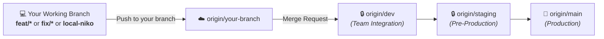

<div align="center">
  
  <h1>🎮 RageNodes Ultimate</h1>
  <p><strong>High-Performance Game Server & Bot Orchestration Platform</strong></p>

  <p>
    <a href="#-english"><b>🇬🇧 English</b></a> | <a href="#-español"><b>🇪🇸 Español</b></a>
  </p>

  <p>
    
    
    
    
    
  </p>
</div>

---

# 🇬🇧 English

## 🚀 Overview
**RageNodes Ultimate** is an all-in-one, enterprise-grade game server and application orchestration platform. Built with an Object-Oriented **Node.js** architecture, an ultra-fast low-latency reverse proxy written in **Rust (`OxideProxy`)**, and hardened **Docker** container isolation.

---

## 🛠️ Technology Stack & Architecture
* **Backend Core:** Node.js (ESM), Express, PostgreSQL, MariaDB, Redis.
* **Networking & Proxy:** Rust (`oxideproxy`), TLS termination, dynamic CSP nonces, query caching.
* **Design Patterns:** *Template Method* (`BaseGameService`), *Factory & Registry* (`GameFactory`), *Observer* (Docker Events), *Strategy* (Backups).
* **Automated Testing:** Native Node.js test runner (`node:test` & `node:assert/strict`).
* **Frontend:** Vanilla JS, Glassmorphism CSS, real-time WebSocket telemetry.

---

## 💻 Quickstart for New Developers (Local Setup)

### 1. Prerequisites
* **Node.js** >= 20.x (recommended Node 22 or 24).
* **Docker Desktop** (or Linux Docker Engine) with Docker Compose v2.
* **Git**.

### 2. Clone & Setup
```bash
# 1. Clone the repository
git clone https://gitlab.com/mariomatos/ragenodesultimate.git
cd ragenodesultimate

# 2. Switch/create your working branch (following GitFlow rules)
git checkout -b feat/my-new-feature

# 3. Configure local environment variables
cp .env.example .env
```

### 3. Install Dependencies & Run Tests
```bash
# Install backend dependencies
cd backend
npm install

# Run automated test suite (15 unit tests across 7 suites in < 500ms)
npm test
cd ..
```

### 4. Start the Local Docker Stack
```bash
# Starts local stack with optional Cloudflare tunnel profile
docker compose -f docker-compose.yml -f docker-compose.local.yml up -d
```

### 5. Local Access URLs
* **Web Dashboard:** [http://localhost:8088](http://localhost:8088)
* **Backend API:** [http://localhost:3011](http://localhost:3011)
* **Live Readiness Probe:** [http://localhost:3011/readyz](http://localhost:3011/readyz)
* **phpMyAdmin:** [http://localhost:8089](http://localhost:8089)

---

## 🛡️ GitFlow & Team Branching Protocol

To prevent merge conflicts and protect production stability, **all developers must adhere to these rules**:



1. **Protected Branches (`dev`, `staging`, `main`):**
   - 🚫 **Direct pushes are strictly prohibited.**
2. **Workflow:**
   - Always work on your designated branch (`local-niko`, `feat/feature-name`, `fix/bug-name`).
   - Push to your remote branch: `git push origin my-branch`.
   - Open a **Merge Request (MR)** on GitLab targeting the **`dev`** branch for code review.

---

## ☁️ Cloudflare Tunnel Namespace Isolation

The platform features an environment-aware namespace system (`CF_TUNNEL_ENV_PREFIX`) so local and staging workers **never interfere with or delete production tunnels**:

* **Production:** `CF_TUNNEL_ENV_PREFIX=""` (`tx40120.ragenodes.com`, `node1.ragenodes.com`)
* **Staging:** `CF_TUNNEL_ENV_PREFIX="staging-"` (`staging-tx40120.ragenodes.com`, `staging.ragenodes.com`)
* **Development:** `CF_TUNNEL_ENV_PREFIX="dev-"` (`dev-tx40120.ragenodes.com`)

---

## 🕹️ Adding a New Game (Extending `GameFactory`)

Creating support for a new game requires only a clean class extending `BaseGameService`:

```javascript
import { BaseGameService } from './BaseGameService.js';
import { GameFactory } from './GameFactory.js';

export class NewGameService extends BaseGameService {
    constructor() {
        super('new_game', 'image/docker:latest');
    }

    buildEnvironment(opts) {
        return [`SERVER_NAME=${opts.serverName}`, `PORT=${opts.gamePort}`];
    }

    buildPortBindings(opts) {
        return {
            exposed: { [`${opts.gamePort}/udp`]: {} },
            bindings: { [`${opts.gamePort}/udp`]: [{ HostIp: "0.0.0.0", HostPort: String(opts.gamePort) }] }
        };
    }
}

export const newGameService = new NewGameService();
GameFactory.register('new_game', newGameService);
```

---

<br/>

# 🇪🇸 Español

## 🚀 Visión General
**RageNodes Ultimate** es una plataforma integral y modular de hosting y orquestación de servidores de juegos y aplicaciones. Combina una arquitectura orientada a objetos en **Node.js**, un proxy inverso ultra-rápido de baja latencia en **Rust (`OxideProxy`)**, y aislamiento estricto de contenedores en **Docker**.

---

## 💻 Guía de Inicio Rápido (Setup Local)

1. **Instalar dependencias y correr tests:**
   ```bash
   cd backend && npm install && npm test && cd ..
   ```
2. **Levantar el stack local:**
   ```bash
   docker compose -f docker-compose.yml -f docker-compose.local.yml up -d
   ```
3. **Acceder a los servicios:**
   - Panel Web: [http://localhost:8088](http://localhost:8088)
   - API Backend: [http://localhost:3011](http://localhost:3011)
   - Sonda de Salud: [http://localhost:3011/readyz](http://localhost:3011/readyz)

---

## 🛡️ Protocolo de Git para el Equipo
* **Ramas Protegidas (`dev`, `staging`, `main`):** Prohibido el push directo.
* **Flujo:** Trabajar en tu rama propia ➔ `git push origin tu-rama` ➔ Crear **Merge Request** en GitLab hacia `dev`.

---

## 📚 Technical Documentation / Documentación Técnica
* [System Architecture & UML Diagrams / Arquitectura del Sistema](docs/ARCHITECTURE.md)
* [ADR-001: Rust OxideProxy](docs/adr/ADR-001-rust-reverse-proxy.md)
* [ADR-002: OOP Architecture & GameFactory](docs/adr/ADR-002-game-factory-oop-architecture.md)
* [ADR-003: Cloudflare Tunnel Namespace Isolation](docs/adr/ADR-003-cloudflare-tunnel-namespace-isolation.md)

---

## 🤝 Contributors / Contribuidores
* [@payniko24](https://gitlab.com/payniko24)
* [@marioscience](https://github.com/marioscience)

---

## 📜 License / Licencia
This project is private. Please ensure compliance with the terms and EULAs of the respective game servers (FiveM, SteamCMD, etc.).
