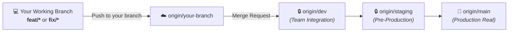
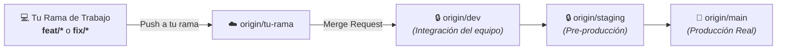

<div align="center">
  
  <h1>🎮 RageNodes Ultimate</h1>
  <p><strong>High-Performance Game Server & Discord Bot Orchestration Platform</strong></p>
  <p><strong>Plataforma de Alto Rendimiento para Orquestación de Servidores de Juegos y Bots</strong></p>

  <p>
    <a href="#-english"><b>🇬🇧 English Documentation</b></a> | <a href="#-español"><b>🇪🇸 Documentación en Español</b></a>
  </p>

  <p>
    
    
    
    
    
  </p>
</div>

---

# 🇬🇧 English

## 🚀 Overview
**RageNodes Ultimate** is an all-in-one, enterprise-grade game server and application orchestration platform. Built with an Object-Oriented **Node.js** backend architecture, an ultra-fast low-latency reverse proxy written in **Rust (`OxideProxy`)**, and hardened **Docker** container isolation.

Whether deploying a large FiveM roleplay community or a multi-node cluster for Rust and Minecraft, RageNodes provides full hardware orchestration with automated zero-trust security and dynamic Cloudflare integration.

---

## 🌟 Key Features
- **🕹️ 1-Click Game Deployment:** Instant orchestration for FiveM (txAdmin), Rust, Minecraft (Paper/Java), CS2, Palworld, ARK: Survival Ascended, and 7 Days to Die.
- **🤖 Discord Bot Hosting:** Secure, isolated containers for Node.js and Python bots with automated health monitoring.
- **⚡ OxideProxy (Rust Core & L7 Control Plane):** Hyper-optimized Layer 4/7 reverse proxy with TLS termination, cryptographic CSP nonces, eBPF-ready networking, 30s token caching, and DDoS mitigation.
- **🛡️ Dynamic Private IP CORS & CSRF:** Automated Origin matching for private network IPs (`192.168.x.x`, `10.x.x.x`, `172.16-31.x.x`, `127.0.0.1`, `localhost`) enabling seamless state operations.
- **🐳 Hardened Docker Architecture:** Automated non-root execution (`1000:1000`), minimal capability allowlist, fail-fast volume validations, and Distroless base images.
- **📊 Real-Time Telemetry & iFrame Auth:** Live CPU, memory heap, and I/O metrics streaming over WebSockets, with JWT token auto-propagation (`authFetch`).
- **🩺 Production & Staging Diagnostics:** Native `/healthz`, `/readyz` probes, and an adaptive hardware test suite (`stagingHealthTestRunner.js`) generating PDF/HTML diagnostic reports.

---

## 🖥️ Supported Game Engines & Services

| Game / Service | Engine / Stack | Status | Environment Ports |
|---|---|---|---|
| **FiveM (GTA V)** | FXServer + txAdmin | ✅ Fully Supported | 30120 (Game), 40120 (txAdmin) |
| **Rust** | Unity / SteamCMD | ✅ Fully Supported | 28015 (Game), 28016 (RCON) |
| **Minecraft** | Java / Paper / Bedrock | ✅ Fully Supported | 25565 (Default) |
| **Counter-Strike 2** | Source 2 | ✅ Fully Supported | 27015 (Default) |
| **Valheim** | Unity | ✅ Fully Supported | 2456-2457 |
| **Palworld** | Unreal Engine 5 | ✅ Fully Supported | 8211 (Default) |
| **ARK: Ascended** | Unreal Engine 5 | ✅ Fully Supported | 7777, 27020 |
| **Discord Bots** | Node.js / Python | ✅ Fully Supported | Internal isolated socket |
| **Web & Databases** | WordPress / MariaDB / Postgres | ✅ Fully Supported | 8088, 3306, 5432 |

---

## 🛠️ Technology Stack
* **Backend:** Node.js (ESM), Express, PostgreSQL, MariaDB, Redis.
* **Networking/Proxy:** Rust (`oxideproxy`), TLS termination, dynamic CSP nonces, query caching.
* **Design Patterns:** *Template Method* (`BaseGameService`), *Factory & Registry* (`GameFactory`), *Observer* (Docker Events), *Strategy* (Backups).
* **Testing:** Native Node.js test runner (`node:test` and `node:assert/strict`), Adaptive Hardware Health Test Suite.
* **Frontend:** Vanilla JS, Glassmorphism CSS, WebSockets for live metrics.

---

## 💻 Quickstart for New Developers (Local Setup)

### 1. Prerequisites
* **Node.js** >= 20.x (recommended Node 22 or 24).
* **Docker Desktop** (or Linux Docker Engine) with Docker Compose v2.
* **Git**.

### 2. Clone & Setup Workspace
```bash
# 1. Clone the repository
git clone https://gitlab.com/mariomatos/ragenodesultimate.git
cd ragenodesultimate

# 2. Switch/create your working branch (following GitFlow rules)
git checkout -b feat/my-feature

# 3. Configure local environment variables
cp .env.example .env
```

### 3. Install Dependencies, Migrate Database & Run Tests
```bash
# Install backend dependencies
cd backend
npm install

# Run database migrations
npm run db:migrate

# Run automated test suite (22 unit tests across 9 suites in ~1s)
npm test
cd ..
```

### 4. Start the Local Docker Stack
```bash
# Starts local stack with optional Cloudflare tunnel profile
docker compose -f docker-compose.yml -f docker-compose.local.yml up -d
```

### 5. Local Access URLs
* **Web Dashboard:** [http://localhost:8088](http://localhost:8088)
* **Backend API:** [http://localhost:3011](http://localhost:3011)
* **Live Readiness Probe:** [http://localhost:3011/readyz](http://localhost:3011/readyz)
* **phpMyAdmin:** [http://localhost:8089](http://localhost:8089)

---

## 🛡️ GitFlow & Release Management Protocol

To protect production stability and avoid merge conflicts, **all developers must strictly follow this protocol**:



### 📋 Collaboration & Tagging Rules:
1. **Protected Branches (`dev`, `staging`, `main`):**
   - 🚫 **Direct pushes are strictly prohibited.**
2. **Sequential Promotion:**
   - Develop on your feature branch -> PR to `dev` -> promote to `staging` -> merge to `main`.
3. **Official Releases:**
   - Tag releases on `main` using semantic versioning (e.g. `v55.9.1`).

---

## ☁️ Cloudflare Tunnel Namespace Isolation

The platform implements an environment-aware namespace system (`CF_TUNNEL_ENV_PREFIX`) ensuring development and staging workers **never interfere with or delete production tunnels**:

* **Production (`CF_TUNNEL_ENV_PREFIX=""`):** Standard hostnames (`tx40120.ragenodes.com`, `node1.ragenodes.com`).
* **Staging (`CF_TUNNEL_ENV_PREFIX="staging-"`):** Prefixed hostnames (`staging-tx40120.ragenodes.com`, `staging.ragenodes.com`).
* **Development (`CF_TUNNEL_ENV_PREFIX="dev-"`):** Local hostnames (`dev-tx40120.ragenodes.com`).

---

## 🕹️ Adding a New Game (Extending `GameFactory`)

To add support for a new game, create an OOP service extending `BaseGameService`:

```javascript
import { BaseGameService } from './BaseGameService.js';
import { GameFactory } from './GameFactory.js';

export class NewGameService extends BaseGameService {
    constructor() {
        super('new_game', 'image/docker:latest');
    }

    buildEnvironment(opts) {
        return [
            `SERVER_NAME=${opts.serverName}`,
            `PORT=${opts.gamePort}`
        ];
    }

    buildPortBindings(opts) {
        return {
            exposed: { [`${opts.gamePort}/udp`]: {} },
            bindings: { [`${opts.gamePort}/udp`]: [{ HostIp: "0.0.0.0", HostPort: String(opts.gamePort) }] }
        };
    }
}

// Instantiate and register in the factory
export const newGameService = new NewGameService();
GameFactory.register('new_game', newGameService);
```

---

## 🧪 Quality & Security Commands

```bash
# Run all unit and integration tests
npm --prefix backend test

# Run security contract audits
npm run security:secrets
npm run security:csp-bindings
npm run security:inline-code
npm run security:routes
```

---

<br/>
<br/>

# 🇪🇸 Español

## 🚀 Visión General
**RageNodes Ultimate** es una plataforma integral y empresarial para la orquestación y administración de servidores de juegos y aplicaciones. Está construida sobre una arquitectura orientada a objetos en **Node.js**, un proxy inverso de ultra-baja latencia en **Rust (`OxideProxy`)**, y aislamiento estricto de contenedores en **Docker**.

Ya sea para desplegar una comunidad masiva de FiveM o un clúster multi-nodo para Rust y Minecraft, RageNodes proporciona control total del hardware con seguridad *zero-trust* y automatización dinámica en Cloudflare.

---

## 🌟 Características Principales
- **🕹️ Despliegue en 1-Clic:** Orquestación instantánea para FiveM (txAdmin), Rust, Minecraft, CS2, Palworld, ARK: Survival Ascended y 7 Days to Die.
- **🤖 Hosting de Bots de Discord:** Contenedores seguros y aislados para bots en Node.js y Python con monitoreo de salud.
- **⚡ OxideProxy (Núcleo en Rust & L7 Control Plane):** Proxy inverso L4/L7 hiper-optimizado con terminación TLS, nonces criptográficos CSP, caché de tokens de 30s y mitigación DDoS.
- **🛡️ CORS y CSRF Dinámico para IPs Privadas:** Evaluación automática de origen para redes locales (`192.168.x.x`, `10.x.x.x`, `172.16-31.x.x`, `127.0.0.1`, `localhost`) permitiendo modificaciones de estado sin bloqueos.
- **🐳 Blindaje de Docker:** Ejecución rootless (`1000:1000`), lista de capacidades mínimas, validación fail-fast de volúmenes e imágenes Distroless.
- **📊 Telemetría en Tiempo Real e iframe Autenticado:** Métricas de CPU, memoria heap e I/O transmitidas por WebSockets, con auto-propagación de tokens JWT (`authFetch`).
- **🩺 Diagnóstico Adaptativo de Salud:** Sondas nativas `/healthz`, `/readyz` y runner adaptativo en Staging (`stagingHealthTestRunner.js`) con generación de reportes PDF/HTML.

---

## 🖥️ Juegos y Servicios Soportados

| Juego / Servicio | Motor / Stack | Estado | Puertos del Entorno |
|---|---|---|---|
| **FiveM (GTA V)** | FXServer + txAdmin | ✅ Soportado al 100% | 30120 (Juego), 40120 (txAdmin) |
| **Rust** | Unity / SteamCMD | ✅ Soportado al 100% | 28015 (Juego), 28016 (RCON) |
| **Minecraft** | Java / Paper / Bedrock | ✅ Soportado al 100% | 25565 (Por defecto) |
| **Counter-Strike 2** | Source 2 | ✅ Soportado al 100% | 27015 (Por defecto) |
| **Valheim** | Unity | ✅ Soportado al 100% | 2456-2457 |
| **Palworld** | Unreal Engine 5 | ✅ Soportado al 100% | 8211 (Por defecto) |
| **ARK: Ascended** | Unreal Engine 5 | ✅ Soportado al 100% | 7777, 27020 |
| **Bots de Discord** | Node.js / Python | ✅ Soportado al 100% | Socket aislado interno |
| **Webs y Bases de Datos** | WordPress / MariaDB / Postgres | ✅ Soportado al 100% | 8088, 3306, 5432 |

---

## 🛠️ Stack Tecnológico
* **Backend:** Node.js (ESM), Express, PostgreSQL, MariaDB, Redis.
* **Capa de Red & Proxy:** Rust (`oxideproxy`), TLS termination, Nonce CSP, caché de consultas y evaluador de seguridad L7.
* **Patrones de Diseño:** *Template Method* (`BaseGameService`), *Factory & Registry* (`GameFactory`), *Observer* (Docker Events), *Strategy* (Backups).
* **Testing:** Test runner nativo de Node.js (`node:test` y `node:assert/strict`) y suite adaptativa de hardware.
* **Frontend:** Vanilla JS moderno, CSS Glassmorphism, WebSockets para métricas en vivo.

---

## 💻 Guía Rápida para Nuevos Desarrolladores (Setup Local)

### 1. Requisitos Previos
* **Node.js** >= 20.x (recomendado Node 22 o 24).
* **Docker Desktop** (o Docker Engine en Linux) con Docker Compose v2.
* **Git**.

### 2. Clonar y Preparar el Entorno
```bash
# 1. Clonar el repositorio
git clone https://gitlab.com/mariomatos/ragenodesultimate.git
cd ragenodesultimate

# 2. Crear tu rama de trabajo (según las reglas de GitFlow)
git checkout -b feat/mi-caracteristica

# 3. Configurar variables de entorno locales
cp .env.example .env
```

### 3. Instalar Dependencias, Migrar Base de Datos y Correr Tests
```bash
# En el backend
cd backend
npm install

# Ejecutar migraciones de base de datos
npm run db:migrate

# Ejecutar las 22 pruebas unitarias automatizadas
npm test
cd ..
```

### 4. Levantar el Stack Completo en Local
```bash
# Levanta el stack local con el túnel Cloudflare en modo opcional
docker compose -f docker-compose.yml -f docker-compose.local.yml up -d
```

### 5. Acceso al Panel en Local
* **Panel de Control Web:** [http://localhost:8088](http://localhost:8088)
* **API Backend:** [http://localhost:3011](http://localhost:3011)
* **Sonda de Salud en Vivo:** [http://localhost:3011/readyz](http://localhost:3011/readyz)
* **phpMyAdmin:** [http://localhost:8089](http://localhost:8089)

---

## 🛡️ Protocolo de Git y Ramas para el Equipo (*GitFlow*)

Para garantizar la estabilidad y prevenir conflictos o regresiones en los servidores de producción, **todos los desarrolladores deben seguir estas reglas estrictas**:



### 📋 Reglas de Colaboración y Etiquetado:
1. **Ramas Protegidas (`dev`, `staging`, `main`):**
   - 🚫 **PROHIBIDO hacer push directo** a `dev`, `staging` o `main`.
2. **Flujo de Trabajo:**
   - Trabaja siempre en tu rama asignada (ej: `feat/nombre-feature`, `fix/nombre-bug`).
   - Sube los cambios a tu rama remota: `git push origin mi-rama`.
   - Abre un **Merge Request (MR)** en GitLab hacia la rama **`dev`** para revisión del equipo.
   - Una vez aprobado y probado en `dev`, se promueve a `staging` y posteriormente a `main`.
3. **Versionado Oficial:**
   - Cada release oficial en `main` debe ser etiquetado mediante tags semánticos (ej: `v55.9.1`).

---

## ☁️ Aislamiento de Túneles Cloudflare (*Namespace Isolation*)

El proyecto cuenta con un sistema de aislamiento por prefijos (`CF_TUNNEL_ENV_PREFIX`) para que el desarrollo local y de staging **jamás interfiera ni borre túneles de Producción**:

* **Producción (`CF_TUNNEL_ENV_PREFIX=""`):** Hostnames limpios (`tx40120.ragenodes.com`, `node1.ragenodes.com`).
* **Staging (`CF_TUNNEL_ENV_PREFIX="staging-"`):** Hostnames prefijados (`staging-tx40120.ragenodes.com`, `staging.ragenodes.com`).
* **Desarrollo (`CF_TUNNEL_ENV_PREFIX="dev-"`):** Hostnames locales (`dev-tx40120.ragenodes.com`).

---

## 🕹️ Cómo Añadir un Nuevo Juego (Extender `GameFactory`)

Añadir soporte para un nuevo juego requiere únicamente crear su clase especializada heredando de `BaseGameService`:

```javascript
import { BaseGameService } from './BaseGameService.js';
import { GameFactory } from './GameFactory.js';

export class NuevoJuegoService extends BaseGameService {
    constructor() {
        super('nuevo_juego', 'imagen/docker:latest');
    }

    buildEnvironment(opts) {
        return [
            `SERVER_NAME=${opts.serverName}`,
            `PORT=${opts.gamePort}`
        ];
    }

    buildPortBindings(opts) {
        return {
            exposed: { [`${opts.gamePort}/udp`]: {} },
            bindings: { [`${opts.gamePort}/udp`]: [{ HostIp: "0.0.0.0", HostPort: String(opts.gamePort) }] }
        };
    }
}

// Instanciar y registrar en la fábrica
export const nuevoJuegoService = new NuevoJuegoService();
GameFactory.register('nuevo_juego', nuevoJuegoService);
```

---

## 🧪 Comandos de Calidad y Seguridad

```bash
# Ejecutar todas las pruebas unitarias e integración del backend
npm --prefix backend test

# Ejecutar migraciones de base de datos
npm --prefix backend run db:migrate

# Ejecutar auditorías de contratos de seguridad
npm run security:secrets
npm run security:csp-bindings
npm run security:inline-code
npm run security:routes
```

---

## 📚 Technical Documentation / Documentación Técnica
* [System Architecture & UML Diagrams / Arquitectura del Sistema](docs/ARCHITECTURE.md)
* [ADR-001: Rust OxideProxy](docs/adr/ADR-001-rust-reverse-proxy.md)
* [ADR-002: OOP Architecture & GameFactory](docs/adr/ADR-002-game-factory-oop-architecture.md)
* [ADR-003: Cloudflare Tunnel Namespace Isolation](docs/adr/ADR-003-cloudflare-tunnel-namespace-isolation.md)
* [ADR-004: Versioned Database Migrations](docs/adr/ADR-004-versioned-database-migrations.md)
* [ADR-005: Structured JSON Logging & Request Correlation](docs/adr/ADR-005-structured-logging-and-request-correlation.md)

---

## 🤝 Contributors / Contribuidores
* [@payniko24](https://gitlab.com/payniko24)
* [@marioscience](https://github.com/marioscience)

---

## 📜 License / Licencia
This project is private. Please ensure compliance with the terms and EULAs of the respective game servers (FiveM, SteamCMD, etc.).
