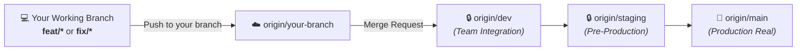
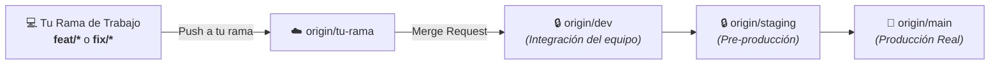

<div align="center">
  
  <h1>🎮 RageNodes Ultimate</h1>
  <p><strong>High-Performance Game Server & Discord Bot Orchestration Platform</strong></p>
  <p><strong>Plataforma de Alto Rendimiento para Orquestación de Servidores de Juegos y Bots</strong></p>

  <p>
    <a href="#-english"><b>🇬🇧 English Documentation</b></a> | <a href="#-español"><b>🇪🇸 Documentación en Español</b></a>
  </p>

  <p>
    
    
    
    
    
    
  </p>
</div>

---

# 🇬🇧 English

## 🚀 Overview
**RageNodes Ultimate** is an all-in-one, production-oriented game server and application orchestration platform. It combines an object-oriented **Node.js** backend, a low-latency reverse proxy written in **Rust (`OxideProxy`)**, and hardened **Docker** container isolation.

Whether deploying a large FiveM roleplay community or a multi-node cluster for Rust and Minecraft, RageNodes provides hardware orchestration with defense-in-depth controls and direct public endpoints managed by OxideProxy.

---

## 🌟 Key Features
- **🕹️ 1-Click Service Deployment:** Orchestration for FiveM (txAdmin), Rust, Minecraft, CS2, Valheim, Project Zomboid, Palworld, ARK, 7 Days to Die, Discord bots, WordPress, MariaDB and Blender Studio 3D.
- **🤖 Discord Bot Hosting:** Secure, isolated containers for Node.js and Python bots with automated health monitoring.
- **⚡ OxideProxy (Rust Core & L7 Control Plane):** Layer 4/7 reverse proxy with TLS termination, cryptographic CSP nonces, eBPF-ready networking, short-lived authorization caching, and configurable traffic-mitigation controls.
- **🛡️ Environment-Aware CORS & CSRF:** Production accepts only configured HTTPS origins; private-network and localhost origins are limited to explicit local-development policy.
- **🐳 Hardened Hybrid Docker Architecture:** A rootful control plane is separated from rootless customer game runtimes; services run non-root where supported, capabilities are restricted per workload, and volume/image validation fails fast before deployment.
- **📊 Real-Time Telemetry & iFrame Auth:** Live CPU, memory, network and I/O metrics use SSE, WebSockets or bounded polling according to the feature, with authenticated browser requests and token propagation where required.
- **🩺 Production & Staging Diagnostics:** Native `/healthz`, `/readyz` probes, and an adaptive hardware test suite (`backend/src/services/stagingHealthTestRunner.js`) generating PDF/HTML diagnostic reports.
- **📦 Complete Base-Image Cache:** Every deployable service has a reusable local base image. FiveM and Blender are version-aware RageNodes masters that are built and archived locally; Minecraft, Rust, Palworld, CS2, Valheim, Project Zomboid, ARK, 7 Days to Die, Discord bots, WordPress and MariaDB use digest-pinned upstream images that are prefetched into the local cache. A hardened systemd timer refreshes the complete manifest without replacing active customer containers, so subsequent deployments normally start from local storage instead of downloading again.

## 🧭 Platform Capability Map

This repository is the control plane for the complete RageNodes service lifecycle, not only a game proxy:

- **Provisioning and lifecycle:** plan-aware placement, dynamic multi-port allocation, creation, start, stop, restart, safe recreation, deletion and rollback across local or remote nodes.
- **Customer panel:** live resource charts, console streaming, file manager, game configuration editors, scheduled tasks, backups, sub-users, mods, databases and connection details.
- **Service catalog:** game servers, Discord bots, WordPress with an isolated database, dedicated MariaDB services, Blender Studio 3D and web tools.
- **Networking:** authenticated OxideProxy L7 routes for HTTPS panels and iframes, plus generated TCP, UDP or dual-protocol L4 routes for every declared service port. Route inventory is reconciled from PostgreSQL and Docker state rather than being limited to a fixed list of games.
- **Data protection:** persistent volumes, ownership normalization between rootful and rootless Docker, database migrations, backup/restore workflows and preservation of customer containers during platform upgrades.
- **Operations:** Docker-event and statistics workers, health/readiness probes, SSE/WebSocket streams, audit logs, image-cache refresh, production readiness checks and automatic fast-forward deployment.
- **Security:** authentication and role checks, admin impersonation controls, CSRF/origin validation, CSP nonces, rate limiting, secret detection, container capability restrictions and isolated staging access.
- **Commercial administration:** plans and quotas, payments/subscriptions, licenses, marketplace, vendors, invoices and deployment limits.

### Game ingress rollout

OxideProxy can act as the public ingress for every service that declares routable ports. Depending on the service manifest, a route can be **TCP**, **UDP**, **dual protocol**, or **HTTPS/L7**. Public game ports are owned by the dedicated, host-networked `oxide_game` service, while customer containers bind shifted backend ports to loopback only. The authenticated route inventory is reconciled from PostgreSQL and Docker state, written atomically, and reloaded automatically. This covers single- and multi-port services such as Minecraft, FiveM, Rust, CS2, Valheim, Project Zomboid, 7 Days to Die, Palworld and ARK; txAdmin, Blender, WordPress and other web tools continue through the HTTPS L7 proxy. Existing direct-published containers remain compatible and can be migrated individually. Set `OXIDE_GAME_PROXY_ENABLED=true` only after the dedicated ingress service is healthy.

Minecraft deployments pin the requested edition and version in the server data directory. Automatic healing therefore recreates the same runtime instead of silently upgrading it, and hosted servers remain active while empty so proxy handshakes and paused clients are not disconnected.

---

## 🖥️ Supported Game Engines & Services

| Game / Service | Engine / Stack | Status | Environment Ports |
|---|---|---|---|
| **FiveM (GTA V)** | FXServer + txAdmin | ✅ Implemented | Game + txAdmin; TCP/UDP + HTTPS |
| **Rust** | Unity / SteamCMD | ✅ Implemented | Game, query and RCON |
| **Minecraft** | Java / Paper / Bedrock | ✅ Implemented | TCP or UDP according to edition |
| **Counter-Strike 2** | Source 2 | ✅ Implemented | Game, query and RCON |
| **Valheim** | Unity | ✅ Implemented | Multi-port UDP |
| **Project Zomboid** | Java / SteamCMD | ✅ Implemented | Multi-port TCP/UDP |
| **7 Days to Die** | Unity / SteamCMD | ✅ Implemented | Game, query and control ports |
| **Palworld** | Unreal Engine 5 | ✅ Implemented | Game, query and RCON |
| **ARK: Survival Ascended** | Unreal Engine 5 | ✅ Implemented | Game, peer and query ports |
| **Discord Bots** | Node.js / Python | ✅ Implemented | Isolated application runtime |
| **WordPress** | WordPress + MariaDB | ✅ Implemented | HTTPS route + private database |
| **Dedicated Database** | MariaDB | ✅ Implemented | Plan-controlled database endpoint |
| **Blender Studio 3D** | Blender + browser streaming | ✅ Implemented | Authenticated HTTPS iframe |

---

## 🛠️ Technology Stack
* **Backend:** Node.js (ESM), Express, PostgreSQL, MariaDB, Redis.
* **Networking/Proxy:** Rust (`oxideproxy`), TLS termination, dynamic CSP nonces, query caching.
* **Design Patterns:** *Template Method* (`BaseGameService`), *Factory & Registry* (`GameFactory`), *Observer* (Docker Events), *Strategy* (Backups).
* **Testing:** Native Node.js test runner (`node:test` and `node:assert/strict`), Adaptive Hardware Health Test Suite.
* **Frontend:** Vanilla JS, Glassmorphism CSS, SSE/WebSockets and bounded polling for live state.

## 🗂️ Repository Guide for New Developers

| Path | Responsibility |
|---|---|
| `backend/src/routes/` | HTTP API boundaries, authentication and request validation |
| `backend/src/services/` | Business rules, lifecycle orchestration, plans, backups, telemetry and integrations |
| `backend/src/services/games/` | Container specification for each game or hosted application |
| `backend/src/migrations/` | Versioned PostgreSQL schema changes |
| `backend/test/` and `backend/tests/` | Unit, integration and security regression tests |
| `frontend/public/` | Landing page, customer/admin panels, static assets and browser controllers |
| `oxideproxy/` | Rust L4/L7 proxy, TLS, routing, access gate and telemetry |
| `oxide_web/` | OxideProxy web/control configuration |
| `blender-web/` | Browser-accessible Blender runtime |
| `fivem-base/` | Cached and reproducible FiveM base image |
| `scripts/` | Deployment, image cache, security checks, diagnostics and operational automation |
| `docker-compose*.yml` | Base, local, staging, production and security overlays |
| `docs/` | Architecture decisions, readiness checklist and operational documentation |

Start a feature by locating its route, service and tests. Changes to a hosted service normally also require reviewing its game adapter, port manifest, plan policy, proxy reconciliation and backup behavior. Never add a secret to Git; document new variables in the appropriate example environment file.

---

## 💻 Quickstart for New Developers (Local Setup)

### 1. Prerequisites
* **Node.js** >= 20.x (recommended Node 22 or 24).
* **Docker Desktop** (or Linux Docker Engine) with Docker Compose v2.
* **Git**.

### 2. Clone & Setup Workspace
```bash
# 1. Clone the repository
git clone https://gitlab.com/mariomatos/ragenodesultimate.git
cd ragenodesultimate

# 2. Switch/create your working branch (following GitFlow rules)
git checkout -b feat/my-feature

# 3. Configure the Linux local-development environment
cp .env.local.example .env
# Materialize the absolute local paths; the safe dotenv loader never evaluates shell expressions.
sed -i "s|\${HOME}|$HOME|g" .env
mkdir -p "$HOME/.local/share/ragenodes-ultimate/data/templates" \
  "$HOME/.local/share/ragenodes-ultimate/backups"
```

### Optional: Reproducible Development Container

The repository includes [`.devcontainer/devcontainer.json`](.devcontainer/devcontainer.json) for editors and tools that support the Development Container Specification. It provides Node.js 24, Rust, Docker Compose and an isolated Docker-in-Docker daemon, then installs the exact locked dependencies automatically. Choose **Reopen in Container** after cloning.

The container does not start RageNodes or any game service automatically, does not contain real secrets, and does not mount the host Docker socket. Copy `.env.local.example` to `.env` only when you explicitly want to launch the local stack. See [`.devcontainer/README.md`](.devcontainer/README.md) for the workflow and security boundary.

### 3. Install Dependencies & Run Tests
```bash
# Install the exact locked backend dependencies
cd backend
npm ci

# Run the current backend suite (the CI report is the source of truth for counts)
npm test
cd ..
```

### 4. Start the Local Docker Stack
```bash
# Starts the local stack. The local override is intentionally minimal today and
# remains the extension point for developer-specific, non-production settings.
docker compose -f docker-compose.yml -f docker-compose.local.yml up -d
```

The backend applies versioned migrations during startup. For an explicit manual run, wait until PostgreSQL is healthy and then execute `npm --prefix backend run db:migrate` with the configured environment.

### 5. Local Access URLs
* **Web Dashboard:** [http://localhost:8088](http://localhost:8088)
* **Backend API:** [http://localhost:3010](http://localhost:3010)
* **Live Readiness Probe:** [http://localhost:3010/readyz](http://localhost:3010/readyz)
* **phpMyAdmin:** [http://localhost:8089](http://localhost:8089)

---

## 🛡️ GitFlow & Release Management Protocol

To protect production stability and avoid merge conflicts, **all developers must strictly follow this protocol**:



### 📋 Collaboration & Tagging Rules:
1. **Protected Branches (`dev`, `staging`, `main`):**
   - 🚫 **Direct pushes are strictly prohibited.**
2. **Sequential Promotion:**
   - Develop on your feature branch -> Merge Request to `dev` -> promote to `staging` -> merge to `main`.
3. **Official Releases:**
   - This repository starts from base version **`0.0.1`**. Future releases on `main` use semantic versioning.

---

## 🌐 Public Edge and Direct Game Endpoints

The platform exposes OxideProxy and game ports directly, without a tunnel provider. Game traffic remains transparent TCP/UDP; web panels and embedded tools use HTTPS. txAdmin URLs are generated from the public host and assigned port. For the current production rollout, `ragenodes.com` keeps Cloudflare only as its public web/SSL edge; Cloudflare is not used to tunnel game traffic. The `.dev` staging zone and `.app` tool endpoints terminate or pass through TLS at OxideProxy according to their environment configuration.

When staging sits behind the production edge, production must set `STAGING_UPSTREAM` for HTTP and `STAGING_TLS_UPSTREAM` for raw TLS passthrough. `STAGING_TLS_DOMAINS` limits SNI forwarding to the staging zone, so dynamic hosts such as `tx41120.ragenodes.dev` retain staging's certificate and access gate without weakening production TLS.

TLS passthrough does not create certificates. The staging edge must therefore have a publicly trusted certificate for every name listed in `OXIDE_ACME_DOMAINS`, or use a wildcard certificate provisioned through DNS-01. Never expose the embedded self-signed development certificate on a public endpoint.

| Environment | Public endpoint | Docker policy | Data and ports |
|---|---|---|---|
| Local | `http://localhost:8088` | Rootful exception permitted only in development | Developer-owned paths and local ports |
| Staging | `https://panel.ragenodes.dev` | Isolated runtime socket and `STAGING_PORT_BASE_OFFSET` | Separate databases, volumes, networks and `.dev` endpoints |
| Production | `https://ragenodes.com` / `.app` tools | Hardened hybrid: rootful control plane and rootless game runtime | Production-only volumes and unshifted port bands |

The GitLab pipeline validates tests, security contracts, dependencies, Rust and Compose; it does not connect to production or perform the deployment itself. Promotion remains `feature -> dev -> staging -> main`. On the production host, a local updater polls `origin/main`, accepts only a clean fast-forward update, runs the reviewed deployment script and records success or rollback in its deployment log. This keeps deployment automatic after promotion to `main` without granting the GitLab runner direct production access.

The `niko-local` integration branch also builds the application containers once
and publishes them to the private GitLab Container Registry. Its pipeline
produces a digest-pinned `registry-release.env` artifact; the same reviewed
digests can later be promoted without recompiling. The existing source-build
deployment remains available as the manual recovery path during this rollout.
See [`docs/container-registry-deployments.md`](docs/container-registry-deployments.md).

### Complete base-image cache refresh

```bash
# Safe manual refresh; active customer containers are not recreated
./scripts/update_image_cache.sh

# Verify the scheduled refresh
systemctl status ragenodes-image-cache.timer
```

---

## 🕹️ Adding a New Game (Extending `GameFactory`)

To add support for a new game, create an OOP service extending `BaseGameService`:

```javascript
import { BaseGameService } from './BaseGameService.js';
import { GameFactory } from './GameFactory.js';

export class NewGameService extends BaseGameService {
    constructor() {
        super('new_game', 'image/docker:latest');
    }

    buildEnvironment(opts) {
        return [
            `SERVER_NAME=${opts.serverName}`,
            `PORT=${opts.gamePort}`
        ];
    }

    buildPortBindings(opts) {
        return {
            exposed: { [`${opts.gamePort}/udp`]: {} },
            bindings: { [`${opts.gamePort}/udp`]: [{ HostIp: "0.0.0.0", HostPort: String(opts.gamePort) }] }
        };
    }
}

// Instantiate and register in the factory
export const newGameService = new NewGameService();
GameFactory.register('new_game', newGameService);
```

---

## 🧪 Quality & Security Commands

```bash
# Run all unit and integration tests
npm --prefix backend test

# Run security contract audits
npm run security:secrets
npm run security:csp-bindings
npm run security:inline-code
npm run security:deployment
npm run security:routes
```

---

<br/>
<br/>

# 🇪🇸 Español

## 🚀 Visión General
**RageNodes Ultimate** es una plataforma integral, orientada a producción, para la orquestación y administración de servidores de juegos y aplicaciones. Combina una arquitectura orientada a objetos en **Node.js**, un proxy inverso de baja latencia en **Rust (`OxideProxy`)** y aislamiento endurecido de contenedores en **Docker**.

Ya sea para desplegar una comunidad de FiveM o un clúster multi-nodo para Rust y Minecraft, RageNodes proporciona orquestación del hardware con controles de defensa en profundidad y endpoints públicos directos administrados por OxideProxy.

---

## 🌟 Características Principales
- **🕹️ Despliegue de Servicios en 1-Clic:** Orquestación para FiveM (txAdmin), Rust, Minecraft, CS2, Valheim, Project Zomboid, Palworld, ARK, 7 Days to Die, bots de Discord, WordPress, MariaDB y Blender Studio 3D.
- **🤖 Hosting de Bots de Discord:** Contenedores seguros y aislados para bots en Node.js y Python con monitoreo de salud.
- **⚡ OxideProxy (Núcleo en Rust & L7 Control Plane):** Proxy inverso L4/L7 con terminación TLS, nonces criptográficos CSP, caché breve de autorización y controles configurables de mitigación de tráfico.
- **🛡️ CORS y CSRF por entorno:** Producción sólo acepta HTTPS y dominios configurados; los orígenes privados se permiten exclusivamente durante desarrollo local.
- **🐳 Arquitectura Docker Híbrida Endurecida:** El plano de control rootful está separado de los runtimes rootless de juegos; los servicios se ejecutan sin root cuando lo permiten, las capacidades se restringen por carga y la validación de volúmenes e imágenes falla antes del despliegue.
- **📊 Telemetría en Tiempo Real e iframe Autenticado:** Métricas de CPU, memoria, red e I/O mediante SSE, WebSockets o polling acotado según la función, con solicitudes autenticadas y propagación de tokens cuando corresponde.
- **🩺 Diagnóstico Adaptativo de Salud:** Sondas nativas `/healthz`, `/readyz` y runner adaptativo en staging (`backend/src/services/stagingHealthTestRunner.js`) con generación de reportes PDF/HTML.
- **📦 Caché Completa de Imágenes Base:** Cada servicio desplegable dispone de una imagen base reutilizable en local. FiveM y Blender son imágenes maestras de RageNodes, versionadas, construidas y archivadas localmente; Minecraft, Rust, Palworld, CS2, Valheim, Project Zomboid, ARK, 7 Days to Die, bots de Discord, WordPress y MariaDB usan imágenes externas fijadas por digest que se precargan en la caché local. Un timer systemd endurecido actualiza el manifiesto completo sin reemplazar contenedores activos, permitiendo que los siguientes despliegues se inicien normalmente desde el almacenamiento local sin volver a descargar.

Los despliegues de Minecraft fijan en el directorio de datos la edición y versión solicitadas. El auto-curado recrea exactamente ese runtime, sin actualizarlo de forma silenciosa, y los servidores alojados permanecen activos aunque estén vacíos para no interrumpir handshakes del proxy ni clientes en pausa.

## 🧭 Mapa de Funciones de la Plataforma

Este repositorio contiene el plano de control del ciclo completo de RageNodes; no es únicamente un proxy para juegos:

- **Aprovisionamiento y ciclo de vida:** selección de nodo según plan y recursos, asignación dinámica de varios puertos, creación, inicio, apagado, reinicio, recreación segura, eliminación y rollback en nodos locales o remotos.
- **Panel del cliente:** gráficas de recursos, consola en vivo, gestor de archivos, editores de configuración por juego, tareas programadas, backups, subusuarios, mods, bases de datos y datos de conexión.
- **Catálogo de servicios:** servidores de juegos, bots de Discord, WordPress con base aislada, MariaDB dedicada, Blender Studio 3D y herramientas web.
- **Red:** rutas L7 autenticadas de OxideProxy para paneles e iframes HTTPS y rutas L4 TCP, UDP o duales para cada puerto declarado por un servicio. El inventario se reconcilia desde PostgreSQL y Docker, sin limitarse a una lista fija de juegos.
- **Protección de datos:** volúmenes persistentes, normalización de permisos entre Docker rootful y rootless, migraciones, flujos de backup/restauración y conservación de contenedores de clientes durante actualizaciones.
- **Operación:** workers de eventos Docker, estadísticas y backups; sondas de salud; streams SSE/WebSocket; auditoría; actualización de imágenes maestras; verificación de producción y despliegue automático por fast-forward.
- **Seguridad:** autenticación, roles, controles de suplantación administrativa, validación CSRF/origen, nonces CSP, límites de peticiones, detección de secretos, reducción de capacidades y acceso aislado a staging.
- **Administración comercial:** planes, cuotas, pagos y suscripciones, licencias, marketplace, vendedores, facturas y límites de despliegue.

---

## 🖥️ Juegos y Servicios Soportados

| Juego / Servicio | Motor / Stack | Estado | Puertos del Entorno |
|---|---|---|---|
| **FiveM (GTA V)** | FXServer + txAdmin | ✅ Implementado | Juego + txAdmin; TCP/UDP + HTTPS |
| **Rust** | Unity / SteamCMD | ✅ Implementado | Juego, consulta y RCON |
| **Minecraft** | Java / Paper / Bedrock | ✅ Implementado | TCP o UDP según edición |
| **Counter-Strike 2** | Source 2 | ✅ Implementado | Juego, consulta y RCON |
| **Valheim** | Unity | ✅ Implementado | Varios puertos UDP |
| **Project Zomboid** | Java / SteamCMD | ✅ Implementado | Varios puertos TCP/UDP |
| **7 Days to Die** | Unity / SteamCMD | ✅ Implementado | Juego, consulta y control |
| **Palworld** | Unreal Engine 5 | ✅ Implementado | Juego, consulta y RCON |
| **ARK: Survival Ascended** | Unreal Engine 5 | ✅ Implementado | Juego, peer y consulta |
| **Bots de Discord** | Node.js / Python | ✅ Implementado | Runtime aislado de aplicación |
| **WordPress** | WordPress + MariaDB | ✅ Implementado | Ruta HTTPS + base privada |
| **Base de datos dedicada** | MariaDB | ✅ Implementado | Endpoint controlado por plan |
| **Blender Studio 3D** | Blender + streaming web | ✅ Implementado | iframe HTTPS autenticado |

---

## 🛠️ Stack Tecnológico
* **Backend:** Node.js (ESM), Express, PostgreSQL, MariaDB, Redis.
* **Capa de Red & Proxy:** Rust (`oxideproxy`), TLS termination, Nonce CSP, caché de consultas y evaluador de seguridad L7.
* **Patrones de Diseño:** *Template Method* (`BaseGameService`), *Factory & Registry* (`GameFactory`), *Observer* (Docker Events), *Strategy* (Backups).
* **Testing:** Test runner nativo de Node.js (`node:test` y `node:assert/strict`) y suite adaptativa de hardware.
* **Frontend:** Vanilla JS moderno, CSS Glassmorphism, SSE/WebSockets y polling acotado para estado en vivo.

## 🗂️ Guía del Repositorio para Nuevos Desarrolladores

| Ruta | Responsabilidad |
|---|---|
| `backend/src/routes/` | Límites de la API HTTP, autenticación y validación de solicitudes |
| `backend/src/services/` | Reglas de negocio, ciclo de vida, planes, backups, telemetría e integraciones |
| `backend/src/services/games/` | Especificación de contenedores para cada juego o aplicación alojada |
| `backend/src/migrations/` | Cambios versionados del esquema PostgreSQL |
| `backend/test/` y `backend/tests/` | Pruebas unitarias, de integración y regresiones de seguridad |
| `frontend/public/` | Landing, paneles de cliente/admin, recursos y controladores del navegador |
| `oxideproxy/` | Proxy Rust L4/L7, TLS, rutas, puerta de acceso y telemetría |
| `oxide_web/` | Configuración web y de control de OxideProxy |
| `blender-web/` | Runtime de Blender accesible desde el navegador |
| `fivem-base/` | Imagen base de FiveM reproducible y almacenada en caché |
| `scripts/` | Despliegue, caché de imágenes, seguridad, diagnóstico y automatización operativa |
| `docker-compose*.yml` | Base y overlays de local, staging, producción y seguridad |
| `docs/` | Decisiones de arquitectura, checklist de preparación y operación |

Para iniciar una función, localiza su ruta, servicio y pruebas. Un cambio en un servicio alojado normalmente también exige revisar su adaptador, manifiesto de puertos, política de planes, reconciliación del proxy y comportamiento de backups. Nunca añadas secretos a Git; documenta variables nuevas en el archivo de entorno de ejemplo correspondiente.

---

## 💻 Guía Rápida para Nuevos Desarrolladores (Setup Local)

### 1. Requisitos Previos
* **Node.js** >= 20.x (recomendado Node 22 o 24).
* **Docker Desktop** (o Docker Engine en Linux) con Docker Compose v2.
* **Git**.

### 2. Clonar y Preparar el Entorno
```bash
# 1. Clonar el repositorio
git clone https://gitlab.com/mariomatos/ragenodesultimate.git
cd ragenodesultimate

# 2. Crear tu rama de trabajo (según las reglas de GitFlow)
git checkout -b feat/mi-caracteristica

# 3. Configurar el entorno de desarrollo local en Linux
cp .env.local.example .env
# Convertir las rutas locales a absolutas; el lector seguro de dotenv no evalúa expresiones shell.
sed -i "s|\${HOME}|$HOME|g" .env
mkdir -p "$HOME/.local/share/ragenodes-ultimate/data/templates" \
  "$HOME/.local/share/ragenodes-ultimate/backups"
```

### Opcional: Contenedor de Desarrollo Reproducible

El repositorio incluye [`.devcontainer/devcontainer.json`](.devcontainer/devcontainer.json) para editores y herramientas compatibles con la especificación Development Container. Proporciona Node.js 24, Rust, Docker Compose y un daemon Docker-in-Docker aislado, e instala automáticamente las dependencias exactas fijadas en los lockfiles. Después de clonar, selecciona **Reopen in Container**.

El contenedor no inicia RageNodes ni servidores de juegos automáticamente, no incluye secretos reales y no monta el socket Docker del host. Copia `.env.local.example` a `.env` únicamente cuando quieras levantar explícitamente el stack local. Consulta [`.devcontainer/README.md`](.devcontainer/README.md) para conocer el flujo y el límite de seguridad.

### 3. Instalar Dependencias y Ejecutar Pruebas
```bash
# En el backend
cd backend
npm ci

# Ejecutar la suite actual; el reporte de CI es la fuente de verdad para el total
npm test
cd ..
```

### 4. Levantar el Stack Completo en Local
```bash
# Levanta el stack local. El override local es intencionalmente mínimo y queda
# como punto de extensión para ajustes del desarrollador que no van a producción.
docker compose -f docker-compose.yml -f docker-compose.local.yml up -d
```

El backend aplica las migraciones versionadas durante el arranque. Para ejecutarlas manualmente, espera a que PostgreSQL esté saludable y usa `npm --prefix backend run db:migrate` con el entorno configurado.

### 5. Acceso al Panel en Local
* **Panel de Control Web:** [http://localhost:8088](http://localhost:8088)
* **API Backend:** [http://localhost:3010](http://localhost:3010)
* **Sonda de Salud en Vivo:** [http://localhost:3010/readyz](http://localhost:3010/readyz)
* **phpMyAdmin:** [http://localhost:8089](http://localhost:8089)

---

## 🛡️ Protocolo de Git y Ramas para el Equipo (*GitFlow*)

Para garantizar la estabilidad y prevenir conflictos o regresiones en los servidores de producción, **todos los desarrolladores deben seguir estas reglas estrictas**:



### 📋 Reglas de Colaboración y Etiquetado:
1. **Ramas Protegidas (`dev`, `staging`, `main`):**
   - 🚫 **PROHIBIDO hacer push directo** a `dev`, `staging` o `main`.
2. **Flujo de Trabajo:**
   - Trabaja siempre en tu rama asignada (ej: `feat/nombre-feature`, `fix/nombre-bug`).
   - Sube los cambios a tu rama remota: `git push origin mi-rama`.
   - Abre un **Merge Request (MR)** en GitLab hacia la rama **`dev`** para revisión del equipo.
   - Una vez aprobado y probado en `dev`, se promueve a `staging` y posteriormente a `main`.
3. **Versionado Oficial:**
   - El repositorio parte de la versión base **`0.0.1`**. Las futuras releases de `main` seguirán versionado semántico.

---

## 🌐 Borde Público y Endpoints Directos de Juego

La plataforma expone OxideProxy y los puertos de juego directamente, sin depender de túneles. El tráfico de juego permanece TCP/UDP transparente; los paneles web e iframes usan HTTPS. Las URLs de txAdmin se construyen con el host público y el puerto asignado. En el despliegue productivo actual, `ragenodes.com` conserva Cloudflare únicamente como borde web y proveedor de SSL; Cloudflare no transporta el tráfico de los juegos. La zona `.dev` de staging y las herramientas `.app` terminan o atraviesan TLS en OxideProxy según la configuración de cada entorno.

Cuando staging está detrás del borde de producción, producción configura `STAGING_UPSTREAM` para HTTP y `STAGING_TLS_UPSTREAM` para passthrough TLS en crudo. `STAGING_TLS_DOMAINS` restringe el reenvío SNI a la zona de preproducción, permitiendo subdominios dinámicos como `tx41120.ragenodes.dev` sin compartir claves privadas ni debilitar TLS.

El passthrough TLS no genera certificados. El borde de staging debe disponer de un certificado público válido para cada nombre de `OXIDE_ACME_DOMAINS`, o de un certificado wildcard emitido mediante DNS-01. El certificado autofirmado incluido para desarrollo nunca debe exponerse públicamente.

| Entorno | Endpoint público | Política Docker | Aislamiento |
|---|---|---|---|
| Local | `http://localhost:8088` | Excepción rootful permitida solo en desarrollo | Rutas y puertos del desarrollador |
| Staging | `https://panel.ragenodes.dev` | Socket aislado y `STAGING_PORT_BASE_OFFSET` | Bases de datos, volúmenes, redes y dominios `.dev` separados |
| Producción | `https://ragenodes.com` / herramientas `.app` | Híbrido endurecido: plano de control rootful y juegos rootless | Volúmenes productivos y bandas de puertos sin desplazamiento |

Si el plano de control se ejecuta con Docker rootful y los juegos con Docker
rootless, los datos de juego aparecen en el host con un GID remapeado. Configura
`GAME_DATA_GID` para producción y `STAGING_GAME_DATA_GID` para staging con el
GID que devuelve `stat -c '%g'` sobre un directorio de instancia. Mantener ambos
valores separados evita que el gestor de archivos y los editores de configuración
pierdan acceso, sin ampliar permisos ni mezclar datos entre entornos.

El pipeline de GitLab valida pruebas, contratos de seguridad, dependencias, Rust y Compose; no se conecta a producción ni ejecuta directamente el despliegue. La promoción sigue `feature -> dev -> staging -> main`. En el host de producción, un actualizador local consulta `origin/main`, acepta únicamente una actualización *fast-forward* con el árbol de trabajo limpio, ejecuta el script de despliegue revisado y registra el éxito o la reversión. Así, la actualización se aplica automáticamente después de promover a `main` sin conceder acceso directo a producción al runner de GitLab.

La rama de integración `niko-local` también compila una sola vez los
contenedores propios y los publica en el GitLab Container Registry privado. El
pipeline genera el artefacto `registry-release.env` con referencias inmutables
por digest, que después podrán promocionarse sin recompilar. Durante esta
adopción se conserva el despliegue actual desde código como recuperación manual.
Consulta [`docs/container-registry-deployments.md`](docs/container-registry-deployments.md).

### Actualización de la caché completa de imágenes base

```bash
# Actualización manual segura; no recrea contenedores activos de clientes
./scripts/update_image_cache.sh

# Comprobar la actualización programada
systemctl status ragenodes-image-cache.timer
```

---

## 🕹️ Cómo Añadir un Nuevo Juego (Extender `GameFactory`)

Añadir soporte para un nuevo juego requiere únicamente crear su clase especializada heredando de `BaseGameService`:

```javascript
import { BaseGameService } from './BaseGameService.js';
import { GameFactory } from './GameFactory.js';

export class NuevoJuegoService extends BaseGameService {
    constructor() {
        super('nuevo_juego', 'imagen/docker:latest');
    }

    buildEnvironment(opts) {
        return [
            `SERVER_NAME=${opts.serverName}`,
            `PORT=${opts.gamePort}`
        ];
    }

    buildPortBindings(opts) {
        return {
            exposed: { [`${opts.gamePort}/udp`]: {} },
            bindings: { [`${opts.gamePort}/udp`]: [{ HostIp: "0.0.0.0", HostPort: String(opts.gamePort) }] }
        };
    }
}

// Instanciar y registrar en la fábrica
export const nuevoJuegoService = new NuevoJuegoService();
GameFactory.register('nuevo_juego', nuevoJuegoService);
```

---

## 🧪 Comandos de Calidad y Seguridad

```bash
# Ejecutar todas las pruebas unitarias e integración del backend
npm --prefix backend test

# Ejecutar migraciones de base de datos
npm --prefix backend run db:migrate

# Ejecutar auditorías de contratos de seguridad
npm run security:secrets
npm run security:csp-bindings
npm run security:inline-code
npm run security:deployment
npm run security:routes
```

---

## 📚 Technical Documentation / Documentación Técnica
* [System Architecture & UML Diagrams / Arquitectura del Sistema](docs/ARCHITECTURE.md)
* [ADR-001: Rust OxideProxy](docs/adr/ADR-001-rust-reverse-proxy.md)
* [ADR-002: OOP Architecture & GameFactory](docs/adr/ADR-002-game-factory-oop-architecture.md)
* [ADR-003: Direct Public Endpoints](docs/adr/ADR-003-direct-public-endpoints.md)
* [ADR-004: Versioned Database Migrations](docs/adr/ADR-004-versioned-database-migrations.md)
* [ADR-005: Structured JSON Logging & Request Correlation](docs/adr/ADR-005-structured-logging-and-request-correlation.md)
* [Production Readiness Checklist / Lista de preparación](docs/production-readiness-checklist.md)

---

## 🤝 Contributors / Contribuidores
* [Nicolas Figuereo (@payniko24)](https://gitlab.com/payniko24)
* [Mario Matos (@mariomatos)](https://gitlab.com/mariomatos)

---

## 📜 License / Licencia
This project is private. Please ensure compliance with the terms and EULAs of the respective game servers (FiveM, SteamCMD, etc.).
