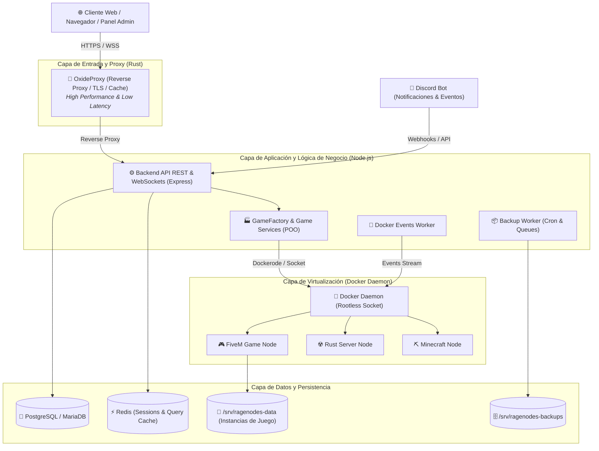
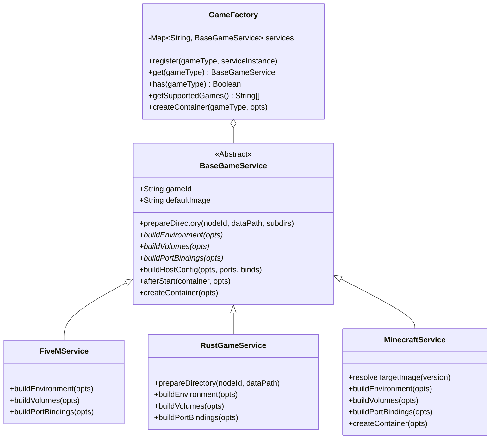
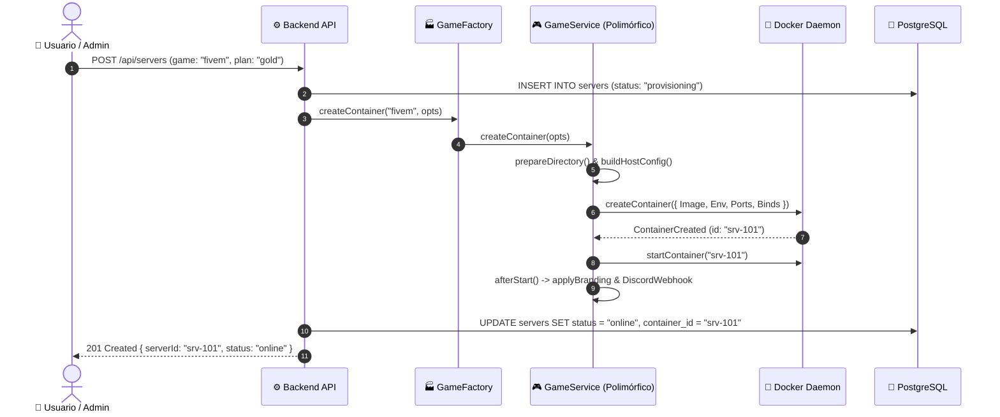

# 🏛️ Documento de Arquitectura de Software - RageNodes Ultimate

Este documento define la arquitectura técnica del sistema **RageNodes**, estructurado bajo los principios de **Ingeniería de Software de IBM (Coursera - Módulos 1, 3 y 4)**.

---

## 1. Visión General del Sistema y Diagrama de Componentes (C4 Nivel 2)

---

## 2. Diagrama de Clases POO (Módulo 3: Herencia y Patrón Template Method)

---

## 3. Diagrama de Secuencia: Ciclo de Vida del Servidor de Juegos (Módulo 4: Interaction Design)

---

## 4. Estrategia Multi-Lenguaje (*Polyglot Architecture*)

1. **Rust (`oxideproxy` y N-API):**
   - Manejo de conexiones TLS concurrentes, enrutamiento HTTP/2 y proxy inverso sin sobrecarga de recolección de basura (*Zero-cost abstractions*).
   - Acceso nativo y seguro al cálculo de métricas y lectura de logs mediante N-API.
2. **Node.js (`backend`):**
   - Orquestación asíncrona no bloqueante de eventos de Docker, APIs REST, WebSockets en tiempo real y lógica de negocio.
3. **Shell Scripting (Bash & PowerShell):**
   - Automatización de despliegues seguros (`deploy.sh`, `auto_update_prod.sh`) y auto-recuperación de instancias.

---

## 5. Calidad y Observabilidad en Producción (*Quality Attributes*)

- **Liveness Probe:** `GET /healthz` retorna `200 OK` si el proceso Node.js responde.
- **Readiness Probe:** `GET /readyz` valida activamente la conexión a base de datos y la memoria RAM disponible antes de admitir tráfico de usuarios.
- **Testing Automatizado:** Ejecución de pruebas unitarias y de integración con `npm test` (`node:test`).
