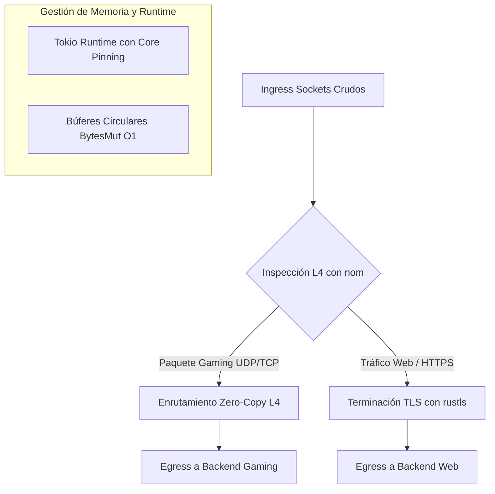

# 🏗️ OxideProxy (Motor L4/L7 Asíncrono de Ultra-Baja Latencia)

**OxideProxy** es un proxy asíncrono moderno de capa 4 y 7, desarrollado 100% en Rust. Está diseñado específicamente para mantener millones de conexiones abiertas simultáneamente con latencia de sub-milisegundos, eliminando los cuellos de botella históricos de arquitecturas en C como NGINX en entornos de alto tráfico y gaming.

---

## 🚀 Arquitectura del Motor



### 1. El Corazón Asíncrono (Tokio + Core Pinning)
*   **Runtime Tokio:** Aprovecha el multiplexado de I/O asíncrono líder en la industria, gestionando millones de eventos de red sin bloquear hilos del sistema operativo.
*   **Afinidad de CPU (Core Pinning):** Configurado para asignar exactamente un hilo de trabajo por núcleo físico del servidor, eliminando la sobrecarga por cambio de contexto del kernel.

### 2. Gestión de Memoria Zero-Copy Absoluta
*   **Búferes Circulares (`BytesMut`):** Cada conexión asigna un único búfer al nacer. Los paquetes entrantes se escriben una sola vez en memoria.
*   **Sub-referencias (*Slices*):** El analizador de protocolos (`nom`) no realiza copias ni asignaciones en el montículo (*heap*), devolviendo referencias directas (`&[u8]`) a las secciones del payload.
*   **Sin Recolección de Basura:** Al cerrarse un socket, Rust libera la memoria en ese mismo microsegundo sin pausas (*GC pauses*), evitando picos de latencia (*lag spikes*) en el juego.

### 3. Pipeline de Procesamiento Modular
*   **Ingress:** Escucha asíncrona dual en puertos TCP crudos (ej. 8443) y UDP (ej. 8080).
*   **eBPF / XDP:** Interfaz preparada para cargar filtros a nivel de tarjeta de red (NIC) para descarte instantáneo de ataques DDoS en nanosegundos.
*   **Inspector L4:** Analizador binario ultrarrápido que evalúa el formato estricto `[2 bytes GameID][2 bytes PayloadLen][Payload]`.
*   **Terminación TLS:** Integración de `tokio-rustls` para handshakes criptográficos un 30% más rápidos y seguros que OpenSSL.
*   **Egress:** Reenvío bidireccional transparente hacia los servidores de backend.

---

## 🛠️ Despliegue en VM Linux (Docker & Compose)

El proyecto incluye una configuración de despliegue optimizada para producción mediante Docker multietapa y modo de red `host`.

### Pasos para desplegar:
1. Clonar o copiar esta carpeta a tu máquina virtual Linux.
2. Ejecutar Docker Compose para compilar y levantar el motor:
   ```bash
   docker compose up -d --build
   ```
   *(Durante la compilación, el contenedor generará automáticamente los certificados TLS auto-firmados de prueba en `config/certs/`).*

### Verificación de Logs en Tiempo Real:
```bash
docker logs -f oxide_proxy_engine
```
