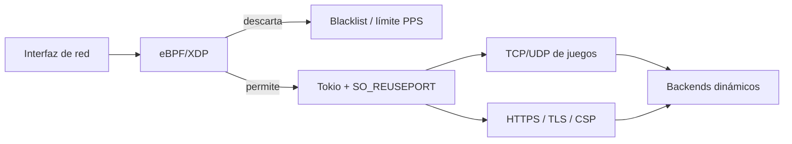

# OxideProxy — proxy L4/L7 en Rust

OxideProxy es la entrada TCP, UDP y HTTPS de RageNodes. Enruta puertos dinámicos de juegos, termina o retransmite TLS según la ruta, aplica la puerta de acceso de staging y publica telemetría consumida por el panel administrativo.

## Flujo de datos



## Capacidades implementadas

- Enrutamiento TCP, UDP y dual por cada puerto declarado en el inventario dinámico.
- Listeners dedicados con `SO_REUSEPORT`, buffers `BytesMut` y runtime Tokio configurable.
- Terminación TLS con Rustls, passthrough por SNI y políticas CSP con nonce para herramientas web.
- eBPF/XDP real con Aya para IPv4, IPv6 y hasta dos etiquetas VLAN.
- Blacklist dinámica y limitación PPS antes de que el tráfico llegue a los sockets.
- Modo XDP nativo (`driver`) con fallback a XDP genérico (`skb`). Si el kernel no lo admite, el estado se muestra explícitamente como mitigación en memoria; no se presenta como XDP activo.
- Contadores reales por CPU: paquetes vistos, permitidos, descartados, bloqueos por blacklist, limitación de tasa y errores de análisis.
- Recarga de política y blacklist sin recompilar ni reiniciar el proxy.

Los descartes XDP evitan el lock y el pipeline de Tokio. Los paquetes desconocidos se registran en nivel `debug` para impedir amplificación de disco durante escaneos UDP.

## Compilación reproducible

La imagen multietapa compila dos artefactos:

1. `oxide-ebpf.o` para el kernel mediante Rust nightly y `bpf-linker` fijado por versión y SHA-256.
2. `oxide_proxy` para espacio de usuario mediante Rust estable y `Cargo.lock`.

El objeto XDP se incluye en `/app/oxide-ebpf.o`; no se descarga en el arranque.

```bash
docker build -t ragenodes/oxideproxy:local .
```

## Permisos mínimos

Solo el servicio `oxide_game`, conectado a la red del host, carga XDP. Se ejecuta con UID 0 porque el kernel lo exige en el modelo actual, pero conserva `cap_drop: ALL`, filesystem de solo lectura y únicamente `NET_ADMIN`, `BPF` y `PERFMON`. El proxy web permanece sin privilegios.

No se requiere `SYS_ADMIN` ni modo privilegiado en producción. El Dev Container sí es privilegiado porque necesita crear interfaces aisladas y ejecutar pruebas eBPF locales.

## Desarrollo y pruebas

Al abrir el repositorio en su Dev Container, `.devcontainer/setup-ebpf.sh` instala `bpftool`, Clang/LLVM, Rust nightly y el `bpf-linker` verificado. Después:

```bash
cd oxideproxy
./scripts/build-ebpf.sh
cargo check --package oxide_proxy --all-targets
cargo test --package oxide_proxy --all-targets
```

El fixture `tests/fixtures/xdp-test.yml` usa un límite bajo para verificar que los paquetes excedentes son descartados en XDP y que los contadores publicados coinciden. La prueba local de referencia envió 1.000 datagramas: 100 llegaron a Tokio y 900 fueron descartados en XDP.

## Estados operativos

- `xdp-driver`: programa adjunto en modo nativo por el driver.
- `xdp-generic`: programa adjunto en modo genérico por el kernel.
- `memory`: XDP no pudo cargarse y se aplica la protección de respaldo en espacio de usuario.
- `disabled`: la política está desactivada expresamente.

La telemetría distingue estos estados; una etiqueta `LIVE` significa que el panel recibe muestras recientes, no que XDP esté necesariamente adjunto.
